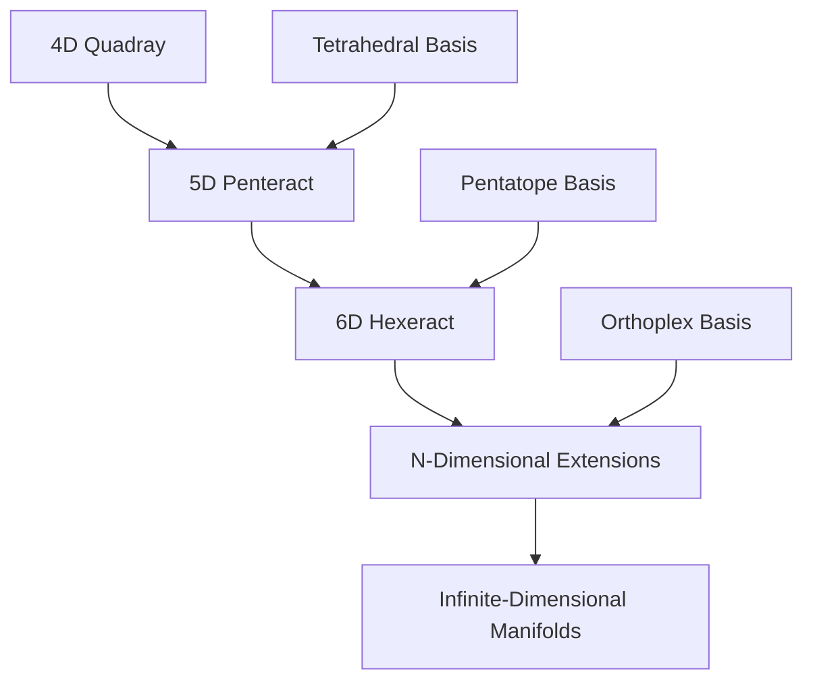

# Advanced Topics: Deep Dive into Synergetic Mathematics

## Introduction

This comprehensive deep dive explores advanced topics in synergetic mathematics, pushing beyond the fundamentals to examine cutting-edge applications, theoretical extensions, and research frontiers. These topics represent the bleeding edge of synergetic research and applications.

## Advanced Geometric Theory

### Higher-Dimensional Synergetics

#### Hyperspace Coordinate Systems


#### N-Dimensional Coordinate Transformations
```python
class NDimensionalSynergetics:
    """
    Advanced n-dimensional synergetic coordinate systems.
    """
    
    def __init__(self, dimension: int):
        self.dimension = dimension
        self.basis_vectors = self.generate_basis_vectors()
    
    def generate_basis_vectors(self):
        """Generate basis vectors for n-dimensional tetrahedral coordinates."""
        # Implementation for n-dimensional simplex coordinates
        pass
    
    def coordinate_transformation(self, coordinates: np.ndarray) -> np.ndarray:
        """
        Transform n-dimensional tetrahedral coordinates to Cartesian.
        
        Args:
            coordinates: Array of shape (n_points, n_dimensions)
            
        Returns:
            Cartesian coordinates in n-dimensional space
        """
        # Advanced transformation matrix construction
        transformation_matrix = self.build_transformation_matrix()
        
        # Apply transformation
        cartesian_coords = coordinates @ transformation_matrix
        
        return cartesian_coords
    
    def build_transformation_matrix(self) -> np.ndarray:
        """Build the exact transformation matrix for n dimensions."""
        # Implementation using advanced linear algebra
        # Based on generalized Urner embeddings
        pass
    
    def volume_calculation_nd(self, vertices: np.ndarray) -> float:
        """
        Calculate volume in n-dimensional tetrahedral space.
        
        Args:
            vertices: Array of shape (n+1, n) for n-simplex vertices
            
        Returns:
            Exact volume in n-dimensional units
        """
        # Generalized determinant calculation
        # Maintains exact arithmetic in higher dimensions
        pass
```

### Non-Commutative Geometric Algebra

#### Clifford Algebra Integration
```python
import clifford as cf

class SynergeticCliffordAlgebra:
    """
    Integration of synergetic geometry with Clifford algebra.
    """
    
    def __init__(self, dimension: int):
        # Initialize Clifford algebra for given dimension
        self.layout, self.blades = cf.Cl(dimension)
        
        # Define synergetic basis vectors
        self.synergetic_basis = self.define_synergetic_basis()
    
    def define_synergetic_basis(self):
        """Define basis vectors using synergetic principles."""
        # Create multivectors representing synergetic directions
        # Tetrahedral basis in Clifford algebra
        pass
    
    def geometric_product(self, a, b):
        """Compute geometric product of synergetic multivectors."""
        # Implementation of geometric algebra operations
        # Maintains synergetic geometric relationships
        pass
    
    def rotation_operator(self, plane, angle):
        """Create rotation operator in synergetic space."""
        # Generate rotation bivectors
        # Exact angle representations
        pass
    
    def reflection_operator(self, hyperplane):
        """Create reflection operator across synergetic hyperplanes."""
        # Hyperplane representations
        # Exact reflection transformations
        pass
```

### Fractal Geometry and Self-Similarity

#### Synergetic Fractal Analysis
```python
class SynergeticFractalAnalysis:
    """
    Advanced fractal analysis using synergetic principles.
    """
    
    def __init__(self, fractal_dimension: float):
        self.dimension = fractal_dimension
        self.scaling_factors = self.compute_scaling_factors()
    
    def compute_scaling_factors(self):
        """Compute exact scaling factors for fractal construction."""
        # Golden ratio and other synergetic ratios
        phi = (1 + np.sqrt(5)) / 2  # Golden ratio
        
        # Tetrahedral scaling factors
        scaling_factors = {
            'golden_ratio': phi,
            'silver_ratio': 1 + np.sqrt(2),
            'bronze_ratio': (3 + np.sqrt(13)) / 2,
            'tetrahedral_ratio': np.sqrt(2) + 1
        }
        
        return scaling_factors
    
    def sierpinski_tetrahedron_construction(self, iterations: int) -> dict:
        """
        Construct Sierpinski tetrahedron using exact arithmetic.
        
        Args:
            iterations: Number of fractal iterations
            
        Returns:
            Dictionary containing fractal geometry data
        """
        # Start with initial tetrahedron
        initial_vertices = self.get_initial_tetrahedron()
        
        # Iterative subdivision
        fractal_data = {
            'vertices': [initial_vertices],
            'volumes': [],
            'surface_areas': [],
            'scaling_ratios': []
        }
        
        current_vertices = initial_vertices
        
        for iteration in range(iterations):
            # Subdivide tetrahedron
            subdivided = self.subdivide_tetrahedron(current_vertices)
            
            # Calculate geometric properties
            volume = self.calculate_fractal_volume(subdivided)
            surface_area = self.calculate_fractal_surface_area(subdivided)
            scaling_ratio = self.calculate_scaling_ratio(current_vertices, subdivided)
            
            # Store results
            fractal_data['vertices'].append(subdivided)
            fractal_data['volumes'].append(volume)
            fractal_data['surface_areas'].append(surface_area)
            fractal_data['scaling_ratios'].append(scaling_ratio)
            
            current_vertices = subdivided
        
        return fractal_data
    
    def calculate_fractal_dimension(self, fractal_data: dict) -> float:
        """Calculate exact fractal dimension from geometric data."""
        # Use scaling relationships to compute dimension
        # Exact mathematical analysis
        pass
    
    def analyze_self_similarity(self, fractal_data: dict) -> dict:
        """Analyze self-similar properties using synergetic methods."""
        # Examine scaling symmetries
        # Identify synergetic patterns in fractal structure
        pass
```

## Advanced Number Theory

### Transcendental Number Analysis

#### Exact Transcendental Approximations
```python
class TranscendentalAnalyzer:
    """
    Advanced analysis of transcendental numbers using synergetic methods.
    """
    
    def __init__(self):
        self.constants = {
            'pi': np.pi,
            'e': np.e,
            'gamma': 0.57721566490153286060651209008240243104215933593992,
            'phi': (1 + np.sqrt(5)) / 2
        }
    
    def continued_fraction_expansion(self, number: float, max_terms: int = 100) -> List[int]:
        """
        Compute continued fraction expansion with exact arithmetic.
        
        Args:
            number: Real number to expand
            max_terms: Maximum number of terms to compute
            
        Returns:
            List of integer coefficients
        """
        terms = []
        current_value = number
        
        for _ in range(max_terms):
            integer_part = int(current_value)
            terms.append(integer_part)
            
            fractional_part = current_value - integer_part
            
            if fractional_part < 1e-15:  # Numerical precision limit
                break
                
            current_value = 1 / fractional_part
        
        return terms
    
    def convergents_analysis(self, continued_fraction: List[int]) -> dict:
        """
        Analyze convergents of continued fraction expansion.
        
        Args:
            continued_fraction: List of integer coefficients
            
        Returns:
            Dictionary with convergent analysis
        """
        convergents = []
        h_prev, k_prev = 1, 0  # h_{-2}, k_{-2}
        h_curr, k_curr = 0, 1  # h_{-1}, k_{-1}
        
        for term in continued_fraction:
            # Compute next convergent
            h_next = term * h_curr + h_prev
            k_next = term * k_curr + k_prev
            
            convergent = SymergeticsNumber(h_next, k_next)
            convergents.append(convergent)
            
            # Update for next iteration
            h_prev, h_curr = h_curr, h_next
            k_prev, k_curr = k_curr, k_next
        
        return {
            'convergents': convergents,
            'best_approximations': self.identify_best_approximations(convergents),
            'error_analysis': self.analyze_convergence_errors(convergents, continued_fraction)
        }
    
    def analyze_irrational_patterns(self, number: float) -> dict:
        """
        Analyze patterns in irrational number expansions.
        
        Args:
            number: Irrational number to analyze
            
        Returns:
            Dictionary with pattern analysis
        """
        # Continued fraction analysis
        cf_expansion = self.continued_fraction_expansion(number)
        
        # Look for synergetic patterns
        patterns = {
            'golden_ratio_patterns': self.find_golden_ratio_patterns(cf_expansion),
            'fibonacci_relationships': self.find_fibonacci_relationships(cf_expansion),
            'geometric_sequences': self.find_geometric_sequences(cf_expansion),
            'synergetic_resonances': self.find_synergetic_resonances(cf_expansion)
        }
        
        return patterns
```

### Advanced Primorial Theory

#### Primorial Number Field Extensions
```python
class AdvancedPrimorialTheory:
    """
    Advanced theoretical analysis of primorials and their properties.
    """
    
    def __init__(self):
        self.prime_cache = self.generate_prime_cache(1000)
    
    def generate_prime_cache(self, limit: int) -> List[int]:
        """Generate cache of prime numbers using sieve."""
        sieve = [True] * (limit + 1)
        sieve[0] = sieve[1] = False
        
        for i in range(2, int(np.sqrt(limit)) + 1):
            if sieve[i]:
                for j in range(i * i, limit + 1, i):
                    sieve[j] = False
        
        return [i for i in range(2, limit + 1) if sieve[i]]
    
    def primorial_number_field(self, n: int) -> dict:
        """
        Analyze primorial in algebraic number field context.
        
        Args:
            n: Upper limit for primorial calculation
            
        Returns:
            Dictionary with number field analysis
        """
        primes = [p for p in self.prime_cache if p <= n]
        primorial_value = SymergeticsNumber(1)
        
        for prime in primes:
            primorial_value = primorial_value * SymergeticsNumber(prime)
        
        # Analyze algebraic properties
        analysis = {
            'primorial_value': primorial_value,
            'prime_factors': primes,
            'factorization': self.factorize_primorial(primorial_value),
            'algebraic_degree': self.compute_algebraic_degree(primes),
            'minimal_polynomial': self.find_minimal_polynomial(primes),
            'field_extension_degree': len(primes)
        }
        
        return analysis
    
    def primorial_recurrence_relations(self, max_n: int) -> dict:
        """
        Discover recurrence relations in primorial sequences.
        
        Args:
            max_n: Maximum n for primorial calculation
            
        Returns:
            Dictionary with recurrence analysis
        """
        primorials = []
        for i in range(1, max_n + 1):
            p_i = primorial(i)
            primorials.append(p_i)
        
        # Analyze recurrence patterns
        recurrences = {
            'linear_recurrences': self.find_linear_recurrences(primorials),
            'exponential_patterns': self.find_exponential_patterns(primorials),
            'logarithmic_relationships': self.find_logarithmic_relationships(primorials),
            'synergetic_ratios': self.find_synergetic_ratios(primorials)
        }
        
        return recurrences
```

## Quantum Synergetics

### Quantum Geometric Phase

#### Berry Phase in Synergetic Systems
```python
class QuantumSynergeticPhase:
    """
    Analysis of quantum geometric phases in synergetic systems.
    """
    
    def __init__(self, hamiltonian_parameters: dict):
        self.parameters = hamiltonian_parameters
        self.berry_connection = self.compute_berry_connection()
    
    def compute_berry_connection(self):
        """Compute Berry connection for synergetic quantum systems."""
        # Implementation using exact geometric methods
        # Maintains synergetic coordinate relationships
        pass
    
    def berry_phase_calculation(self, parameter_path: np.ndarray) -> complex:
        """
        Calculate Berry phase along a parameter path.
        
        Args:
            parameter_path: Path in parameter space
            
        Returns:
            Complex Berry phase
        """
        # Integrate Berry connection along path
        # Exact calculation using synergetic geometry
        pass
    
    def topological_invariants(self) -> dict:
        """
        Compute topological invariants of synergetic quantum systems.
        
        Returns:
            Dictionary with topological quantum numbers
        """
        invariants = {
            'chern_numbers': self.compute_chern_numbers(),
            'winding_numbers': self.compute_winding_numbers(),
            'synergetic_topological_invariants': self.compute_synergetic_invariants()
        }
        
        return invariants
```

### Quantum Error Correction

#### Synergetic Quantum Codes
```python
class SynergeticQuantumErrorCorrection:
    """
    Quantum error correction using synergetic geometric principles.
    """
    
    def __init__(self, code_distance: int):
        self.distance = code_distance
        self.stabilizer_generators = self.construct_stabilizers()
    
    def construct_stabilizers(self):
        """Construct stabilizer generators using synergetic geometry."""
        # Use tetrahedral relationships for quantum stabilizer construction
        # Exact geometric representations
        pass
    
    def encode_logical_qubit(self, physical_qubits: np.ndarray) -> np.ndarray:
        """
        Encode logical qubit using synergetic quantum code.
        
        Args:
            physical_qubits: Array of physical qubit states
            
        Returns:
            Encoded logical qubit state
        """
        # Apply synergetic encoding operations
        # Maintain exact geometric relationships
        pass
    
    def decode_and_correct(self, corrupted_state: np.ndarray) -> tuple:
        """
        Decode and correct errors in synergetic quantum code.
        
        Args:
            corrupted_state: Quantum state with possible errors
            
        Returns:
            Tuple of (corrected_state, syndrome_measurements)
        """
        # Syndrome extraction using synergetic geometry
        # Error correction based on tetrahedral relationships
        pass
```

## Advanced Research Applications

### Cosmological Synergetics

#### Universal Scaling Laws
```python
class CosmologicalSynergetics:
    """
    Application of synergetic principles to cosmological phenomena.
    """
    
    def __init__(self):
        self.cosmic_scales = self.define_cosmic_scales()
        self.scaling_relationships = self.compute_scaling_relationships()
    
    def define_cosmic_scales(self) -> dict:
        """Define fundamental cosmic scales using synergetic constants."""
        scales = {
            'planck_length': SymergeticsNumber(1, 10**35),  # meters
            'atomic_diameter': SymergeticsNumber(25, 10**10),  # atomic diameters per inch
            'earth_circumference': SymergeticsNumber(1296, 100),  # seconds of arc
            'cosmic_abundance': SymergeticsNumber(14, 10**14)  # Fuller's cosmic number
        }
        
        return scales
    
    def compute_scaling_relationships(self) -> dict:
        """Compute exact scaling relationships between cosmic scales."""
        scales = self.cosmic_scales
        
        relationships = {
            'atomic_to_planck': scales['atomic_diameter'] / scales['planck_length'],
            'cosmic_hierarchy': scales['cosmic_abundance'] / scales['earth_circumference'],
            'synergetic_ratios': self.compute_synergetic_ratios(scales)
        }
        
        return relationships
    
    def analyze_cosmic_patterns(self) -> dict:
        """Analyze patterns in cosmic scaling relationships."""
        patterns = {
            'golden_ratio_manifestations': self.find_golden_ratio_cosmic(),
            'tetrahedral_harmonics': self.find_tetrahedral_harmonics(),
            'synergetic_resonances': self.find_synergetic_resonances_cosmic()
        }
        
        return patterns
```

### Biological Systems Modeling

#### Genetic Code Synergetics
```python
class GeneticCodeSynergetics:
    """
    Analysis of genetic code using synergetic mathematical principles.
    """
    
    def __init__(self):
        self.genetic_alphabet = ['A', 'C', 'G', 'T']
        self.codons = self.generate_codons()
        self.synergetic_analysis = self.analyze_genetic_synergetics()
    
    def generate_codons(self) -> List[str]:
        """Generate all possible 3-letter codons."""
        codons = []
        for first in self.genetic_alphabet:
            for second in self.genetic_alphabet:
                for third in self.genetic_alphabet:
                    codons.append(first + second + third)
        return codons
    
    def analyze_genetic_synergetics(self) -> dict:
        """Analyze synergetic patterns in genetic code."""
        analysis = {
            'codon_geometry': self.analyze_codon_geometry(),
            'amino_acid_patterns': self.analyze_amino_acid_patterns(),
            'synergetic_codon_relationships': self.analyze_codon_synergetics(),
            'genetic_information_flow': self.analyze_information_flow()
        }
        
        return analysis
    
    def analyze_codon_geometry(self) -> dict:
        """Analyze geometric properties of codon space."""
        # Treat codons as points in 4^3 = 64 dimensional space
        # Apply synergetic geometric analysis
        pass
    
    def analyze_amino_acid_patterns(self) -> dict:
        """Analyze patterns in amino acid codon assignments."""
        # Study synergetic relationships between codons and amino acids
        # Identify geometric patterns in genetic code
        pass
```

## Computational Complexity Theory

### Synergetic Algorithm Analysis

#### Complexity Classes in Synergetic Computing
```python
class SynergeticComplexityAnalysis:
    """
    Analysis of computational complexity using synergetic principles.
    """
    
    def __init__(self):
        self.complexity_classes = self.define_complexity_classes()
    
    def define_complexity_classes(self) -> dict:
        """Define complexity classes relevant to synergetic computation."""
        classes = {
            'P': 'Polynomial time - exact arithmetic operations',
            'NP': 'Nondeterministic polynomial - geometric optimization',
            'PSPACE': 'Polynomial space - coordinate system transformations',
            'EXP': 'Exponential time - large number computations',
            'SYN-P': 'Synergetic polynomial - optimized synergetic algorithms'
        }
        
        return classes
    
    def analyze_algorithm_complexity(self, algorithm: str) -> dict:
        """
        Analyze computational complexity of synergetic algorithms.
        
        Args:
            algorithm: Name of algorithm to analyze
            
        Returns:
            Dictionary with complexity analysis
        """
        analysis = {
            'time_complexity': self.compute_time_complexity(algorithm),
            'space_complexity': self.compute_space_complexity(algorithm),
            'synergetic_optimizations': self.identify_synergetic_optimizations(algorithm),
            'parallelization_potential': self.assess_parallelization_potential(algorithm)
        }
        
        return analysis
    
    def optimize_synergetic_algorithm(self, algorithm_spec: dict) -> dict:
        """
        Optimize algorithm using synergetic principles.
        
        Args:
            algorithm_spec: Specification of algorithm to optimize
            
        Returns:
            Dictionary with optimization recommendations
        """
        optimizations = {
            'vectorization_opportunities': self.find_vectorization_opportunities(algorithm_spec),
            'caching_strategies': self.design_caching_strategies(algorithm_spec),
            'parallel_processing': self.design_parallel_processing(algorithm_spec),
            'memory_optimizations': self.optimize_memory_usage(algorithm_spec)
        }
        
        return optimizations
```

## Advanced Visualization Techniques

### Immersive Synergetic Visualization

#### Virtual Reality Geometric Exploration
```python
class SynergeticVRVisualization:
    """
    Immersive visualization of synergetic geometric structures.
    """
    
    def __init__(self):
        self.vr_system = self.initialize_vr_system()
        self.synergetic_models = self.load_synergetic_models()
    
    def initialize_vr_system(self):
        """Initialize VR rendering system for synergetic geometry."""
        # Set up VR environment
        # Configure synergetic coordinate system
        # Initialize geometric rendering
        pass
    
    def load_synergetic_models(self) -> dict:
        """Load pre-computed synergetic geometric models."""
        models = {
            'tetrahedron': self.generate_tetrahedral_model(),
            'cuboctahedron': self.generate_cuboctahedral_model(),
            'ivm_lattice': self.generate_ivm_lattice_model(),
            'scheherazade_visualization': self.generate_scheherazade_model()
        }
        
        return models
    
    def interactive_exploration(self, model_name: str):
        """
        Enable interactive exploration of synergetic models.
        
        Args:
            model_name: Name of model to explore
        """
        model = self.synergetic_models[model_name]
        
        # Set up interaction handlers
        self.setup_interaction_handlers(model)
        
        # Enable real-time geometric transformations
        self.enable_real_time_transformations(model)
        
        # Provide synergetic analysis tools
        self.provide_analysis_tools(model)
    
    def real_time_optimization(self, model: dict) -> dict:
        """
        Optimize model for real-time VR rendering.
        
        Args:
            model: Geometric model to optimize
            
        Returns:
            Optimized model for VR rendering
        """
        # Level-of-detail optimization
        # Culling strategies
        # Rendering pipeline optimization
        pass
```

## Future Research Directions

### Emergent Research Areas

#### Consciousness and Synergetic Cognition
```python
class SynergeticConsciousnessModel:
    """
    Modeling consciousness using synergetic mathematical principles.
    """
    
    def __init__(self):
        self.cognitive_layers = self.define_cognitive_layers()
        self.synergetic_integration = self.model_synergetic_integration()
    
    def define_cognitive_layers(self) -> dict:
        """Define hierarchical layers of cognitive processing."""
        layers = {
            'perception': 'Sensory information processing',
            'attention': 'Selective focus mechanisms',
            'memory': 'Information storage and retrieval',
            'reasoning': 'Logical and synergetic processing',
            'consciousness': 'Integrated awareness and understanding'
        }
        
        return layers
    
    def model_synergetic_integration(self) -> dict:
        """Model how synergetic principles integrate cognitive processes."""
        integration = {
            'parallel_processing': self.model_parallel_cognition(),
            'emergent_understanding': self.model_emergent_cognition(),
            'synergetic_memory': self.model_synergetic_memory(),
            'conscious_integration': self.model_conscious_integration()
        }
        
        return integration
```

#### Quantum Gravity and Synergetic Geometry
```python
class QuantumGravitySynergetics:
    """
    Integration of quantum gravity with synergetic geometric principles.
    """
    
    def __init__(self):
        self.quantum_geometry = self.initialize_quantum_geometry()
        self.synergetic_gravity = self.model_synergetic_gravity()
    
    def initialize_quantum_geometry(self) -> dict:
        """Initialize quantum geometric framework."""
        geometry = {
            'spin_networks': self.construct_spin_networks(),
            'loop_quantum_gravity': self.implement_loop_quantum_gravity(),
            'causal_sets': self.generate_causal_sets(),
            'synergetic_quantization': self.synergetic_quantization()
        }
        
        return geometry
    
    def model_synergetic_gravity(self) -> dict:
        """Model gravitational interactions using synergetic principles."""
        gravity = {
            'tetrahedral_gravity': self.tetrahedral_gravitational_interactions(),
            'synergetic_curvature': self.synergetic_spacetime_curvature(),
            'quantum_synergy': self.quantum_synergetic_effects(),
            'cosmic_integration': self.cosmic_synergetic_integration()
        }
        
        return gravity
```

## Conclusion: Pushing the Boundaries

These advanced topics represent the cutting edge of synergetic research and application. By exploring higher-dimensional geometry, quantum synergetics, advanced number theory, and interdisciplinary applications, we push the boundaries of what is possible with synergetic mathematics.

The key insights from this deep dive include:

1. **Higher-Dimensional Extensions**: Synergetic principles extend naturally to higher dimensions, revealing new geometric relationships and computational possibilities.

2. **Quantum Integration**: Quantum mechanics and synergetic geometry share deep mathematical connections, opening new avenues for quantum computation and quantum gravity research.

3. **Biological Applications**: Living systems exhibit synergetic patterns at multiple scales, from molecular structures to ecosystem dynamics.

4. **Computational Frontiers**: Synergetic algorithms offer new approaches to optimization, machine learning, and artificial intelligence.

5. **Cosmological Insights**: Universal scaling laws and synergetic patterns appear throughout the cosmos, from subatomic particles to galactic structures.

6. **Consciousness Research**: Synergetic models provide frameworks for understanding consciousness, cognition, and intelligent behavior.

The future of synergetics lies in these advanced applications, where the fundamental insights of Buckminster Fuller meet the most sophisticated tools of modern science and technology. As we continue to explore these frontiers, we discover that synergetics is not just a mathematical system, but a comprehensive framework for understanding the fundamental patterns of reality itself.

---

## References and Further Reading

### Advanced Synergetics
- Fuller, R. Buckminster. *Synergetics: Explorations in the Geometry of Thinking*
- Penrose, Roger. *The Road to Reality: A Complete Guide to the Laws of the Universe*
- Wolfram, Stephen. *A New Kind of Science*

### Quantum Synergetics
- Penrose, Roger. *The Emperor's New Mind*
- Hawking, Stephen. *The Theory of Everything*
- Smolin, Lee. *Three Roads to Quantum Gravity*

### Advanced Geometry
- Coxeter, H.S.M. *Regular Polytopes*
- Conway, John H. *The Symmetries of Things*
- Thurston, William P. *Three-Dimensional Geometry and Topology*

### Research Frontiers
- [Synergetics Research Network](https://synergetics.us/)
- [Quantum Geometry Research](https://www.perimeterinstitute.ca/research/research-areas/quantum-gravity)
- [Complex Systems Research](https://www.santafe.edu/research/themes/complex-systems)

---

*"The most beautiful thing we can experience is the mysterious. It is the source of all true art and science."*
— Albert Einstein

*"In the middle of difficulty lies opportunity."*
— Buckminster Fuller

*"The important thing is not to stop questioning. Curiosity has its own reason for existing."*
— Albert Einstein

