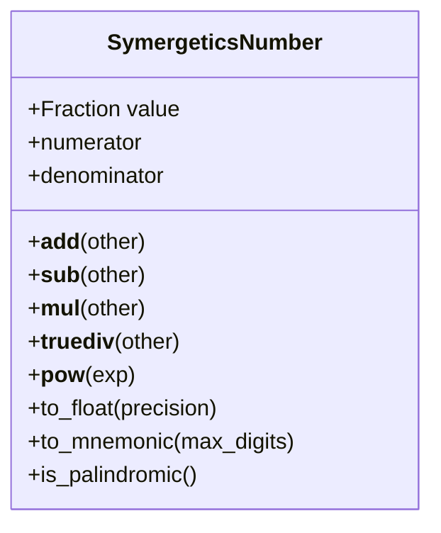
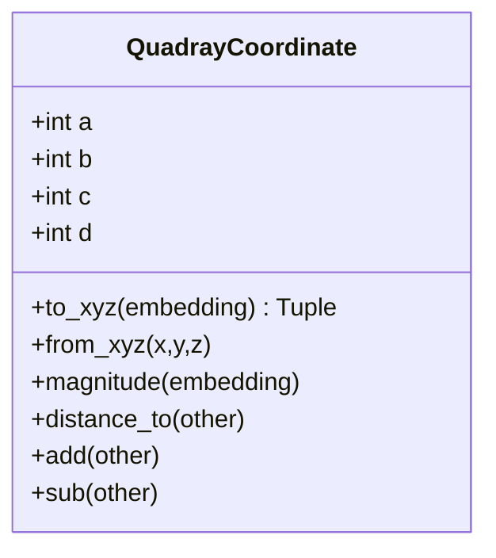
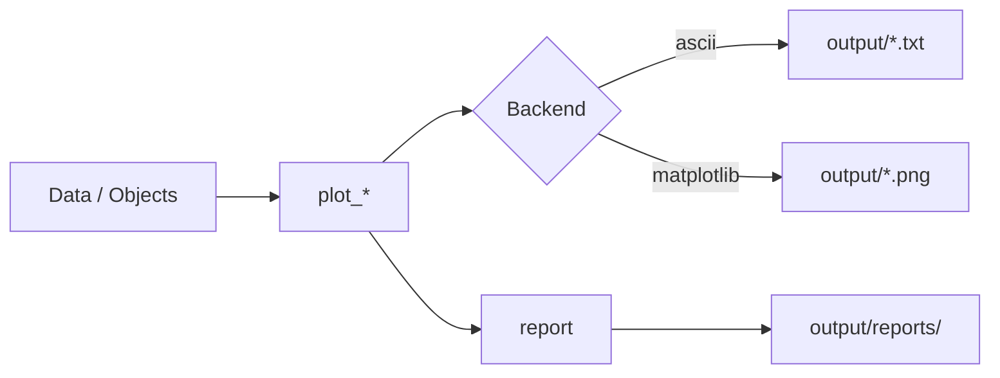

# API Reference

## Core Module

### SymergeticsNumber

```python
class SymergeticsNumber:
    """Exact rational arithmetic for Synergetics."""

    def __init__(self, numerator, denominator=1)
    def __add__(self, other) -> SymergeticsNumber
    def __mul__(self, other) -> SymergeticsNumber
    def to_float(self, precision=None) -> float
    def to_mnemonic(self) -> str
    def is_palindromic() -> bool
```

**Key Methods:**

- Arithmetic: `+`, `-`, `*`, `/`, `**`
- Conversion: `to_float()`, `from_float()`
- Analysis: `is_palindromic()`, `to_mnemonic()`
- Properties: `numerator`, `denominator`



### QuadrayCoordinate

```python
class QuadrayCoordinate:
    """Four-coordinate tetrahedral coordinate system."""

    def __init__(self, a, b, c, d, normalize=True)
    def to_xyz(self, embedding=None) -> Tuple[float, float, float]
    def magnitude(self, embedding=None) -> float
    def distance_to(self, other) -> float
```

**Key Methods:**

- Conversion: `to_xyz()`, `from_xyz()`
- Operations: `add()`, `sub()`, `dot()`
- Properties: `as_tuple()`, `as_array()`



## Geometry Module

### Polyhedra Classes

#### Tetrahedron

```python
class Tetrahedron(SymergeticsPolyhedron):
    """Regular tetrahedron - volume = 1 IVM unit."""

    def volume(self) -> int  # Returns 1
    def faces(self) -> List[List[QuadrayCoordinate]]
    def edges(self) -> List[Tuple[QuadrayCoordinate, QuadrayCoordinate]]
```

#### Octahedron

```python
class Octahedron(SymergeticsPolyhedron):
    """Regular octahedron - volume = 4 tetrahedra."""

    def volume(self) -> int  # Returns 4
```

#### Cube

```python
class Cube(SymergeticsPolyhedron):
    """Cube - volume = 3 tetrahedra."""

    def volume(self) -> int  # Returns 3
```

#### Cuboctahedron

```python
class Cuboctahedron(SymergeticsPolyhedron):
    """Vector equilibrium - volume = 20 tetrahedra."""

    def volume(self) -> int  # Returns 20
```

### Volume Calculation Functions

```python
def integer_tetra_volume(p0, p1, p2, p3) -> int
def ace_tetra_volume_5x5(p0, p1, p2, p3) -> int
```

## Computation Module

### Primorial Calculations

```python
def primorial(n: int) -> SymergeticsNumber
def scheherazade_power(n: int) -> SymergeticsNumber
def cosmic_abundance_factors() -> Dict
```

### Palindrome Analysis

```python
def is_palindromic(number) -> bool
def extract_palindromic_patterns(number, min_length=3) -> List[str]
def find_palindromic_sequence(power: int) -> Dict
def analyze_scheherazade_ssrcd(power: int) -> Dict
```

## Utils Module

### Conversion Functions

```python
def rational_to_float(rational, precision=None) -> float
def float_to_exact_rational(value, max_denominator=1000000) -> SymergeticsNumber
def xyz_to_quadray(x, y, z) -> QuadrayCoordinate
def quadray_to_xyz(coord) -> Tuple[float, float, float]
def decimal_to_fraction(decimal_str: str) -> SymergeticsNumber
def best_rational_approximation(value: float, max_denominator=1000000) -> SymergeticsNumber
```

### Mnemonic Encoding

```python
def mnemonic_encode(number, style='grouped') -> str
def format_large_number(number, grouping=3) -> str
def create_memory_aid(number) -> Dict[str, str]
def mnemonic_decode(mnemonic) -> Union[int, str]
def ungroup_number(grouped: str) -> int
```

Note on number formatting:

- Default representations across the project are ungrouped for symbolic workflows; use `format_large_number()` and `ungroup_number()` to transform as needed.

## Constants

### Mathematical Constants

```python
# Volume ratios
TETRAHEDRON_VOLUME = 1
OCTAHEDRON_VOLUME = 4
CUBE_VOLUME = 3
CUBOCTAHEDRON_VOLUME = 20

# Scheherazade numbers
SCHEHERAZADE_BASE = 1001
SCH_1 = 1001
SCH_2 = 1002001
SCH_6 = 1006015020015006001  # Contains Pascal's triangle

# Cosmic scaling
ATOMIC_DIAMETERS_PER_INCH = 25_000_000_000
EARTH_CIRCUMFERENCE_SECONDS = 1_296_000
EARTH_CIRCUMFERENCE_DEGREES = 360
```

### Convenience Constants

```python
PHI = (1 + √5) / 2  # Golden ratio
PI = π              # π
E = e               # Euler's number
SQRT2 = √2          # Square root of 2
SQRT3 = √3          # Square root of 3
```

## Coordinate System Constants

### Predefined Coordinates

```python
ORIGIN = QuadrayCoordinate(0, 0, 0, 0)
IVM_NEIGHBORS = [QuadrayCoordinate(2,1,1,0), ...]  # 12-around-one
TETRAHEDRON_VERTICES = [...]  # Unit tetrahedron vertices
OCTAHEDRON_VERTICES = [...]   # Regular octahedron vertices
CUBE_VERTICES = [...]         # Cube vertices
```

## Visualization Module

High-level plotting API for geometry, numbers, and mathematical constructs. All functions honor the visualization configuration and produce organized outputs under `output/{category}/{subcategory}/`.

### Configuration

```python
from symergetics.visualization import set_config, get_config, reset_config,
  ensure_output_dir, get_organized_output_path,
  create_output_structure_readme, list_output_structure,
  save_config, load_config
```

### Geometry Visualizations

```python
from symergetics.visualization.geometry import (
  plot_polyhedron,
  plot_quadray_coordinate,
  plot_ivm_lattice,
  plot_coordinate_transformation
)
```

### Number Visualizations

```python
from symergetics.visualization.numbers import (
  plot_palindromic_pattern,
  plot_scheherazade_pattern,
  plot_primorial_distribution,
  plot_mnemonic_visualization
)
```

### Mathematical Visualizations

```python
from symergetics.visualization.mathematical import (
  plot_continued_fraction,
  plot_base_conversion,
  plot_pattern_analysis,
  plot_ssrcd_analysis
)
```

### Batch and Export

```python
from symergetics.visualization import (
  batch_visualize,
  create_animation,
  export_visualization,
  batch_process,
  create_visualization_report
)
```



## Error Handling

The package uses standard Python exceptions:

- `ValueError`: Invalid input parameters
- `ZeroDivisionError`: Division by zero
- `TypeError`: Incorrect type usage

## Performance Notes

- All calculations use exact arithmetic (no floating-point errors)
- Large integer operations are optimized
- Coordinate conversions use efficient matrix operations
- Volume calculations use integer determinant methods

## Thread Safety

All classes and functions are thread-safe for read operations. Write operations to shared state are not recommended in multi-threaded environments.
