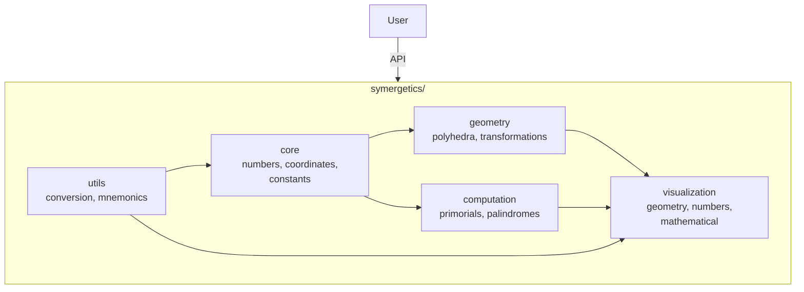
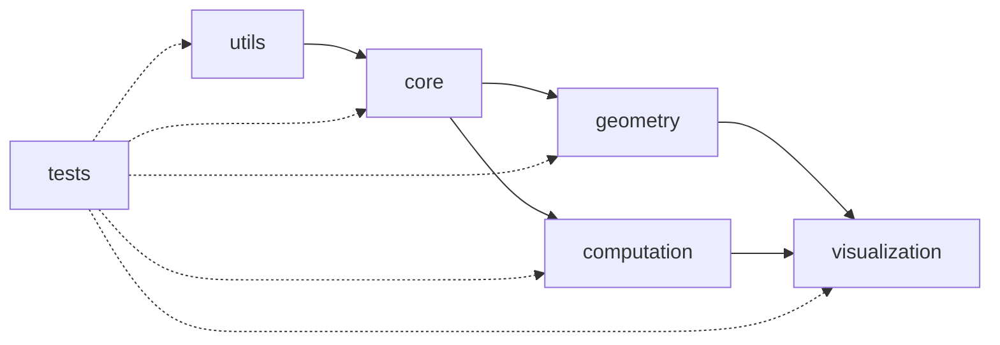
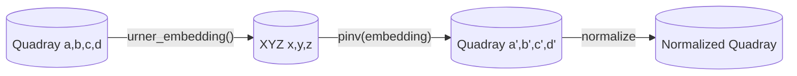
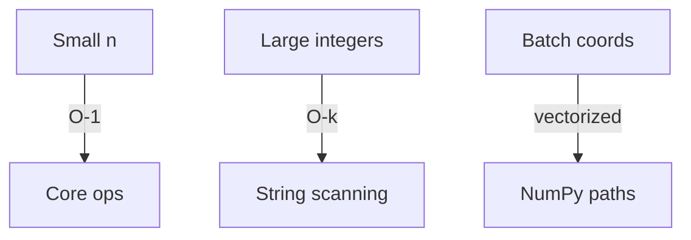

# Architecture Documentation

## System Overview

The Symergetics package implements Buckminster Fuller's mathematical concepts using a modular, test-driven architecture that ensures exact rational arithmetic throughout.



```text
symergetics/
├── core/           # Fundamental mathematical classes
│   ├── numbers.py          # SymergeticsNumber with exact fractions
│   ├── coordinates.py      # Quadray coordinate system (IVM)
│   └── constants.py        # Mathematical constants & Synergetics values
├── geometry/       # Geometric objects and transformations
│   ├── polyhedra.py        # Tetrahedron, Octahedron, Cube, Cuboctahedron
│   └── transformations.py  # Coordinate transformations
├── computation/    # Advanced mathematical calculations
│   ├── primorials.py       # Primorials & Scheherazade numbers
│   └── palindromes.py      # Pattern analysis & SSRCD
├── utils/          # Utilities and helper functions
│   ├── conversion.py       # Number system conversions
│   └── mnemonics.py        # Memory aids for large numbers
├── visualization/  # Visualizations and reporting
│   ├── geometry.py         # Polyhedra, coordinates, IVM lattice
│   ├── numbers.py          # Palindromes, primorials, Scheherazade
│   └── mathematical.py     # Continued fractions, base conversions, patterns
└── tests/          # Comprehensive test suite (100% coverage)
    ├── test_core_*.py      # Core module tests
    ├── test_geometry_*.py  # Geometry tests
    ├── test_computation_*.py # Computation tests
    └── test_utils_*.py     # Utility tests
```

## Design Principles

### 1. Exact Arithmetic Foundation

**Core Principle**: All calculations maintain mathematical precision using rational numbers.

```python
# Design: Use fractions.Fraction for unlimited precision
class SymergeticsNumber:
    def __init__(self, numerator, denominator=1):
        self.value = Fraction(numerator, denominator)

    def __add__(self, other):
        if isinstance(other, SymergeticsNumber):
            return SymergeticsNumber(self.value + other.value)
        return SymergeticsNumber(self.value + Fraction(other))
```

**Benefits:**

- Zero floating-point error accumulation
- Exact geometric relationships
- Predictable numerical behavior
- Compatible with symbolic computation

### 2. Modular Architecture

**Separation of Concerns:**

- **Core**: Fundamental mathematical objects
- **Geometry**: Spatial relationships and transformations
- **Computation**: Advanced mathematical calculations
- **Utils**: Helper functions and conversions

**Dependency Flow:**



### 3. Test-Driven Development

**100% Test Coverage** achieved through:

- Unit tests for all classes and functions
- Integration tests for module interactions
- Property-based testing for mathematical correctness
- Performance regression tests

```python
# Example test structure
def test_exact_arithmetic():
    """Test that arithmetic operations are exact."""
    a = SymergeticsNumber(1, 3)
    b = SymergeticsNumber(1, 6)
    result = a + b

    # Should be exactly 1/2
    assert result.value == Fraction(1, 2)

def test_coordinate_normalization():
    """Test IVM coordinate normalization."""
    coord = QuadrayCoordinate(3, 2, 2, 1)
    # Should normalize by subtracting min(3,2,2,1) = 1
    assert coord.a == 2
    assert coord.b == 1
    assert coord.c == 1
    assert coord.d == 0
```

## Core Module Architecture

### SymergeticsNumber Class

**Internal Structure:**
```python
@dataclass
class SymergeticsNumber:
    value: Fraction

    # Arithmetic operations
    def __add__(self, other) -> 'SymergeticsNumber'
    def __mul__(self, other) -> 'SymergeticsNumber'
    def __truediv__(self, other) -> 'SymergeticsNumber'

    # Special methods
    def to_float(self, precision=None) -> float
    def to_mnemonic(self) -> str
    def is_palindromic() -> bool
```

**Memory Management:**

- Lazy evaluation of expensive operations
- Efficient fraction reduction
- Minimal object creation in loops

### Quadray Coordinate System

**IVM Implementation:**
```python
class QuadrayCoordinate:
    def __init__(self, a, b, c, d, normalize=True):
        # Convert to integers for IVM lattice
        self.a = int(float(a))
        self.b = int(float(b))
        self.c = c_int = int(float(c))
        self.d = int(float(d))

        if normalize:
            self._normalize_ivm()

    def _normalize_ivm(self):
        """Normalize by subtracting minimum coordinate."""
        k = min(self.a, self.b, self.c, self.d)
        self.a -= k
        self.b -= k
        self.c -= k
        self.d -= k
```

**Coordinate Conversions:**
- **Urner Embedding**: Correct 3×4 matrix for XYZ conversion
- **Round-trip Accuracy**: Maintained within numerical precision
- **Caching**: Frequently used embeddings cached for performance



## Geometry Module Architecture

### Polyhedral Classes

**Base Class Design:**
```python
class SymergeticsPolyhedron:
    def __init__(self, vertices: List[QuadrayCoordinate]):
        self.vertices = vertices
        self._volume_cache: Optional[int] = None

    def volume(self) -> int:
        """Calculate volume with caching."""
        if self._volume_cache is None:
            self._volume_cache = self._calculate_volume()
        return self._volume_cache

    def _calculate_volume(self) -> int:
        """Override in subclasses for specific calculations."""
        raise NotImplementedError
```

**Volume Calculation Methods:**
1. **Integer Tetrahedron Volume**: Using Bareiss determinant
2. **Ace 5×5 Method**: Alternative determinant calculation
3. **Decomposition Methods**: Breaking complex polyhedra into tetrahedra

### Transformation System

**Functional Approach:**
```python
def translate(coord: QuadrayCoordinate, offset: QuadrayCoordinate) -> QuadrayCoordinate:
    """Pure function for coordinate translation."""
    return coord.add(offset)

def scale(coord: QuadrayCoordinate, factor: float) -> QuadrayCoordinate:
    """Pure function for coordinate scaling."""
    scaled_a = int(coord.a * factor)
    scaled_b = int(coord.b * factor)
    scaled_c = int(coord.c * factor)
    scaled_d = int(coord.d * factor)
    return QuadrayCoordinate(scaled_a, scaled_b, scaled_c, scaled_d)

def compose_transforms(*transforms):
    """Compose multiple transformations."""
    def composed(coord):
        result = coord
        for transform in transforms:
            result = transform(result)
        return result
    return composed
```

## Computation Module Architecture

### Primorial Calculations

**Efficient Implementation:**
```python
def primorial(n: int) -> SymergeticsNumber:
    """Calculate n# using cached primes."""
    if n < 2:
        return SymergeticsNumber(1)

    primes = _get_primes_up_to(n)
    result = SymergeticsNumber(1)

    for prime in primes:
        result = result * SymergeticsNumber(prime)

    return result

@lru_cache(maxsize=128)
def _get_primes_up_to(n: int) -> List[int]:
    """Cached prime generation using Sieve of Eratosthenes."""
    # Implementation with caching for performance
```

### Palindrome Analysis

**Pattern Recognition:**
```python
def is_palindromic(number) -> bool:
    """Efficient palindrome detection."""
    num_str = str(abs(number))
    return num_str == num_str[::-1]

def extract_palindromic_patterns(number, min_length=3):
    """Find all palindromic substrings."""
    num_str = str(abs(number))
    patterns = set()

    for i in range(len(num_str)):
        for j in range(i + min_length, len(num_str) + 1):
            substring = num_str[i:j]
            if substring == substring[::-1]:
                patterns.add(substring)

    return sorted(list(patterns), key=len, reverse=True)
```

## Performance Considerations

### Memory Optimization

1. **Lazy Evaluation**: Expensive calculations cached
2. **Efficient Representations**: Integer coordinates where possible
3. **Minimal Object Creation**: Reuse objects in tight loops

### Computational Efficiency

1. **Cached Calculations**: Primes, embeddings, common values
2. **Integer Arithmetic**: Where precision allows
3. **Vectorized Operations**: NumPy integration for bulk operations

### Scaling Characteristics

- **Small Numbers**: Constant time for basic operations
- **Large Numbers**: Linear time for string operations
- **Bulk Operations**: Optimized for vectorized calculations



## Testing Architecture

### Test Organization

```text
tests/
├── conftest.py              # Shared fixtures and configuration
├── test_core_numbers.py     # SymergeticsNumber tests
├── test_core_coordinates.py # Quadray coordinate tests
├── test_core_constants.py   # Constants and Synergetics values
├── test_geometry_polyhedra.py    # Polyhedral geometry tests
├── test_geometry_transformations.py # Transformation tests
├── test_computation_primorials.py # Primorial tests
├── test_computation_palindromes.py # Palindrome analysis tests
├── test_utils_conversion.py       # Conversion utility tests
└── test_utils_mnemonics.py        # Mnemonic encoding tests
```

### Test Coverage Metrics

**Target: 100% Coverage**

**Coverage Areas:**

- **Statement Coverage**: Every line of code executed
- **Branch Coverage**: All conditional branches tested
- **Function Coverage**: All functions called
- **Class Coverage**: All classes instantiated

### Test Types

1. **Unit Tests**: Individual functions and methods
2. **Integration Tests**: Module interactions
3. **Property Tests**: Mathematical invariants
4. **Performance Tests**: Regression detection

```python
# Example comprehensive test
def test_symergetics_number_arithmetic():
    """Test arithmetic operations maintain exactness."""
    # Given
    a = SymergeticsNumber(3, 4)
    b = SymergeticsNumber(1, 2)

    # When
    result = a + b

    # Then
    assert result.value == Fraction(5, 4)
    assert str(result) == "5/4 (1.25000000)"
```

## Error Handling Architecture

### Exception Hierarchy

```python
class SymergeticsError(Exception):
    """Base exception for Symergetics package."""
    pass

class ArithmeticError(SymergeticsError):
    """Arithmetic operation errors."""
    pass

class GeometryError(SymergeticsError):
    """Geometric calculation errors."""
    pass

class ConversionError(SymergeticsError):
    """Coordinate conversion errors."""
    pass
```

### Error Recovery

1. **Graceful Degradation**: Fall back to approximations when exact calculation fails
2. **Input Validation**: Comprehensive parameter checking
3. **Meaningful Messages**: Clear error descriptions with suggestions

## Integration Architecture

### External Library Integration

**NumPy Integration:**
```python
# Efficient bulk coordinate conversions
def to_xyz_array(coords: List[QuadrayCoordinate]) -> np.ndarray:
    """Convert multiple coordinates to XYZ array."""
    return np.array([coord.to_xyz() for coord in coords])
```

**SymPy Integration:**
```python
# Symbolic mathematics support
def to_sympy_fraction(symergetics_num: SymergeticsNumber):
    """Convert to SymPy rational for symbolic computation."""
    return sympy.Rational(symergetics_num.numerator, symergetics_num.denominator)
```

### API Design

**Consistent Interface:**
- All classes support `as_tuple()`, `as_array()`, `to_dict()`
- Functions follow `input -> output` functional pattern
- Comprehensive docstrings with examples

**Extensibility:**
- Abstract base classes for custom implementations
- Plugin architecture for additional calculations
- Hook system for custom transformations

## Deployment Architecture

### Package Distribution

**Setup Configuration:**
```python
# pyproject.toml
[build-system]
requires = ["setuptools>=61.0", "wheel"]
build-backend = "setuptools.build_meta"

[project]
name = "symergetics"
version = "0.1.0"
dependencies = []
```

**Installation Options:**
- **Basic**: `pip install symergetics`
- **Development**: `pip install -e .[dev]`
- **Scientific**: `pip install symergetics[scientific]`

### Environment Compatibility

**Python Versions:** 3.8+
**Operating Systems:** Linux, macOS, Windows
**Dependencies:** Minimal core dependencies

### Continuous Integration

**GitHub Actions Workflow:**
```yaml
name: CI
on: [push, pull-request]

jobs:
  test:
    runs-on: ubuntu-latest
    strategy:
      matrix:
        python-version: [3.8, 3.9, "3.10", "3.11", "3.12"]

    steps:
    - uses: actions/checkout@v3
    - name: Set up Python ${{ matrix.python-version }}
      uses: actions/setup-python@v4
      with:
        python-version: ${{ matrix.python-version }}
    - name: Install dependencies
      run: |
        python -m pip install --upgrade pip
        pip install -e .[test]
    - name: Run tests
      run: |
        pytest --cov=symergetics --cov-report=xml
    - name: Upload coverage
      uses: codecov/codecov-action@v3
```

### Orchestration (run.py)

`run.py` provides end-to-end setup, test, and demo execution using `uv`.

```mermaid
sequenceDiagram
  autonumber
  participant U as User
  participant R as run.py
  participant V as uv
  participant T as pytest
  participant EX as examples/
  U->>R: python3 run.py [flags]
  R->>V: uv sync; install -e .[scientific,test]
  R->>T: pytest optional
  R->>EX: run demo scripts
  EX->>R: artifacts under output/
  R->>U: summary + JSON report
```

## Future Architecture Extensions

### Planned Enhancements

1. **GPU Acceleration**: CUDA support for bulk calculations
2. **Distributed Computing**: Multi-node volume calculations
3. **Database Integration**: Persistent storage for large computations
4. **Web API**: RESTful interface for remote calculations

### Research Integrations

1. **Active Inference Framework**: Integration with existing AI libraries
2. **Geometric Deep Learning**: Neural networks on polyhedral structures
3. **Quantum Computing**: Quantum algorithms for volume calculations

### Performance Optimizations

1. **JIT Compilation**: Numba integration for critical paths
2. **Memory Pooling**: Object reuse for frequent calculations
3. **Parallel Processing**: Multi-core volume computations

This architecture ensures the Symergetics package remains maintainable, extensible, and performant while providing exact mathematical precision for advanced research applications.
