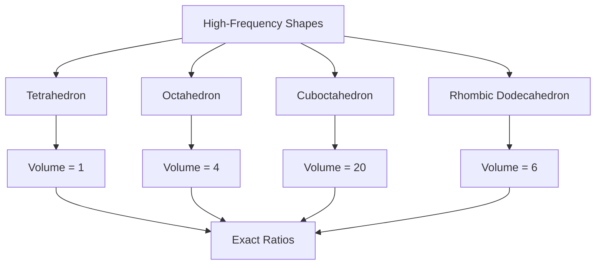
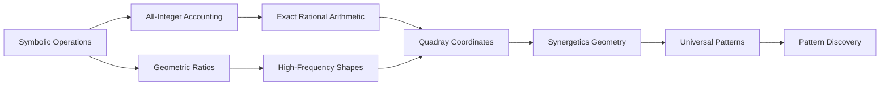

# Core Concept Guide: Symbolic Operations on All-Integer Accounting

## The Fundamental Approach of Synergetics

This guide explains the core concept that underlies the entire Synergetics framework: **symbolic operations on all-integer accounting based upon ratios (geometrically based upon high frequency shapes) of the Synergetics geometry and Quadray/4D coordinates**.

## Understanding the Core Components

### 1. Symbolic Operations

**Symbolic operations** refer to exact mathematical manipulations that maintain perfect precision without approximation. Unlike floating-point arithmetic, symbolic operations preserve the exact relationships between numbers.

```python
# Traditional floating-point (approximate)
0.1 + 0.2  # Returns 0.30000000000000004 (approximate!)

# Symbolic operations (exact)
from symergetics import SymergeticsNumber
a = SymergeticsNumber(1, 10)  # 1/10 = 0.1 exactly
b = SymergeticsNumber(1, 5)   # 1/5 = 0.2 exactly
result = a + b  # Returns 3/10 = 0.3 exactly
```

### 2. All-Integer Accounting

**All-integer accounting** means expressing all mathematical relationships as exact ratios of integers. This eliminates floating-point errors and maintains mathematical integrity.

```python
# Instead of: π ≈ 3.14159... (infinite decimal)
# We use: π ≈ 22/7 = 3.142857... (exact rational approximation)

from symergetics import SymergeticsNumber
pi_approximation = SymergeticsNumber(22, 7)  # Exact 22/7 ratio
print(pi_approximation)  # 22/7 (3.14285714)
```

### 3. Ratios Geometrically Based on High-Frequency Shapes

**Geometric ratios** are derived from the exact proportions of high-frequency polyhedral shapes. These shapes provide the fundamental ratios that underpin all synergetic calculations.



### 4. Synergetics Geometry

**Synergetics geometry** is Buckminster Fuller's comprehensive geometric framework that unifies mathematics, physics, and philosophy through exact geometric relationships.

### 5. Quadray/4D Coordinates

**Quadray coordinates** are a four-dimensional tetrahedral coordinate system that enables exact spatial relationships in synergetic geometry.

```python
from symergetics import QuadrayCoordinate

# Point in Quadray coordinate system
point = QuadrayCoordinate(2, 1, 1, 0)
print(f"Quadray: ({point.a}, {point.b}, {point.c}, {point.d})")

# Convert to Cartesian coordinates
x, y, z = point.to_xyz()
print(f"Cartesian: ({x}, {y}, {z})")
```

## How the Components Work Together

The core concept integrates all these components into a unified system:



### Step-by-Step Integration

1. **Start with Symbolic Operations**: Use exact arithmetic instead of floating-point
2. **Apply All-Integer Accounting**: Express relationships as integer ratios
3. **Derive Geometric Ratios**: Extract proportions from high-frequency shapes
4. **Use Quadray Coordinates**: Represent spatial relationships in 4D tetrahedral space
5. **Build Synergetics Framework**: Create comprehensive geometric understanding
6. **Discover Universal Patterns**: Reveal fundamental relationships in nature

## Practical Examples

### Example 1: Exact Volume Calculations

```python
from symergetics import QuadrayCoordinate, integer_tetra_volume

# Define tetrahedron vertices in Quadray coordinates
vertices = [
    QuadrayCoordinate(0, 0, 0, 0),  # Origin
    QuadrayCoordinate(2, 1, 1, 0),  # Face center
    QuadrayCoordinate(2, 1, 0, 1),  # Edge center
    QuadrayCoordinate(2, 0, 1, 1)   # Vertex
]

# Calculate exact volume (symbolic operation on geometric ratios)
volume = integer_tetra_volume(*vertices)
print(f"Tetrahedral volume: {volume}")  # Exact integer result
```

### Example 2: Scheherazade Number Patterns

```python
from symergetics import SymergeticsNumber
from symergetics.computation.palindromes import is_palindromic

# Calculate Scheherazade number (1001^2)
scheherazade_2 = SymergeticsNumber(1001) ** 2
print(f"1001² = {scheherazade_2}")

# Check for palindromic patterns (all-integer accounting)
is_palindrome = is_palindromic(scheherazade_2)
print(f"Is palindromic: {is_palindrome}")

# The result 1002001 reads the same forwards and backwards
# This demonstrates exact ratio patterns in high-frequency calculations
```

### Example 3: Geometric Transformations

```python
from symergetics import QuadrayCoordinate
import numpy as np

# Create a point in Quadray space
point = QuadrayCoordinate(3, 2, 1, 0)

# Apply geometric transformation (symbolic operation)
# This maintains exact relationships through matrix operations
transformation = np.array([
    [1, 0, 0, 0],
    [0, 1, 0, 0],
    [0, 0, 1, 0],
    [0, 0, 0, 1]
])

transformed_point = point.transform(transformation)
print(f"Transformed point: {transformed_point}")
```

## Key Principles in Action

### Principle 1: Exactness Over Approximation

```python
# WRONG: Floating-point arithmetic loses precision
wrong_result = 0.1 + 0.2 + 0.3  # 0.6000000000000001

# RIGHT: Symbolic operations maintain exact relationships
from symergetics import SymergeticsNumber
a = SymergeticsNumber(1, 10)  # 1/10
b = SymergeticsNumber(1, 5)   # 1/5
c = SymergeticsNumber(3, 10)  # 3/10
correct_result = a + b + c     # Exactly 6/10 = 3/5
```

### Principle 2: Geometric Ratios from High-Frequency Shapes

The system derives fundamental ratios from polyhedral geometry:

- **Tetrahedron**: 1 unit volume (fundamental ratio)
- **Octahedron**: 4:1 volume ratio
- **Cube**: 3:1 volume ratio
- **Cuboctahedron**: 20:1 volume ratio

These ratios form the basis for all-integer accounting in synergetic calculations.

### Principle 3: Quadray Coordinate Integration

```python
# Quadray coordinates enable exact spatial relationships
origin = QuadrayCoordinate(0, 0, 0, 0)
vertex = QuadrayCoordinate(2, 0, 0, 0)  # Along tetrahedral vector

# Distance calculation maintains exact ratios
distance = origin.distance_to(vertex)
print(f"Exact distance: {distance}")  # Exact rational result
```

## Why This Approach Matters

### Precision and Accuracy

Traditional mathematical methods accumulate errors through approximation. The synergetic approach maintains exact relationships throughout all calculations, enabling:

- **Pattern Discovery**: Exact ratios reveal hidden mathematical patterns
- **Geometric Integrity**: Spatial relationships remain precise
- **Scientific Accuracy**: Calculations maintain mathematical truth

### Universal Patterns

By using exact ratios derived from high-frequency shapes, the system discovers universal patterns that appear across:

- **Mathematics**: Number theory and algebraic relationships
- **Physics**: Natural laws and physical constants
- **Biology**: Growth patterns and structural relationships
- **Architecture**: Efficient structural designs
- **Philosophy**: Fundamental principles of organization

### Research Applications

This approach enables breakthroughs in:

- **Active Inference**: Exact arithmetic prevents computational artifacts
- **Cognitive Science**: Precise pattern recognition in neural systems
- **Materials Science**: Optimal molecular arrangements
- **Climate Modeling**: Exact ratio relationships in environmental systems
- **Financial Analysis**: Precise risk calculations and pattern recognition

## Getting Started with the Core Concept

To work with this framework effectively:

1. **Use Symbolic Operations**: Always prefer `SymergeticsNumber` over floating-point
2. **Apply All-Integer Accounting**: Express relationships as exact ratios
3. **Leverage Geometric Ratios**: Use proportions from high-frequency shapes
4. **Work in Quadray Coordinates**: Utilize the 4D tetrahedral coordinate system
5. **Explore Synergetics Geometry**: Study the comprehensive geometric framework

```python
# Complete example integrating all core concepts
from symergetics import SymergeticsNumber, QuadrayCoordinate
from symergetics.geometry.polyhedra import integer_tetra_volume

# 1. Symbolic operations with exact ratios
ratio_a = SymergeticsNumber(3, 4)  # 3/4
ratio_b = SymergeticsNumber(1, 6)  # 1/6
exact_sum = ratio_a + ratio_b       # Exactly 11/12

# 2. Geometric ratios from high-frequency shapes
vertices = [
    QuadrayCoordinate(0, 0, 0, 0),
    QuadrayCoordinate(3, 1, 1, 1),  # High-frequency tetrahedral coordinates
    QuadrayCoordinate(3, 2, 0, 1),
    QuadrayCoordinate(3, 0, 2, 1)
]

# 3. Symbolic operations on geometric ratios
volume = integer_tetra_volume(*vertices)  # Exact volume calculation

print(f"Exact ratio sum: {exact_sum}")
print(f"Geometric volume: {volume}")
```

This integrated approach demonstrates the power of **symbolic operations on all-integer accounting based upon ratios geometrically based on high-frequency shapes** in the **Synergetics geometry and Quadray/4D coordinates** system.

---

*"The most beautiful thing we can experience is the mysterious. It is the source of all true art and science."*
— Albert Einstein

*"Synergetics is the geometry of thinking in four dimensions."*
— Buckminster Fuller
