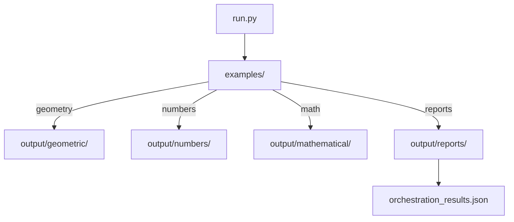

# Examples

## Basic Usage

### Exact Rational Arithmetic

```python
from symergetics import SymergeticsNumber

# Create exact rational numbers
a = SymergeticsNumber(3, 4)  # 3/4 = 0.75
b = SymergeticsNumber(1, 2)  # 1/2 = 0.5

# Exact arithmetic - no floating-point errors
result = a + b  # = 5/4 = 1.25 exactly
print(f"3/4 + 1/2 = {result}")  # "3/4 + 1/2 = 5/4 (1.25000000)"

# Convert to float when needed
float_result = result.to_float()
print(f"As float: {float_result}")  # 1.25
```

### Quadray Coordinate System

```python
from symergetics import QuadrayCoordinate

# Create a coordinate (automatically normalized)
coord = QuadrayCoordinate(2, 1, 1, 0)

# Convert to Cartesian coordinates
x, y, z = coord.to_xyz()
print(f"Quadray {coord} -> XYZ ({x:.3f}, {y:.3f}, {z:.3f})")

# Distance calculations
origin = QuadrayCoordinate(0, 0, 0, 0)
distance = coord.distance_to(origin)
print(f"Distance from origin: {distance:.6f}")
```

### Polyhedral Geometry

```python
from symergetics import Tetrahedron, Octahedron, Cube, Cuboctahedron

# Create polyhedra
tetra = Tetrahedron()
octa = Octahedron()
cube = Cube()
cubocta = Cuboctahedron()

# Volume calculations in IVM units
print(f"Tetrahedron volume: {tetra.volume()}")     # 1
print(f"Octahedron volume: {octa.volume()}")       # 4
print(f"Cube volume: {cube.volume()}")             # 3
print(f"Cuboctahedron volume: {cubocta.volume()}") # 20

# Access vertices
vertices = tetra.vertices
print(f"Tetrahedron has {len(vertices)} vertices")
```

## Advanced Examples

### Scheherazade Mathematics

```python
from symergetics import scheherazade_power, primorial
from symergetics.computation.palindromes import is_palindromic

# Calculate Scheherazade numbers (powers of 1001)
scheherazade_1 = scheherazade_power(1)  # 1001
scheherazade_6 = scheherazade_power(6)  # Contains Pascal's triangle

print(f"1001¹ = {scheherazade_1}")
print(f"1001⁶ = {scheherazade_6}")

# Check for palindromes
print(f"Is 1001 palindromic? {is_palindromic(1001)}")  # True

# Calculate primorials
p13 = primorial(13)  # 13# = 2×3×5×7×11×13 = 30,030
print(f"13# primorial = {p13}")
## Orchestrated Examples

You can run the curated suite via the orchestration script:

```bash
python3 run.py          # setup (uv), tests, examples
python3 run.py --examples-only
python3 run.py --skip-setup --skip-tests
```

Artifacts are organized under `output/`.



Example outputs (ASCII):

- Geometric
  - `output/geometric/polyhedra/{tetrahedron_ascii.txt, cube_ascii.txt, octahedron_ascii.txt, cuboctahedron_ascii.txt}`
  - `output/ivm_lattice_size_3_ascii.txt`
- Numbers
  - `output/numbers/palindromes/palindrome_pattern_*.txt`
  - `output/numbers/primorials/primorial_distribution_max_n_15_ascii.txt`
  - `output/numbers/scheherazade/scheherazade_pattern_*`
- Mathematical
  - `output/mathematical/continued_fractions/continued_fraction_*_ascii.txt`
  - `output/mathematical/base_conversions/base_conversion_*_ascii.txt`

PNG examples are generated by `examples/png_visualization_demo.py` when the matplotlib backend is used.

```text

### Mnemonic Encoding

```python
from symergetics.utils.mnemonics import mnemonic_encode, create_memory_aid

# Encode large numbers mnemonically
large_number = 25000000000  # 25 billion atomic diameters per inch
mnemonic = mnemonic_encode(large_number)
print(f"25 billion: {mnemonic}")

# Create comprehensive memory aids
aids = create_memory_aid(1001)
print("Scheherazade number 1001:")
for style, mnemonic in aids.items():
    print(f"  {style}: {mnemonic}")
```

### Coordinate System Conversions

```python
from symergetics.utils.conversion import xyz_to_quadray, quadray_to_xyz

# Convert between coordinate systems
xyz_point = (1.0, 0.5, -0.5)
quadray_point = xyz_to_quadray(*xyz_point)

print(f"XYZ {xyz_point}")
print(f"Quadray {quadray_point}")

# Round-trip conversion
back_to_xyz = quadray_to_xyz(quadray_point)
print(f"Back to XYZ {back_to_xyz}")
```

### Volume Calculations

```python
from symergetics.geometry.polyhedra import integer_tetra_volume
from symergetics.core.coordinates import QuadrayCoordinate

# Calculate volume of custom tetrahedron
p0 = QuadrayCoordinate(0, 0, 0, 0)
p1 = QuadrayCoordinate(2, 1, 0, 1)
p2 = QuadrayCoordinate(2, 1, 1, 0)
p3 = QuadrayCoordinate(2, 0, 1, 1)

volume = integer_tetra_volume(p0, p1, p2, p3)
print(f"Tetrahedron volume: {volume} IVM units")
```

## Research Applications

### Active Inference Example

```python
from symergetics import SymergeticsNumber
import math

# Exact π calculation for precision-dependent calculations
pi_exact = SymergeticsNumber.from_float(math.pi, max_denominator=1000000)
print(f"Exact π approximation: {pi_exact}")

# Use in precision-critical calculations
circumference = SymergeticsNumber(2) * pi_exact * SymergeticsNumber(5)
print(f"Circle circumference (r=5): {circumference}")
```

### Crystallographic Analysis

```python
from symergetics.core.constants import SymergeticsConstants
from symergetics import SymergeticsNumber

# Use exact rational relationships for crystal analysis
tetra_ratio = SymergeticsConstants.VOLUME_RATIOS['tetrahedron']
octa_ratio = SymergeticsConstants.VOLUME_RATIOS['octahedron']

ratio = octa_ratio / tetra_ratio
print(f"Octahedron:Tetrahedron volume ratio: {ratio}")  # Exactly 4:1
```

### Cosmic Scaling Calculations

```python
from symergetics.core.constants import COSMIC_ABUNDANCE

# Fuller's 14-illion cosmic abundance number
print(f"Cosmic abundance: {COSMIC_ABUNDANCE}")

# Calculate with exact precision
atomic_scale = SymergeticsNumber(25_000_000_000)  # Atomic diameters per inch
earth_circumference = SymergeticsNumber(1_296_000)  # Seconds of arc

# Exact scaling relationships
print(f"Atomic scale: {atomic_scale}")
print(f"Earth circumference: {earth_circumference}")
```

## Integration Examples

### With NumPy

```python
import numpy as np
from symergetics import QuadrayCoordinate

# Convert multiple coordinates
coords = [QuadrayCoordinate(i, j, k, l)
          for i in range(3) for j in range(3) for k in range(3) for l in range(3)]

# Batch convert to XYZ
xyz_coords = np.array([coord.to_xyz() for coord in coords])
print(f"Converted {len(coords)} coordinates to XYZ")
```

### With SymPy (for symbolic mathematics)

```python
from symergetics import SymergeticsNumber
from symergetics.computation.primorials import scheherazade_power

# Use with symbolic computation
s3 = scheherazade_power(3)
print(f"Scheherazade cube: {s3}")

# Access underlying fraction for symbolic work
fraction = s3.value
print(f"As fraction: {fraction}")
```

### Performance Benchmarking

```python
import time
from symergetics import scheherazade_power

# Benchmark large calculations
start_time = time.time()
large_power = scheherazade_power(10)  # 1001^10
end_time = time.time()

print(f"Calculated 1001^10 in {end_time - start_time:.4f} seconds")
print(f"Result has {len(str(large_power.value.numerator))} digits")
```

## Error Handling

```python
from symergetics import QuadrayCoordinate
from symergetics.utils.conversion import coordinate_system_info

# Handle invalid inputs gracefully
try:
    invalid_coord = QuadrayCoordinate("invalid", 1, 2, 3)
except (TypeError, ValueError) as e:
    print(f"Error: {e}")

# Handle invalid coordinate systems
try:
    info = coordinate_system_info("invalid_system")
except ValueError as e:
    print(f"Error: {e}")

# Valid usage
info = coordinate_system_info("quadray")
print(f"Quadray system: {info['description']}")
```

## Custom Polyhedra

```python
from symergetics.core.coordinates import QuadrayCoordinate
from symergetics.geometry.polyhedra import integer_tetra_volume

# Define custom tetrahedron
vertices = [
    QuadrayCoordinate(0, 0, 0, 0),
    QuadrayCoordinate(1, 0, 0, 0),
    QuadrayCoordinate(0, 1, 0, 0),
    QuadrayCoordinate(0, 0, 1, 0)
]

# Calculate volume
volume = integer_tetra_volume(*vertices)
print(f"Custom tetrahedron volume: {volume}")
```

## Complete Research Workflow

```python
# Complete example of research workflow
from symergetics import *
from symergetics.computation.palindromes import analyze_scheherazade_ssrcd

# 1. Exact arithmetic setup
a = SymergeticsNumber(22, 7)  # π approximation
b = SymergeticsNumber(355, 113)  # Better π approximation

print(f"π approximations: {a} vs {b}")

# 2. Geometric calculations
coord = QuadrayCoordinate(2, 1, 1, 0)
magnitude = coord.magnitude()
print(f"Vector magnitude: {magnitude}")

# 3. Pattern analysis
analysis = analyze_scheherazade_ssrcd(6)
print(f"Scheherazade^6 analysis: {len(analysis['palindromic_patterns'])} patterns found")

# 4. Memory encoding
from symergetics.utils.mnemonics import create_memory_aid
aids = create_memory_aid(30030)  # 13# primorial
print(f"Memory aid: {aids['synergetics_context']}")

print("Research workflow completed successfully!")
```
