# Future Implications and Research Directions in Synergetics

## Introduction to Synergetic Futures

This comprehensive exploration examines the future implications of Buckminster Fuller's Synergetics, exploring emerging research directions, technological integrations, and transformative applications that will shape the coming decades. Drawing from current trends and synergetic principles, we envision how this mathematical and philosophical framework will continue to evolve and influence multiple domains.

## Emerging Technological Paradigms

### Quantum Computing and Synergetic Algorithms

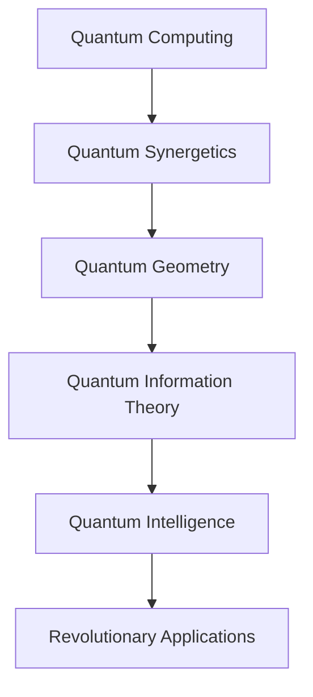

#### Quantum Synergetic Computing

```python
def quantum_synergetic_algorithm(problem_space: dict) -> dict:
    """
    Design quantum algorithms using synergetic principles.
    
    Args:
        problem_space: Definition of computational problem
        
    Returns:
        Quantum synergetic algorithm design
    """
    # Leverage quantum superposition for pattern recognition
    # Use synergetic geometry for quantum state optimization
    # Implement collaborative quantum intelligence
    
    algorithm_design = {
        'quantum_superposition': optimize_superposition_states(problem_space),
        'synergetic_entanglement': design_entanglement_patterns(problem_space),
        'geometric_quantum_gates': create_geometric_gate_operations(problem_space),
        'collaborative_quantum_intelligence': implement_quantum_collaboration(problem_space)
    }
    
    return algorithm_design
```

### Artificial Intelligence and Synergetic Intelligence

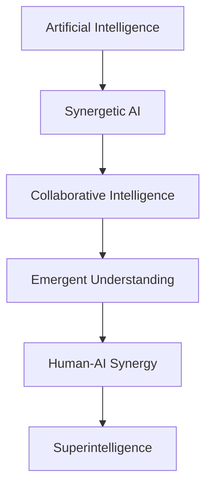

#### Synergetic AI Framework

```python
def synergetic_ai_system(human_intelligence: dict, ai_capabilities: dict) -> dict:
    """
    Design synergetic AI systems that amplify human intelligence.
    
    Args:
        human_intelligence: Human cognitive capabilities and patterns
        ai_capabilities: AI computational and learning abilities
    
    Returns:
        Synergetic AI system architecture
    """
    # Create collaborative intelligence frameworks
    # Design emergent understanding mechanisms
    # Implement human-AI synergy protocols
    
    synergy_system = {
        'collaborative_frameworks': design_collaborative_intelligence(human_intelligence, ai_capabilities),
        'emergent_understanding': create_emergent_cognition(human_intelligence, ai_capabilities),
        'human_ai_synergy': implement_synergy_protocols(human_intelligence, ai_capabilities),
        'ethical_governance': establish_ethical_frameworks(human_intelligence, ai_capabilities),
        'evolutionary_adaptation': design_adaptive_systems(human_intelligence, ai_capabilities)
    }
    
    return synergy_system
```

## Advanced Materials and Nanotechnology

### Synergetic Material Design

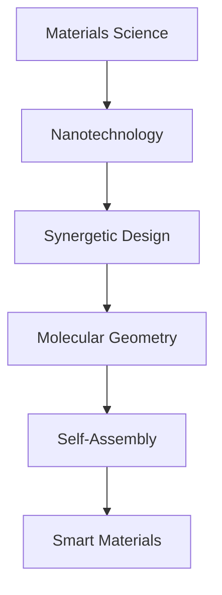

#### Molecular Synergetic Engineering

```python
def synergetic_molecular_design(material_requirements: dict) -> dict:
    """
    Design materials using synergetic molecular principles.
    
    Args:
        material_requirements: Desired material properties and functions
    
    Returns:
        Synergetic molecular design specifications
    """
    # Apply geometric optimization principles
    # Implement self-assembly mechanisms
    # Create adaptive material systems
    
    molecular_design = {
        'geometric_optimization': optimize_molecular_geometry(material_requirements),
        'self_assembly_mechanisms': design_self_assembly_processes(material_requirements),
        'adaptive_properties': create_adaptive_material_systems(material_requirements),
        'synergetic_efficiency': maximize_synergetic_efficiency(material_requirements),
        'sustainability_metrics': ensure_sustainable_design(material_requirements)
    }
    
    return molecular_design
```

### Biomimetic Materials Research

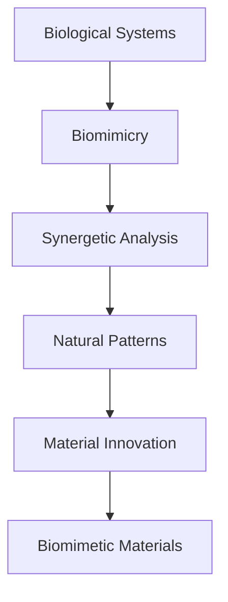

## Space Exploration and Cosmic Engineering

### Synergetic Space Architecture

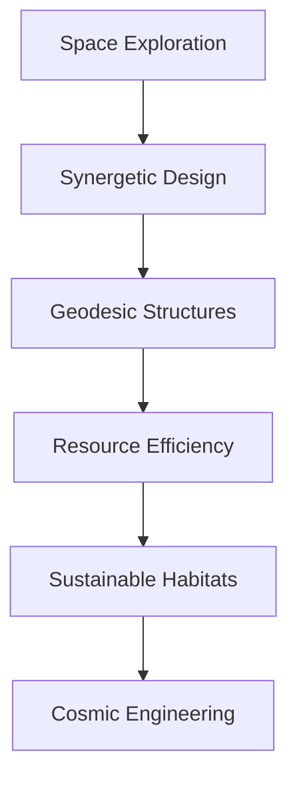

#### Space Habitat Optimization

```python
def synergetic_space_habitat_design(mission_requirements: dict) -> dict:
    """
    Design space habitats using synergetic principles.
    
    Args:
        mission_requirements: Space mission specifications and constraints
    
    Returns:
        Synergetic space habitat design
    """
    # Optimize structural geometry for space conditions
    # Maximize resource efficiency
    # Design sustainable life support systems
    
    habitat_design = {
        'structural_geometry': optimize_space_geometry(mission_requirements),
        'resource_efficiency': maximize_resource_utilization(mission_requirements),
        'life_support_systems': design_sustainable_habitats(mission_requirements),
        'adaptability_mechanisms': create_adaptive_systems(mission_requirements),
        'cosmic_integration': integrate_cosmic_principles(mission_requirements)
    }
    
    return habitat_design
```

### Interstellar Navigation Systems

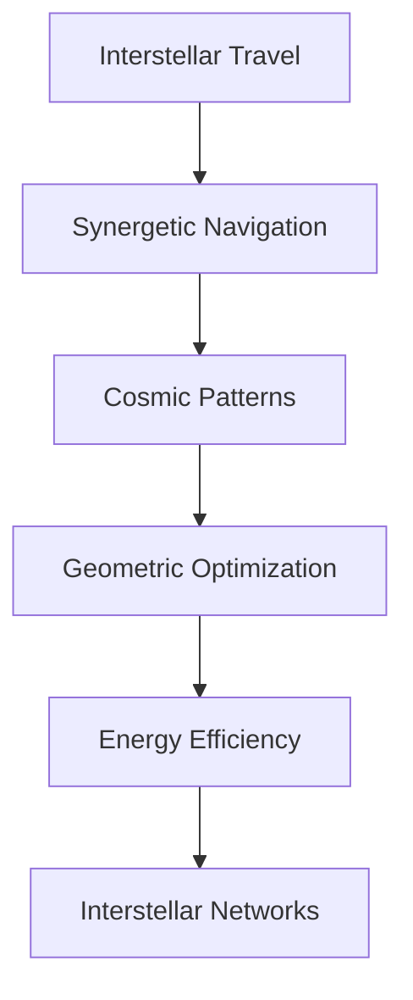

## Environmental and Climate Science

### Climate Synergetics

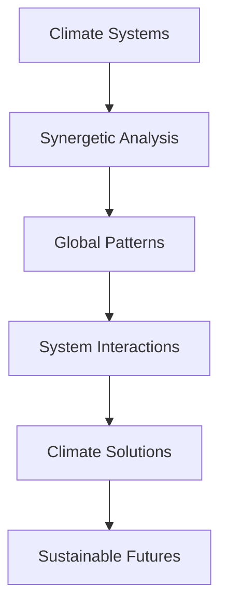

#### Global Climate Optimization

```python
def synergetic_climate_optimization(global_systems: dict) -> dict:
    """
    Optimize global climate systems using synergetic principles.
    
    Args:
        global_systems: Global climate system parameters
    
    Returns:
        Synergetic climate optimization strategies
    """
    # Analyze global system interactions
    # Identify synergetic optimization opportunities
    # Design collaborative climate solutions
    
    climate_optimization = {
        'system_interactions': analyze_global_interactions(global_systems),
        'synergetic_opportunities': identify_optimization_opportunities(global_systems),
        'collaborative_solutions': design_collaborative_strategies(global_systems),
        'adaptive_mechanisms': create_adaptive_systems(global_systems),
        'sustainability_metrics': establish_sustainability_criteria(global_systems)
    }
    
    return climate_optimization
```

### Ecosystem Restoration

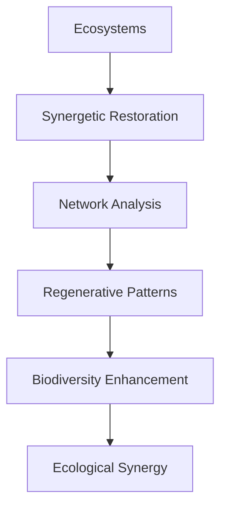

## Neuroscience and Cognitive Science

### Brain Synergetics

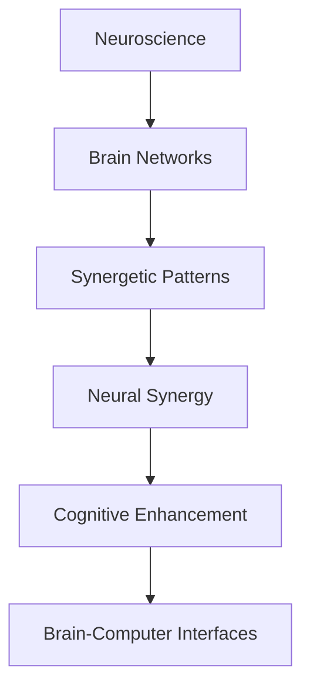

#### Neural Synergetic Modeling

```python
def synergetic_neural_modeling(brain_networks: dict) -> dict:
    """
    Model brain networks using synergetic principles.
    
    Args:
        brain_networks: Neural network structures and dynamics
    
    Returns:
        Synergetic neural model design
    """
    # Analyze neural network patterns
    # Identify synergetic cognitive processes
    # Design enhanced cognitive systems
    
    neural_modeling = {
        'network_patterns': analyze_neural_patterns(brain_networks),
        'synergetic_processes': identify_cognitive_synergy(brain_networks),
        'cognitive_enhancement': design_enhanced_cognition(brain_networks),
        'brain_computer_interfaces': create_neural_interfaces(brain_networks),
        'consciousness_modeling': model_consciousness_processes(brain_networks)
    }
    
    return neural_modeling
```

### Cognitive Enhancement Technologies

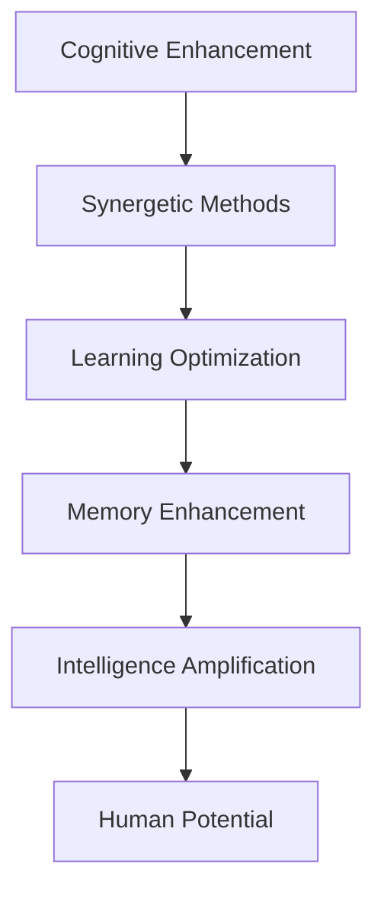

## Economic and Social Systems

### Synergetic Economics

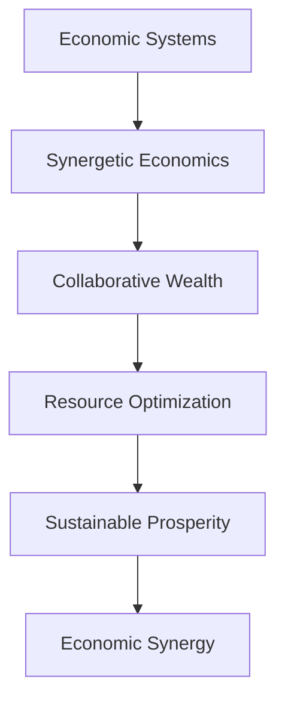

#### Collaborative Economic Modeling

```python
def synergetic_economic_model(economic_systems: dict) -> dict:
    """
    Model economic systems using synergetic principles.
    
    Args:
        economic_systems: Economic network structures and flows
    
    Returns:
        Synergetic economic model design
    """
    # Analyze economic network patterns
    # Identify collaborative wealth creation
    # Design sustainable economic systems
    
    economic_modeling = {
        'network_patterns': analyze_economic_networks(economic_systems),
        'collaborative_wealth': identify_wealth_synergy(economic_systems),
        'resource_optimization': optimize_resource_allocation(economic_systems),
        'sustainable_prosperity': design_sustainable_systems(economic_systems),
        'economic_synergy': maximize_economic_efficiency(economic_systems)
    }
    
    return economic_modeling
```

### Social Synergetics

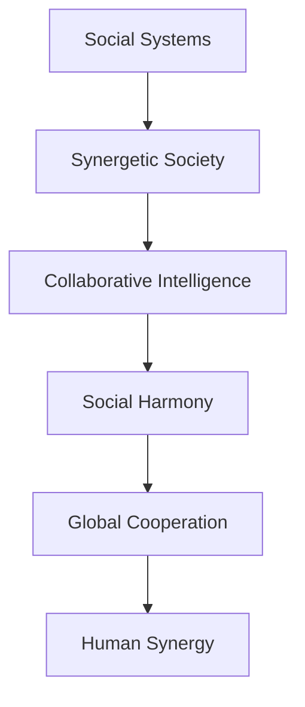

## Research Methodology Evolution

### Synergetic Research Frameworks

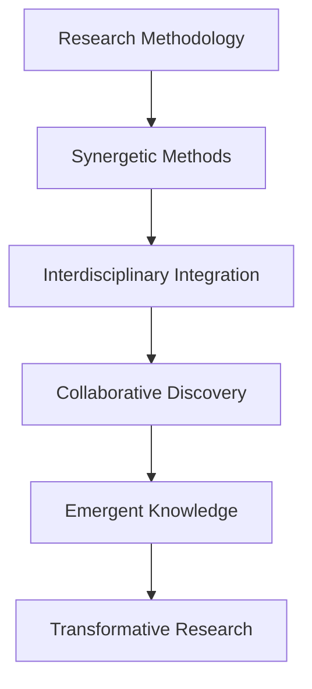

#### Advanced Research Design

```python
def synergetic_research_methodology(research_domain: str) -> dict:
    """
    Design research methodologies using synergetic principles.
    
    Args:
        research_domain: Area of research investigation
    
    Returns:
        Synergetic research methodology framework
    """
    # Integrate interdisciplinary approaches
    # Design collaborative research processes
    # Create emergent knowledge frameworks
    
    research_methodology = {
        'interdisciplinary_integration': design_cross_domain_approaches(research_domain),
        'collaborative_processes': create_collaborative_frameworks(research_domain),
        'emergent_discovery': establish_emergent_methodologies(research_domain),
        'adaptive_methodologies': develop_adaptive_strategies(research_domain),
        'transformative_outcomes': maximize_research_impact(research_domain)
    }
    
    return research_methodology
```

### Knowledge Synthesis Systems

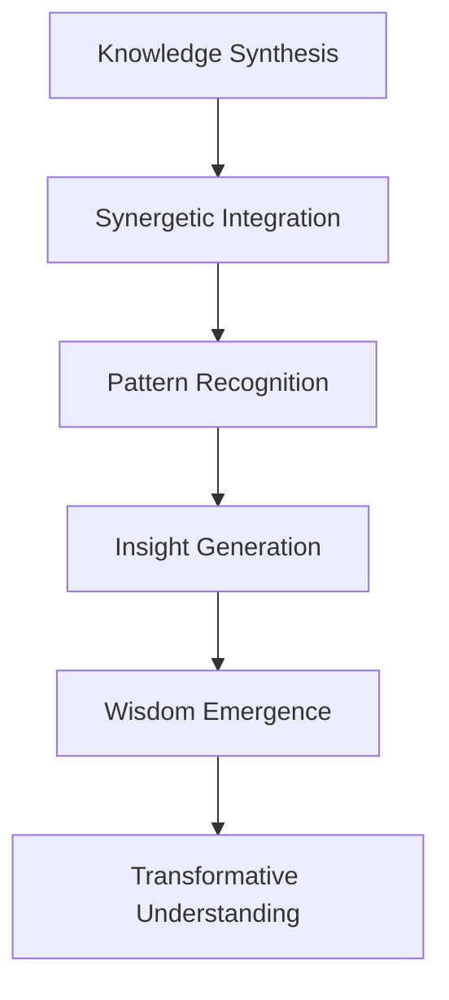

## Educational Innovation

### Synergetic Learning Ecosystems

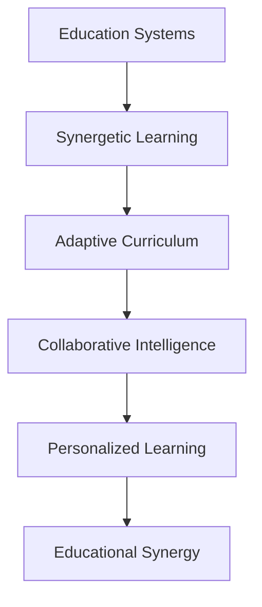

#### Future Learning Systems

```python
def synergetic_learning_ecosystem(learning_requirements: dict) -> dict:
    """
    Design future learning ecosystems using synergetic principles.
    
    Args:
        learning_requirements: Educational system specifications
    
    Returns:
        Synergetic learning ecosystem design
    """
    # Create adaptive learning environments
    # Implement collaborative intelligence systems
    # Design personalized learning trajectories
    
    learning_ecosystem = {
        'adaptive_environments': create_adaptive_spaces(learning_requirements),
        'collaborative_intelligence': implement_collaborative_systems(learning_requirements),
        'personalized_trajectories': design_individualized_paths(learning_requirements),
        'emergent_curricula': establish_adaptive_curricula(learning_requirements),
        'synergetic_assessment': develop_comprehensive_evaluation(learning_requirements)
    }
    
    return learning_ecosystem
```

### Lifelong Learning Networks

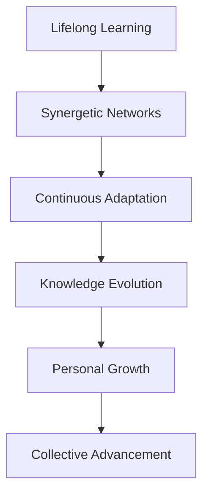

## Ethical and Philosophical Implications

### Synergetic Ethics

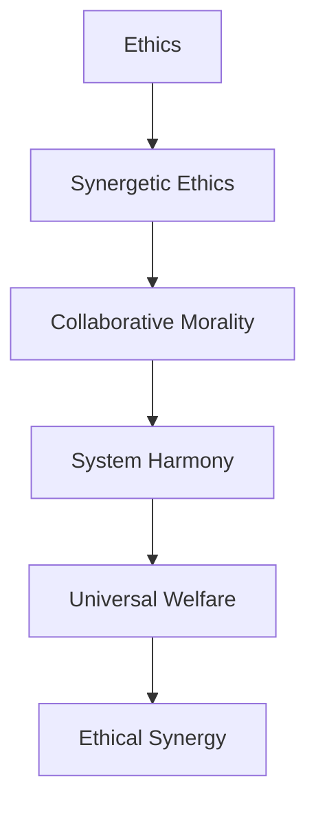

#### Ethical Framework Development

```python
def synergetic_ethical_framework(ethical_challenges: list) -> dict:
    """
    Develop ethical frameworks using synergetic principles.
    
    Args:
        ethical_challenges: Contemporary ethical dilemmas
    
    Returns:
        Synergetic ethical framework
    """
    # Analyze system-level ethical implications
    # Design collaborative ethical decision-making
    # Create harmonious ethical systems
    
    ethical_framework = {
        'system_analysis': analyze_ethical_systems(ethical_challenges),
        'collaborative_decision_making': design_ethical_collaboration(ethical_challenges),
        'harmonious_systems': create_ethical_harmony(ethical_challenges),
        'universal_welfare': maximize_collective_welfare(ethical_challenges),
        'evolutionary_ethics': establish_adaptive_ethics(ethical_challenges)
    }
    
    return ethical_framework
```

### Philosophical Evolution

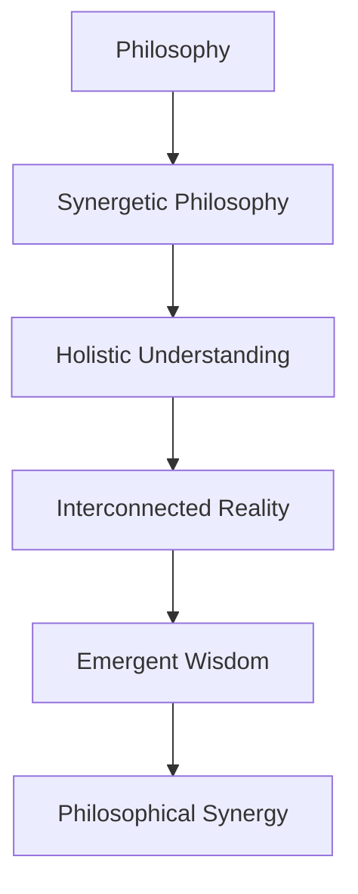

## Implementation Challenges and Strategies

### Scaling Synergetic Systems

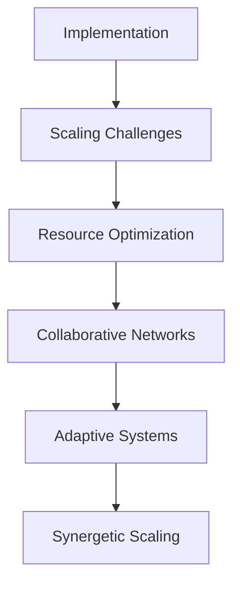

#### Scaling Strategy Framework

```python
def synergetic_scaling_strategy(system_requirements: dict) -> dict:
    """
    Develop scaling strategies for synergetic systems.
    
    Args:
        system_requirements: System scaling specifications
    
    Returns:
        Synergetic scaling strategy
    """
    # Optimize resource utilization
    # Design collaborative scaling mechanisms
    # Create adaptive scaling systems
    
    scaling_strategy = {
        'resource_optimization': optimize_scaling_resources(system_requirements),
        'collaborative_mechanisms': design_collaborative_scaling(system_requirements),
        'adaptive_systems': create_adaptive_scaling(system_requirements),
        'efficiency_maximization': maximize_scaling_efficiency(system_requirements),
        'sustainability_ensurance': ensure_scaling_sustainability(system_requirements)
    }
    
    return scaling_strategy
```

## Conclusion: The Synergetic Future

Synergetics represents a transformative framework for understanding and shaping the future. As we move toward increasingly complex and interconnected systems, synergetic principles offer:

1. **Unified Understanding**: A framework that transcends disciplinary boundaries
2. **Optimization Strategies**: Methods for achieving maximum efficiency
3. **Collaborative Intelligence**: Approaches that leverage collective wisdom
4. **Adaptive Systems**: Frameworks that evolve with changing conditions
5. **Ethical Integration**: Moral frameworks that consider system-wide implications
6. **Sustainable Solutions**: Designs that work in harmony with natural systems

The future of synergetics lies in its ability to integrate emerging technologies, address global challenges, and foster collaborative intelligence. As we continue to explore and develop synergetic principles, we move closer to Fuller's vision of a world where "everything is connected to everything else" and where human ingenuity creates solutions that benefit all of humanity.

---

## References and Further Reading

### Future Synergetics
- Fuller, R. Buckminster. *Operating Manual for Spaceship Earth*
- Kelly, Kevin. *What Technology Wants*
- Diamandis, Peter H. and Kotler, Steven. *Abundance: The Future Is Better Than You Think*

### Emerging Technologies
- Tegmark, Max. *Life 3.0: Being Human in the Age of Artificial Intelligence*
- Kurzweil, Ray. *The Singularity Is Near*
- Harari, Yuval Noah. *21 Lessons for the 21st Century*

### Research Directions
- [Synergetics Research Network](https://synergetics.us/)
- [Collaborative Intelligence Institute](https://collaborative-intelligence.org/)
- [Systems Thinking Applications](https://www.researchgate.net/)

---

*"The future is not something we await, but something we create."*
— Buckminster Fuller

*"Imagination is the beginning of creation. You imagine what you desire, you will what you imagine, and at last, you create what you will."*
— George Bernard Shaw

*"The best way to predict the future is to create it."*
— Buckminster Fuller
