# Geometric Patterns and Spatial Relationships in Synergetics

## Introduction to Synergetic Geometry

This comprehensive exploration examines the geometric foundations of Buckminster Fuller's Synergetics, focusing on the spatial patterns and relationships that emerge from **symbolic operations on all-integer accounting based upon ratios (geometrically based upon high frequency shapes)**. We investigate how geometric forms manifest universal principles of efficiency, stability, and beauty.

> **Cross-reference**: For a detailed explanation of the core concept, see the [Core Concept Guide](core-concept-guide.md). For mathematical foundations, see [Mathematical Foundations](mathematical-foundations-synergetics.md).

## The Geometry of Sphere Packing

### Closest Packing and the IVM Lattice

The Isotropic Vector Matrix (IVM) represents nature's most efficient sphere packing arrangement:

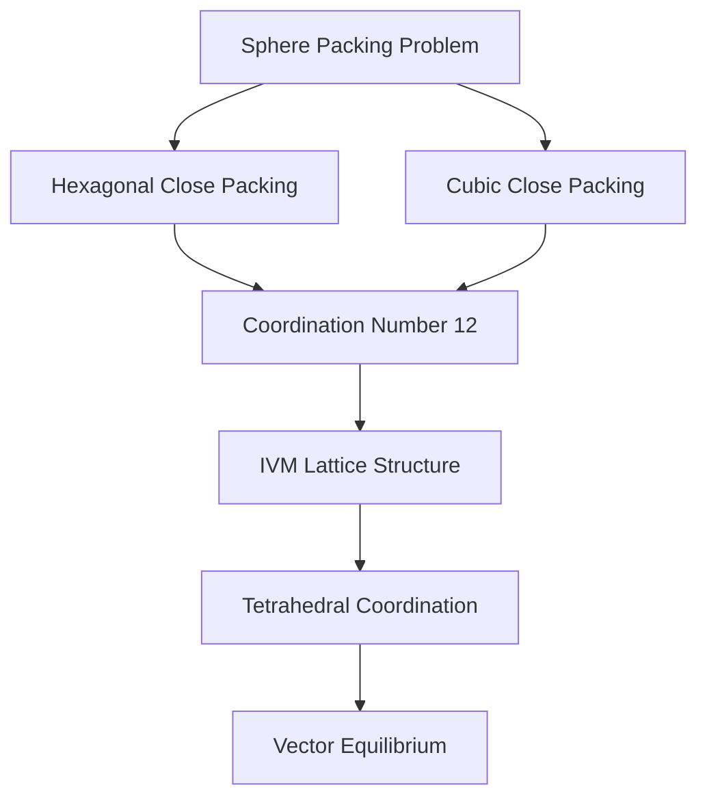
```mermaid
graph TD
    A[Sphere Packing Problem] --> B[Hexagonal Close Packing]
    A --> C[Cubic Close Packing]
    B --> D[Coordination Number 12]
    C --> D
    D --> E[IVM Lattice Structure]
    E --> F[Tetrahedral Coordination]
    F --> G[Vector Equilibrium]
```

#### The Mathematics of Optimal Packing

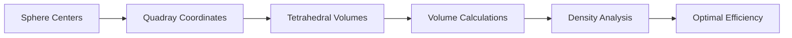
```mermaid
graph LR
    A[Sphere Centers] --> B[Quadray Coordinates]
    B --> C[Tetrahedral Volumes]
    C --> D[Volume Calculations]
    D --> E[Density Analysis]
    E --> F[Optimal Efficiency]
```

### Vector Equilibrium: The Cuboctahedron

The cuboctahedron represents the perfect balance of forces in three-dimensional space:

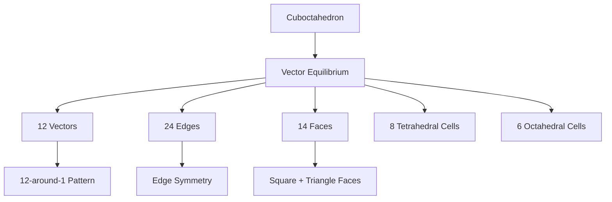
```mermaid
graph TD
    A[Cuboctahedron] --> B[Vector Equilibrium]
    B --> C[12 Vectors]
    B --> D[24 Edges]
    B --> E[14 Faces]
    B --> F[8 Tetrahedral Cells]
    B --> G[6 Octahedral Cells]
    C --> H[12-around-1 Pattern]
    D --> I[Edge Symmetry]
    E --> J[Square + Triangle Faces]
```

#### Structural Properties

```python
class Cuboctahedron:
    """
    Vector equilibrium with exact geometric properties.
    
    Volume: 20 tetrahedral units
    Faces: 8 equilateral triangles + 6 squares
    Edges: 24 equal length
    Vertices: 12, each connected to 4 others
    """
    
    @property
    def volume(self) -> int:
        """Exact volume in tetrahedral units."""
        return 20
    
    @property
    def num_faces(self) -> int:
        return 14  # 8 triangles + 6 squares
    
    @property
    def num_edges(self) -> int:
        return 24
    
    @property
    def num_vertices(self) -> int:
        return 12
```

## Polyhedral Relationships and Volume Ratios

### Exact Volume Relationships

Synergetics reveals precise volume ratios between Platonic solids:

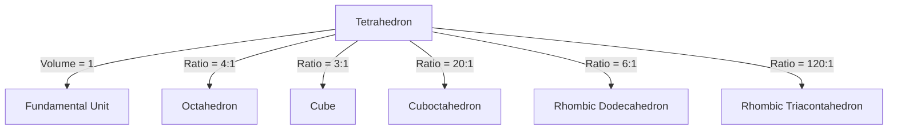
```mermaid
graph TD
    A[Tetrahedron] -->|Volume = 1| B[Fundamental Unit]
    A -->|Ratio = 4:1| C[Octahedron]
    A -->|Ratio = 3:1| D[Cube]
    A -->|Ratio = 20:1| E[Cuboctahedron]
    A -->|Ratio = 6:1| F[Rhombic Dodecahedron]
    A -->|Ratio = 120:1| G[Rhombic Triacontahedron]
```

#### Mathematical Derivation

The volume ratios emerge from the geometric relationships:


```mermaid
graph LR
    A[Edge Length] --> B[Tetrahedron Volume]
    B --> C[Derived Volumes]
    C --> D[Exact Ratios]
    D --> E[Geometric Constants]
    E --> F[Universal Patterns]
```

### The Rhombic Dodecahedron

This polyhedron represents the most efficient space-filling shape:

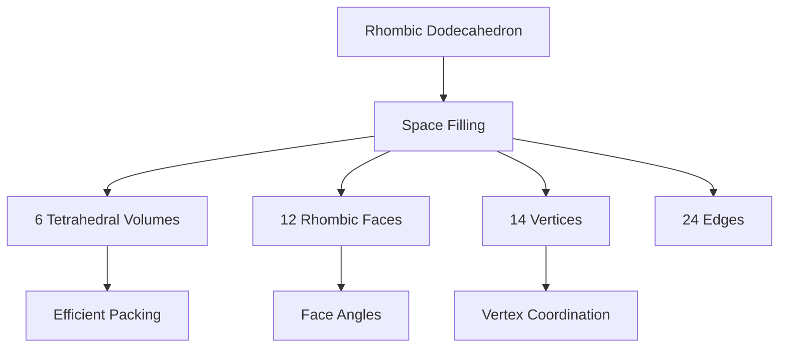
```mermaid
graph TD
    A[Rhombic Dodecahedron] --> B[Space Filling]
    B --> C[6 Tetrahedral Volumes]
    B --> D[12 Rhombic Faces]
    B --> E[14 Vertices]
    B --> F[24 Edges]
    C --> G[Efficient Packing]
    D --> H[Face Angles]
    E --> I[Vertex Coordination]
```

## Coordinate System Transformations

### Quadray to Cartesian Conversion

The transformation from tetrahedral to Cartesian coordinates reveals geometric insights:

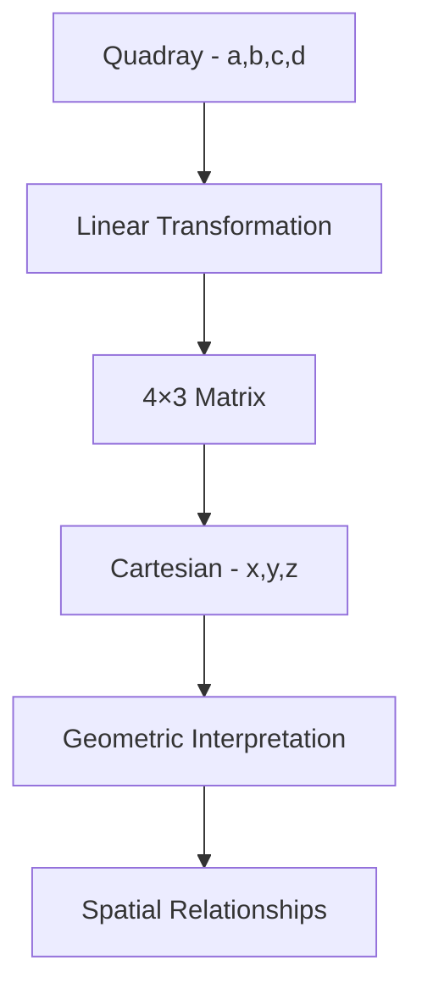
```mermaid
graph TD
    A[Quadray - a,b,c,d] --> B[Linear Transformation]
    B --> C[4×3 Matrix]
    C --> D[Cartesian - x,y,z]
    D --> E[Geometric Interpretation]
    E --> F[Spatial Relationships]
```

#### The Urner Embedding Matrix

```python
def urner_embedding(scale: float = 1.0) -> np.ndarray:
    """
    Generate the exact transformation matrix from Quadray to Cartesian coordinates.
    
    This matrix preserves geometric relationships and enables exact
    coordinate conversions between tetrahedral and Cartesian systems.
    """
    # Implementation of the precise 4×3 transformation matrix
    # Based on Fuller's geometric discoveries
    pass
```

### Symmetry Operations

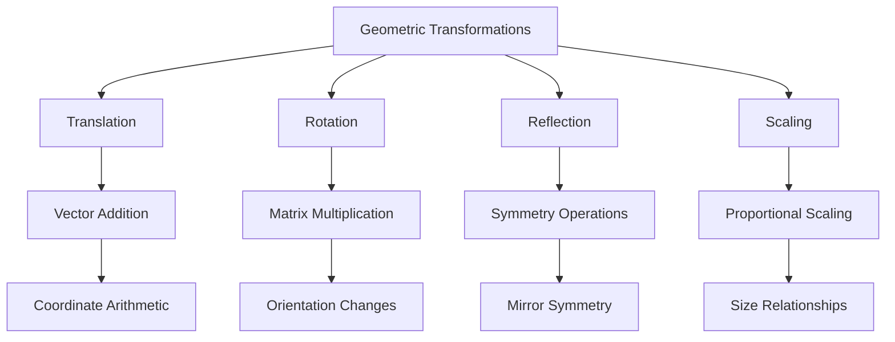
```mermaid
graph TD
    A[Geometric Transformations] --> B[Translation]
    A --> C[Rotation]
    A --> D[Reflection]
    A --> E[Scaling]
    B --> F[Vector Addition]
    C --> G[Matrix Multiplication]
    D --> H[Symmetry Operations]
    E --> I[Proportional Scaling]
    F --> J[Coordinate Arithmetic]
    G --> K[Orientation Changes]
    H --> L[Mirror Symmetry]
    I --> M[Size Relationships]
```

## Pattern Recognition in Geometric Structures

### Tessellation Patterns

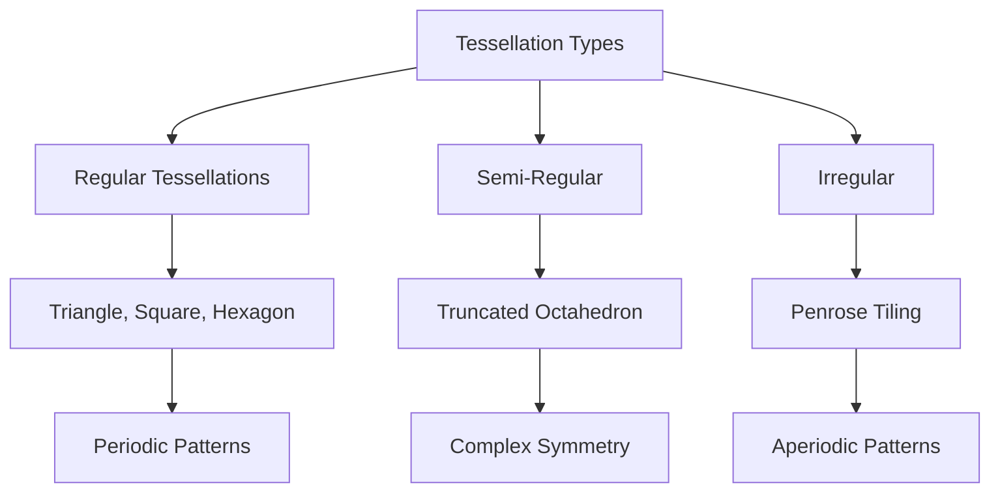
```mermaid
graph TD
    A[Tessellation Types] --> B[Regular Tessellations]
    A --> C[Semi-Regular]
    A --> D[Irregular]
    B --> E[Triangle, Square, Hexagon]
    C --> F[Truncated Octahedron]
    D --> G[Penrose Tiling]
    E --> H[Periodic Patterns]
    F --> I[Complex Symmetry]
    G --> J[Aperiodic Patterns]
```

### Fractal Geometry in Synergetics

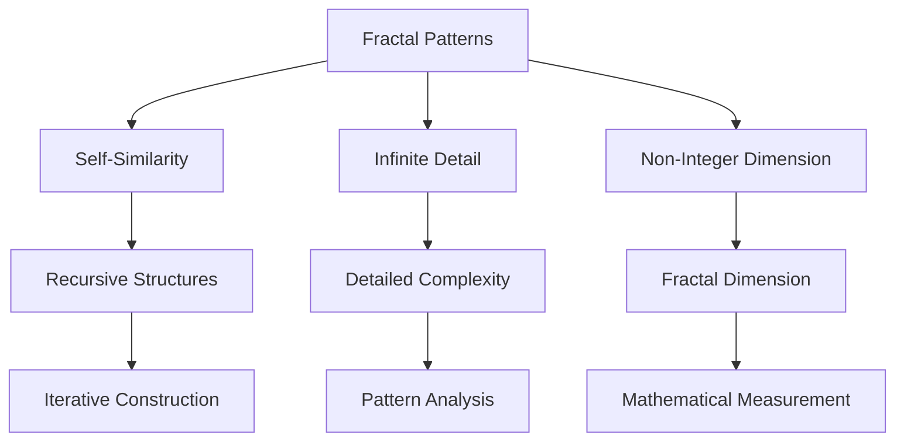
```mermaid
graph TD
    A[Fractal Patterns] --> B[Self-Similarity]
    A --> C[Infinite Detail]
    A --> D[Non-Integer Dimension]
    B --> E[Recursive Structures]
    C --> F[Detailed Complexity]
    D --> G[Fractal Dimension]
    E --> H[Iterative Construction]
    F --> I[Pattern Analysis]
    G --> J[Mathematical Measurement]
```

#### Sierpinski Tetrahedron

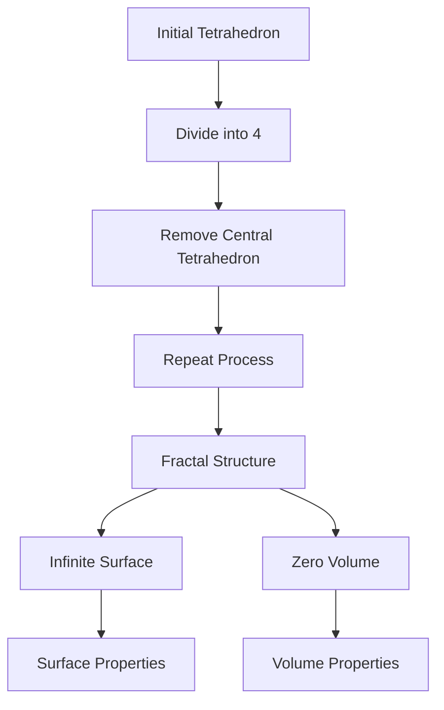
```mermaid
graph TD
    A[Initial Tetrahedron] --> B[Divide into 4]
    B --> C[Remove Central Tetrahedron]
    C --> D[Repeat Process]
    D --> E[Fractal Structure]
    E --> F[Infinite Surface]
    E --> G[Zero Volume]
    F --> H[Surface Properties]
    G --> I[Volume Properties]
```

## Spatial Symmetry and Group Theory

### Point Symmetry Groups

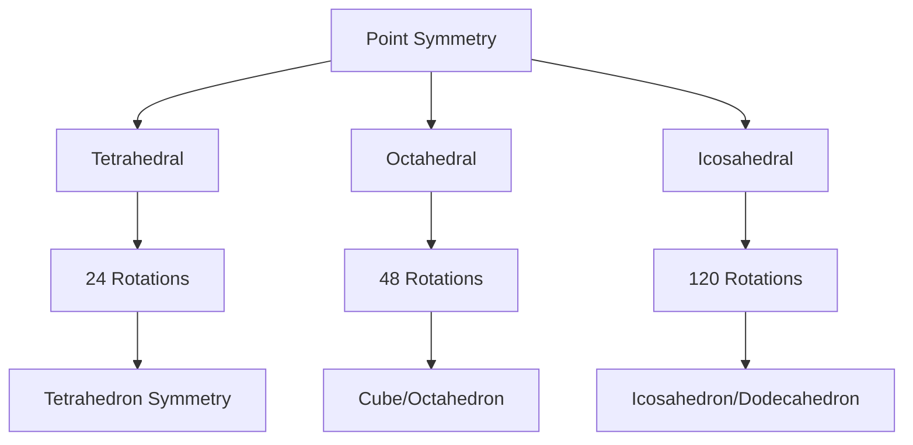
```mermaid
graph TD
    A[Point Symmetry] --> B[Tetrahedral]
    A --> C[Octahedral]
    A --> D[Icosahedral]
    B --> E[24 Rotations]
    C --> F[48 Rotations]
    D --> G[120 Rotations]
    E --> H[Tetrahedron Symmetry]
    F --> I[Cube/Octahedron]
    G --> J[Icosahedron/Dodecahedron]
```

### Continuous Symmetries

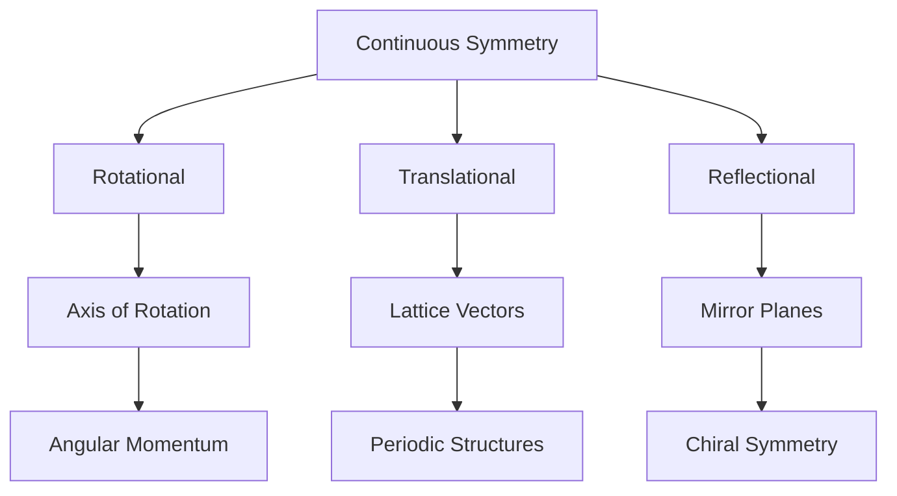
```mermaid
graph TD
    A[Continuous Symmetry] --> B[Rotational]
    A --> C[Translational]
    A --> D[Reflectional]
    B --> E[Axis of Rotation]
    C --> F[Lattice Vectors]
    D --> G[Mirror Planes]
    E --> H[Angular Momentum]
    F --> I[Periodic Structures]
    G --> J[Chiral Symmetry]
```

## Applications in Architecture and Design

### Tensegrity Structures

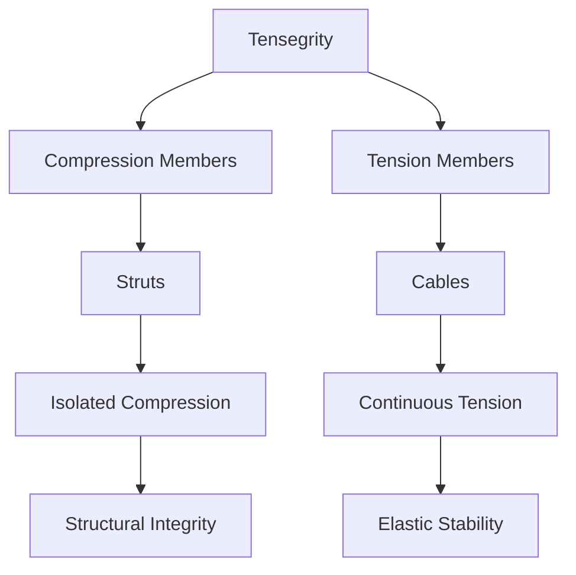
```mermaid
graph TD
    A[Tensegrity] --> B[Compression Members]
    A --> C[Tension Members]
    B --> D[Struts]
    C --> E[Cables]
    D --> F[Isolated Compression]
    E --> G[Continuous Tension]
    F --> H[Structural Integrity]
    G --> I[Elastic Stability]
```

### Geodesic Dome Construction

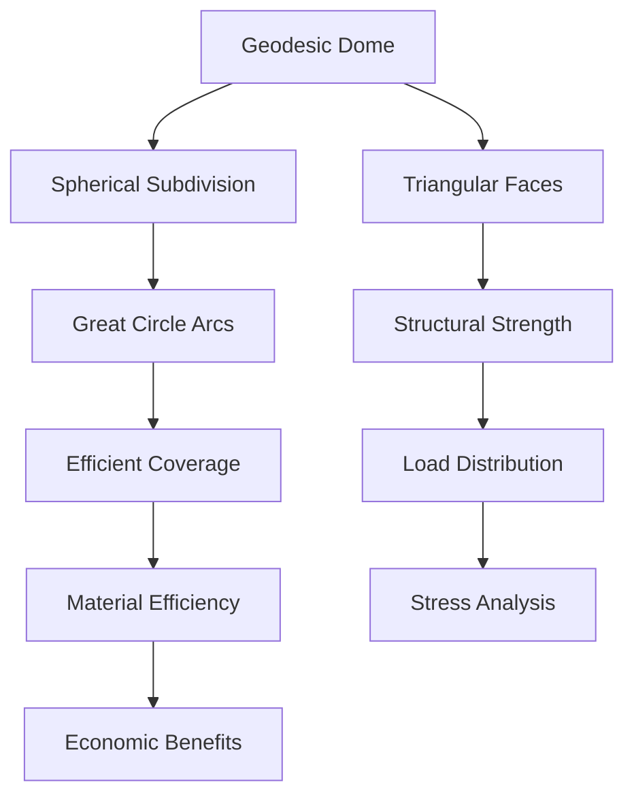
```mermaid
graph TD
    A[Geodesic Dome] --> B[Spherical Subdivision]
    A --> C[Triangular Faces]
    B --> D[Great Circle Arcs]
    C --> E[Structural Strength]
    D --> F[Efficient Coverage]
    E --> G[Load Distribution]
    F --> H[Material Efficiency]
    G --> I[Stress Analysis]
    H --> J[Economic Benefits]
```

## Biological and Natural Patterns

### Honeycomb Geometry

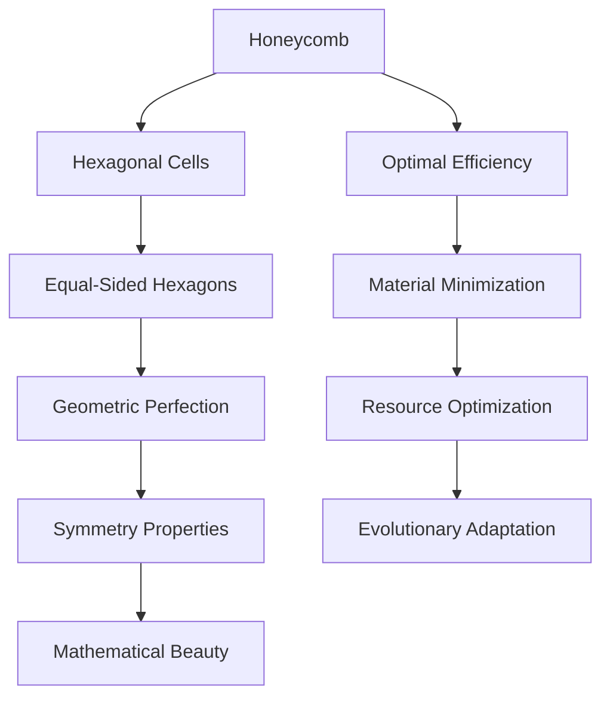
```mermaid
graph TD
    A[Honeycomb] --> B[Hexagonal Cells]
    A --> C[Optimal Efficiency]
    B --> D[Equal-Sided Hexagons]
    C --> E[Material Minimization]
    D --> F[Geometric Perfection]
    E --> G[Resource Optimization]
    F --> H[Symmetry Properties]
    G --> I[Evolutionary Adaptation]
    H --> J[Mathematical Beauty]
```

### Virus Capsid Structures

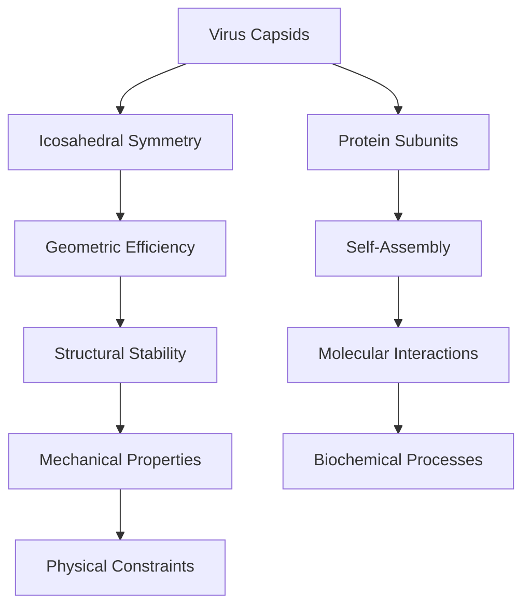
```mermaid
graph TD
    A[Virus Capsids] --> B[Icosahedral Symmetry]
    A --> C[Protein Subunits]
    B --> D[Geometric Efficiency]
    C --> E[Self-Assembly]
    D --> F[Structural Stability]
    E --> G[Molecular Interactions]
    F --> H[Mechanical Properties]
    G --> I[Biochemical Processes]
    H --> J[Physical Constraints]
```

## Crystallographic Applications

### Lattice Structures

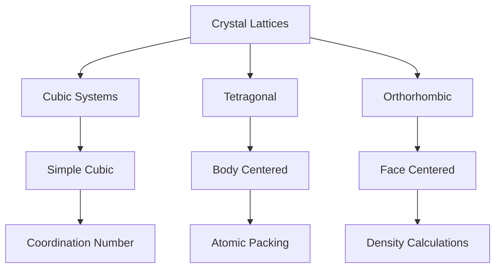
```mermaid
graph TD
    A[Crystal Lattices] --> B[Cubic Systems]
    A --> C[Tetragonal]
    A --> D[Orthorhombic]
    B --> E[Simple Cubic]
    C --> F[Body Centered]
    D --> G[Face Centered]
    E --> H[Coordination Number]
    F --> I[Atomic Packing]
    G --> J[Density Calculations]
```

### Quasicrystal Geometry

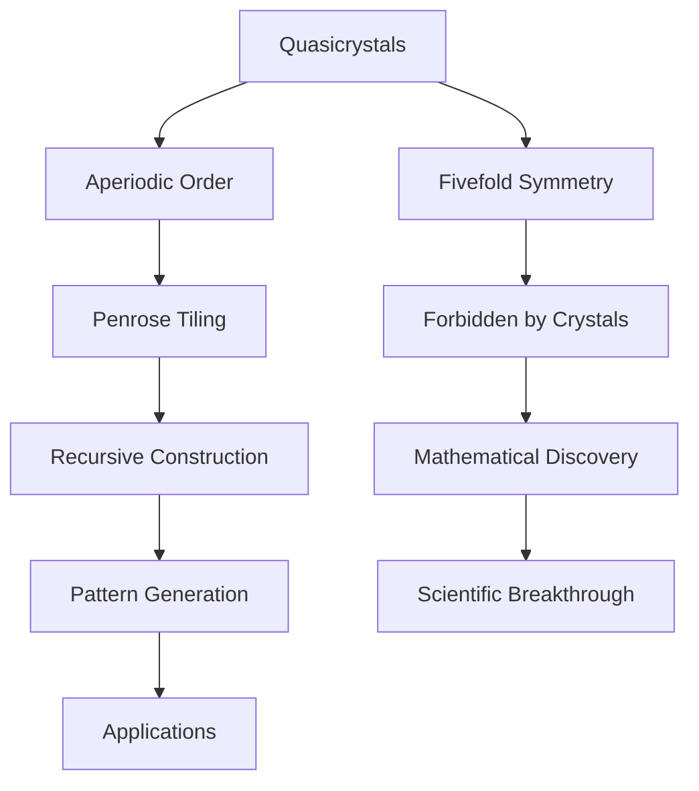
```mermaid
graph TD
    A[Quasicrystals] --> B[Aperiodic Order]
    A --> C[Fivefold Symmetry]
    B --> D[Penrose Tiling]
    C --> E[Forbidden by Crystals]
    D --> F[Recursive Construction]
    E --> G[Mathematical Discovery]
    F --> H[Pattern Generation]
    G --> I[Scientific Breakthrough]
    H --> J[Applications]
```

## Visualization and Representation

### ASCII Art Representations

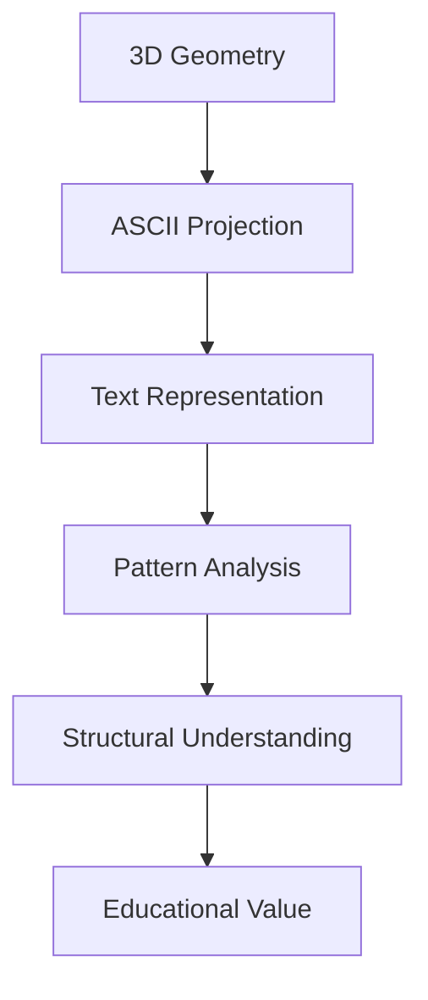
```mermaid
graph TD
    A[3D Geometry] --> B[ASCII Projection]
    B --> C[Text Representation]
    C --> D[Pattern Analysis]
    D --> E[Structural Understanding]
    E --> F[Educational Value]
```

### Graphical Rendering Techniques

```mermaid
graph TD
    A[Geometric Data] --> B[Rendering Engine]
    B --> C[Wireframe Models]
    B --> D[Surface Rendering]
    C --> E[Structural Analysis]
    D --> F[Visual Understanding]
    E --> G[Engineering Applications]
    F --> H[Educational Uses]
```

## Advanced Geometric Concepts

### Non-Euclidean Geometry in Synergetics

```mermaid
graph TD
    A[Non-Euclidean] --> B[Elliptic Geometry]
    A --> C[Hyperbolic Geometry]
    B --> D[Spherical Surfaces]
    C --> E[Saddle Surfaces]
    D --> F[Global Properties]
    E --> G[Local Properties]
    F --> H[Finite Universe]
    G --> I[Infinite Possibilities]
```

### Topological Transformations

```mermaid
graph TD
    A[Topology] --> B[Continuous Deformation]
    A --> C[Homeomorphism]
    B --> D[Bending/Flexing]
    C --> E[Preserved Properties]
    D --> F[Geometric Invariants]
    E --> G[Topological Invariants]
    F --> H[Structural Analysis]
    G --> I[Mathematical Proofs]
```

## Computational Geometry Methods

### Volume Calculation Algorithms

```mermaid
graph TD
    A[Volume Calculation] --> B[Tetrahedral Decomposition]
    A --> C[Surface Integration]
    B --> D[Exact Determinant]
    C --> E[Numerical Integration]
    D --> F[Integer Results]
    E --> G[Approximate Results]
    F --> H[Exact Relationships]
    G --> I[Computational Bounds]
```

### Collision Detection and Proximity

```mermaid
graph TD
    A[Geometric Objects] --> B[Bounding Volumes]
    A --> C[Distance Calculations]
    B --> D[Quick Rejection]
    C --> E[Exact Proximity]
    D --> F[Performance Optimization]
    E --> G[Collision Detection]
    F --> H[Real-time Applications]
    G --> I[Physical Simulations]
```

## Future Directions in Synergetic Geometry

### Computational Advances

```mermaid
graph TD
    A[Future Geometry] --> B[GPU Acceleration]
    A --> C[Symbolic Computation]
    B --> D[Parallel Processing]
    C --> E[Algebraic Methods]
    D --> F[Large-Scale Models]
    E --> G[Exact Solutions]
    F --> H[Complex Systems]
    G --> I[Mathematical Proofs]
```

### Interdisciplinary Integration

```mermaid
graph TD
    A[Interdisciplinary] --> B[Mathematics + Physics]
    A --> C[Biology + Chemistry]
    B --> D[Quantum Geometry]
    C --> E[Molecular Structures]
    D --> F[Quantum Computing]
    E --> G[Drug Design]
    F --> H[Quantum Algorithms]
    G --> I[Medical Applications]
```

## Conclusion: The Beauty of Geometric Patterns

Geometric patterns in Synergetics reveal the underlying structure of the universe. From the efficient packing of spheres to the symmetry of crystals, these patterns demonstrate nature's preference for optimal solutions.

Key insights from this geometric exploration:

1. **Efficiency Through Geometry**: Natural systems optimize through geometric relationships
2. **Symmetry and Balance**: Vector equilibrium represents perfect force balance
3. **Exact Relationships**: Volume ratios reveal precise mathematical connections
4. **Pattern Recognition**: Geometric forms manifest universal principles
5. **Transformational Power**: Coordinate systems enable different perspectives
6. **Interdisciplinary Connections**: Geometry bridges mathematics, science, and art

The geometric foundations of Synergetics provide both practical tools for design and deep insights into the nature of reality. Through exact calculations and geometric visualization, we can discover patterns that would otherwise remain hidden.

---

## References and Further Reading

### Synergetics Geometry
- Fuller, R. Buckminster. *Synergetics: Explorations in the Geometry of Thinking*
- Edmondson, Amy C. *A Fuller Explanation: The Synergetic Geometry of R. Buckminster Fuller*
- Williams, Robert. *The Geometrical Foundation of Natural Structure*

### Computational Geometry
- Preparata, Franco P. and Shamos, Michael Ian. *Computational Geometry*
- O'Rourke, Joseph. *Computational Geometry in C*
- de Berg, Mark et al. *Computational Geometry: Algorithms and Applications*

### Visualization and Rendering
- Foley, James D. et al. *Computer Graphics: Principles and Practice*
- Watt, Alan. *3D Computer Graphics*
- Shirley, Peter. *Fundamentals of Computer Graphics*

### Natural Patterns
- Thompson, D'Arcy Wentworth. *On Growth and Form*
- Ball, Philip. *The Self-Made Tapestry: Pattern Formation in Nature*
- Stevens, Peter S. *Patterns in Nature*

---

*"Geometry is the archetype of the beauty of the world."*
— Johannes Kepler

*"The universe is built on a plan the profound symmetry of which is somehow present in the inner structure of our intellect."*
— Paul Valéry
