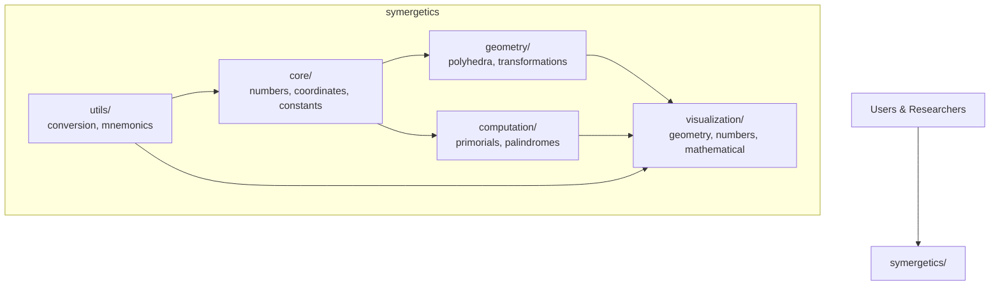
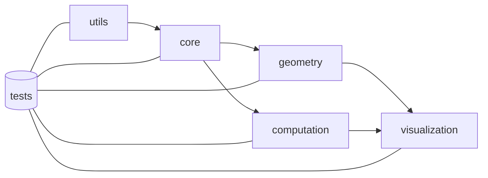
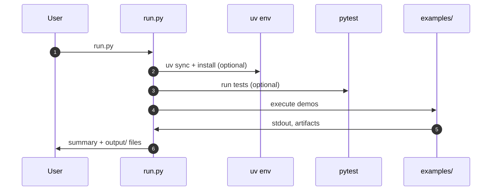

# Symergetics Package Documentation

## Overview

The **Symergetics** package is a comprehensive implementation of Buckminster Fuller's mathematical and geometric concepts, providing exact rational arithmetic for synergetic calculations.



## Architecture

```text
symergetics/
├── core/           # Fundamental mathematical classes
├── geometry/       # Polyhedral geometry and transformations
├── computation/    # Primorials, Scheherazade numbers, palindromes
├── utils/          # Conversion utilities and mnemonics
└── tests/          # 100% test coverage
```



## Key Features

- **Exact Rational Arithmetic**: Zero floating-point errors in geometric calculations
- **Quadray Coordinate System**: Integer-based tetrahedral coordinates with IVM normalization
- **Polyhedral Geometry**: Volume calculations for Platonic solids in IVM units
- **Scheherazade Mathematics**: Powers of 1001 with SSRCD pattern analysis
- **Primorial Calculations**: n# = product of primes ≤ n
- **Mnemonic Encoding**: Memory aids for large numbers

Notes:

- Default number formatting is ungrouped for symbolic workflows; use `format_large_number()` and `ungroup_number()` to transform as needed.

## Quick Start

```python
from symergetics import *

# Exact rational arithmetic
a = SymergeticsNumber(3, 4)  # 3/4
b = SymergeticsNumber(1, 2)  # 1/2
result = a + b  # = 5/4 exactly

# Quadray coordinates
coord = QuadrayCoordinate(2, 1, 1, 0)
xyz = coord.to_xyz()  # Convert to Cartesian

# Polyhedral geometry
tetra = Tetrahedron()
volume = tetra.volume()  # = 1 IVM unit

# Scheherazade mathematics
scheherazade_6 = scheherazade_power(6)  # Contains Pascal's triangle
```

### Orchestrated run (recommended)

```bash
python3 run.py                # setup (uv), tests, and examples
python3 run.py --examples-only
python3 run.py --skip-setup --skip-tests
```

- Generates organized outputs under `output/` (ASCII and PNG when configured)
- Produces a summary report and `output/orchestration_results.json`



## Documentation Sections

### [API Reference](api/)

- Core classes and functions
- Mathematical constants
- Coordinate systems
- Visualization APIs and configuration

### [Examples](examples/)

- Basic usage examples
- Advanced calculations
- Research applications
- Orchestrated demos and output structure

### [Tutorials](tutorials/)

- Getting started guides
- Mathematical concepts
- Integration examples
- Testing and `uv` workflows

### [Research](research/)

- Synergetics theory
- Applications in Active Inference
- Crystallographic analysis
- Concept maps and background

### [Architecture](architecture/)

- Implementation details
- Performance considerations
- Testing methodology

## Mathematical Foundations

The package implements Fuller's key concepts:

- **All-Integer Accounting**: Exact rational relationships in nature
- **Quadray Coordinates**: Four-dimensional tetrahedral coordinate system
- **IVM Lattice**: Isotropic Vector Matrix for sphere packing
- **Scheherazade Numbers**: Powers of 1001 revealing mathematical patterns
- **Cosmic Hierarchy**: Scaling relationships from atomic to cosmic scales

## Research Applications

- **Active Inference**: Exact arithmetic prevents computational artifacts
- **Cognitive Security**: Precise pattern recognition
- **Entomological Research**: Geometric analysis of biological patterns
- **Crystallographic Studies**: Rational relationships in crystal structures

## License

MIT License - see LICENSE file for details.

## Citation

If you use this package in research, please cite:

```text
Symergetics: A Comprehensive Research Analysis and Design Framework
Implementation of Buckminster Fuller's Synergetics with Exact Rational Arithmetic
```

---

**"Mathematics is the language of energy expressed in comprehensible, rational terms."**
— Buckminster Fuller
