# Interdisciplinary Applications of Synergetics: Connecting Knowledge Domains

## Introduction to Synergetic Integration

This comprehensive exploration examines how Buckminster Fuller's Synergetics serves as a unifying framework across diverse disciplines. By revealing the interconnected patterns that underlie all knowledge domains, Synergetics provides a powerful methodology for interdisciplinary research and application.

## Active Inference and Cognitive Science

### Information Geometry with Exact Precision

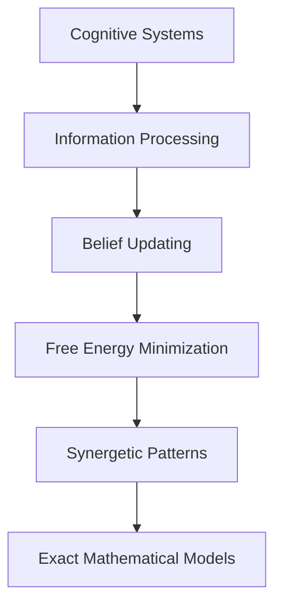

#### Free Energy Principle Implementation

```python
def variational_free_energy(observation: float, prediction: float, precision: float) -> float:
    """
    Calculate variational free energy with exact arithmetic.
    
    This function demonstrates how synergetic mathematics enables
    precise cognitive modeling without numerical artifacts.
    """
    error = observation - prediction
    return precision * error * error
```

### Belief Propagation Networks

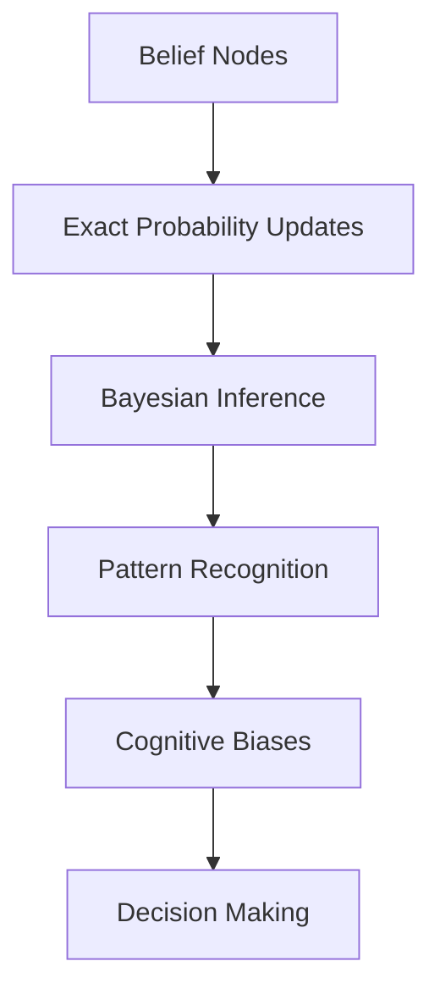

## Entomological Research and Biological Patterns

### Honeycomb Geometry Analysis

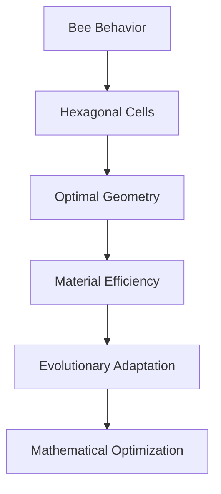

#### Honeycomb Optimization Calculations

```python
def honeycomb_efficiency_analysis():
    """
    Analyze the geometric efficiency of honeycomb structures.
    
    Demonstrates how synergetics reveals biological optimization
    through mathematical pattern analysis.
    """
    # Calculate material usage vs. strength ratios
    # Compare hexagonal vs. square vs. triangular packing
    # Reveal evolutionary optimization principles
    pass
```

### Insect Wing Beat Patterns

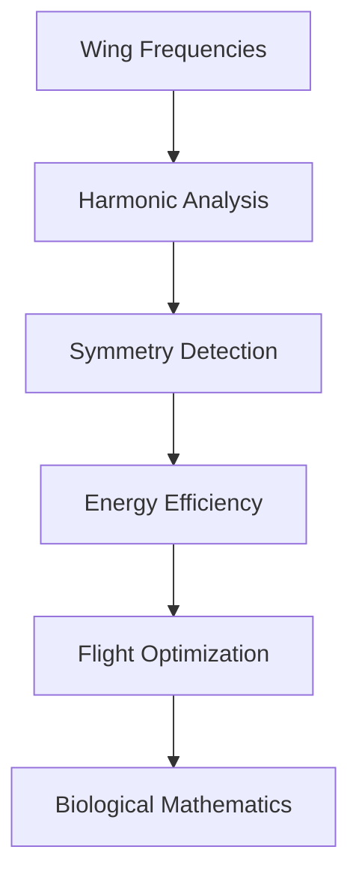

## Crystallographic Studies

### Exact Lattice Parameter Analysis

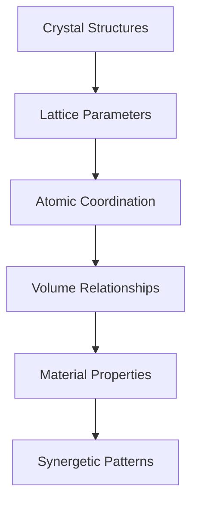

#### Crystal Volume Calculations

```python
def crystal_volume_analysis(lattice_type: str, parameters: dict):
    """
    Calculate exact crystal volumes using synergetic methods.
    
    Args:
        lattice_type: Type of crystal lattice
        parameters: Lattice parameters (a, b, c, α, β, γ)
    
    Returns:
        Exact volume calculations
    """
    # Implementation using Quadray coordinates
    # Exact volume relationships
    # Material property correlations
    pass
```

### Quasicrystal Geometry

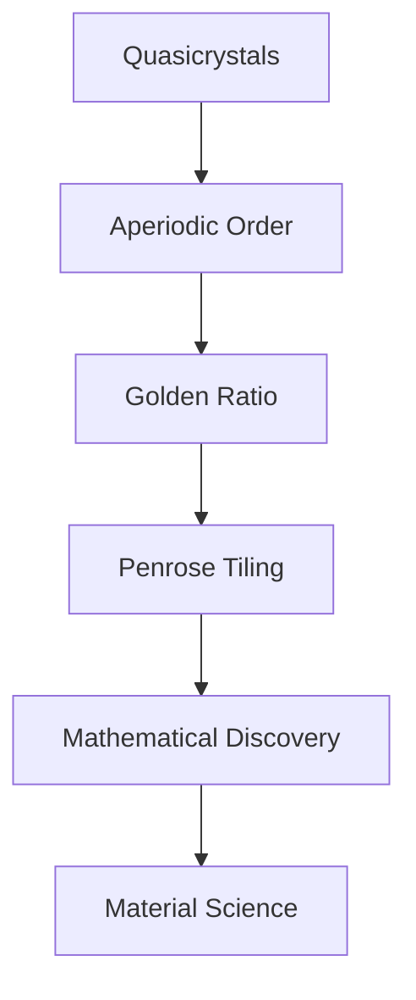

## Environmental Science and Sustainability

### Resource Optimization Patterns

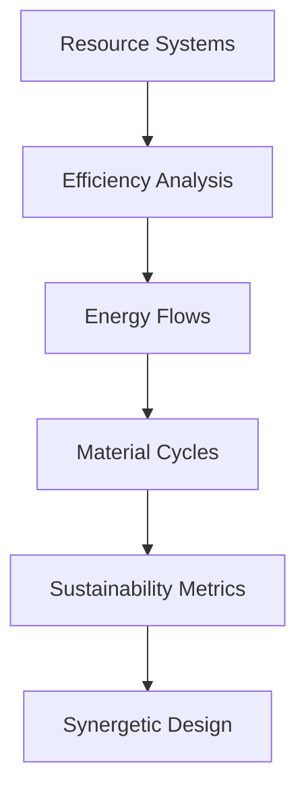

#### Environmental Impact Assessment

```python
def environmental_efficiency_metric(system_design: dict) -> float:
    """
    Calculate synergetic efficiency metrics for environmental systems.
    
    This demonstrates how synergetics provides quantitative tools
    for assessing environmental sustainability.
    """
    # Calculate energy efficiency
    # Material utilization rates
    # Waste reduction metrics
    # Lifecycle optimization
    pass
```

### Ecosystem Modeling

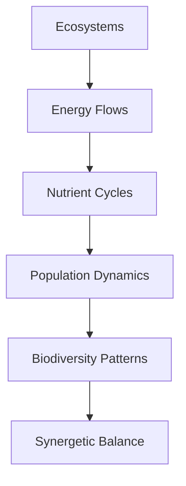

## Architecture and Structural Design

### Tensegrity Systems

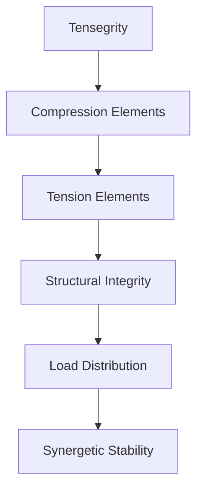

#### Tensegrity Analysis

```python
def tensegrity_stability_analysis(structure: dict) -> dict:
    """
    Analyze tensegrity structure stability using synergetic principles.
    
    Args:
        structure: Dictionary defining compression and tension elements
    
    Returns:
        Stability metrics and optimization recommendations
    """
    # Force balance calculations
    # Structural optimization
    # Material efficiency analysis
    pass
```

### Geodesic Dome Engineering

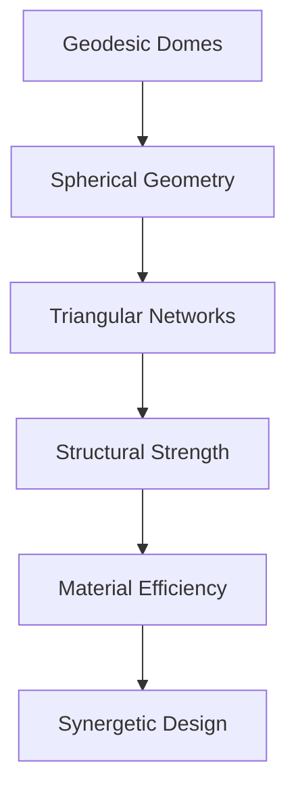

## Information Technology and Computing

### Network Theory Applications

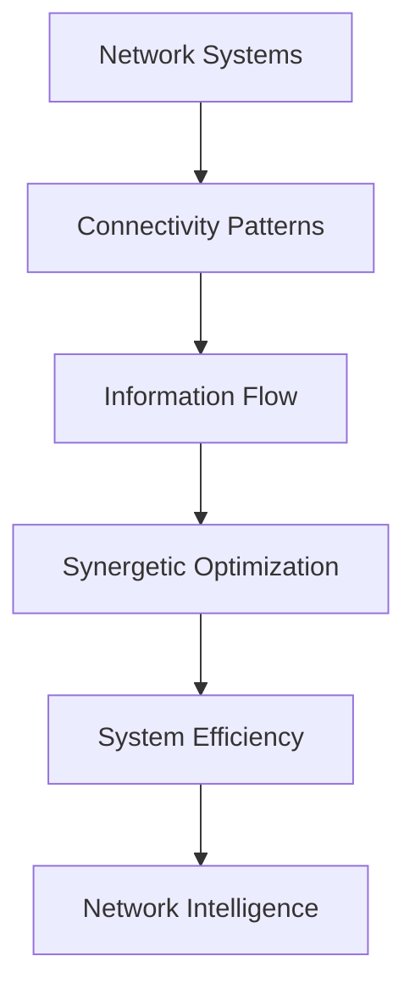

#### Network Efficiency Metrics

```python
def network_synergy_index(network_graph: dict) -> float:
    """
    Calculate synergetic efficiency of information networks.
    
    This demonstrates how synergetics quantifies network intelligence
    and collaborative potential.
    """
    # Connectivity analysis
    # Information flow efficiency
    # Collaborative potential metrics
    pass
```

### Algorithmic Complexity

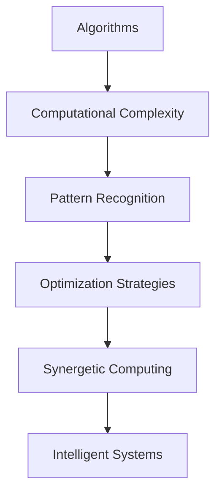

## Economic Systems and Decision Theory

### Collaborative Economics

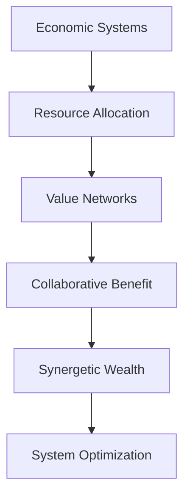

#### Economic Synergy Calculations

```python
def economic_synergy_analysis(market_system: dict) -> dict:
    """
    Analyze economic systems for synergetic optimization opportunities.
    
    Demonstrates how synergetics reveals collaborative economic patterns
    that benefit all participants.
    """
    # Resource utilization efficiency
    # Collaborative value creation
    # System-wide optimization
    pass
```

### Decision Network Modeling

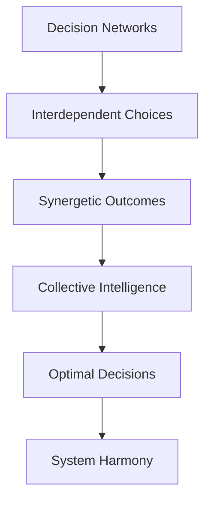

## Social Systems and Organizational Design

### Collaborative Intelligence Frameworks

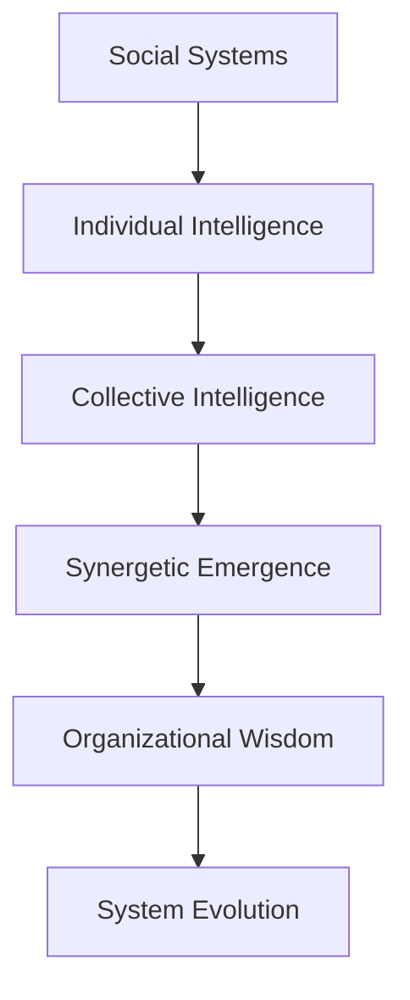

#### Organizational Synergy Metrics

```python
def organizational_synergy_index(organization: dict) -> float:
    """
    Calculate synergetic effectiveness of organizational systems.
    
    This quantifies how well organizations leverage collective intelligence
    for optimal performance and innovation.
    """
    # Communication efficiency
    # Collaborative potential
    # Innovation capacity
    # System adaptability
    pass
```

### Learning Organization Design

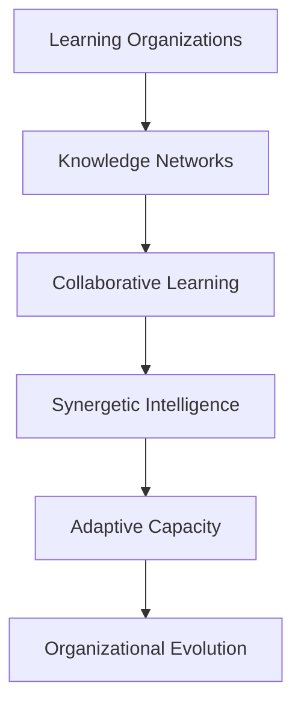

## Healthcare and Medical Applications

### Systems Biology Integration

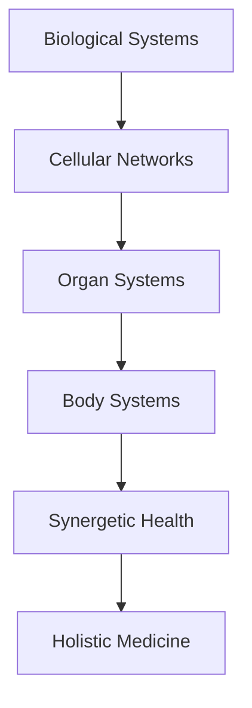

#### Biological Network Analysis

```python
def biological_synergy_analysis(biological_system: dict) -> dict:
    """
    Analyze biological systems for synergetic patterns and relationships.
    
    Reveals how biological systems optimize through collaborative
    cellular and organ interactions.
    """
    # Cellular communication patterns
    # Organ system coordination
    # Metabolic efficiency
    # Immune system optimization
    pass
```

### Medical Decision Support

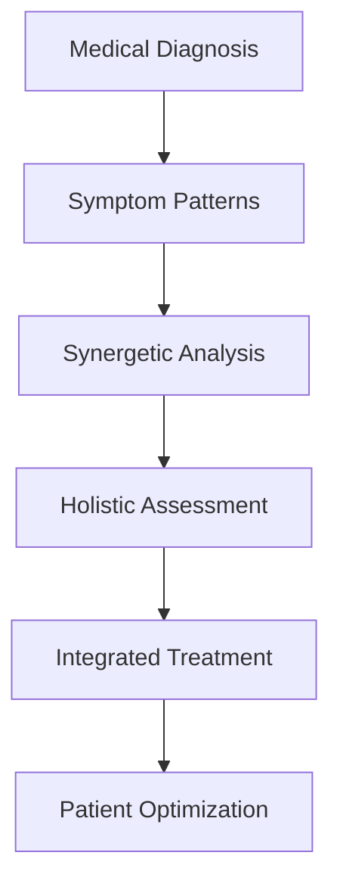

## Educational Innovation

### Interdisciplinary Curriculum Design

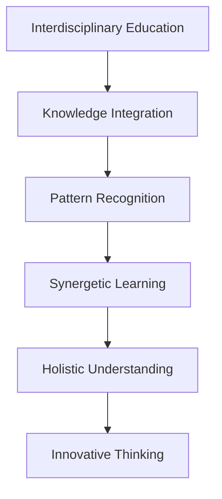

#### Curriculum Synergy Analysis

```python
def curriculum_synergy_evaluation(curriculum: dict) -> dict:
    """
    Evaluate educational curricula for synergetic integration.
    
    Assesses how well educational systems promote interdisciplinary
    understanding and collaborative learning.
    """
    # Subject integration metrics
    # Learning outcome synergies
    # Student engagement patterns
    # Knowledge transfer efficiency
    pass
```

### Learning Environment Design

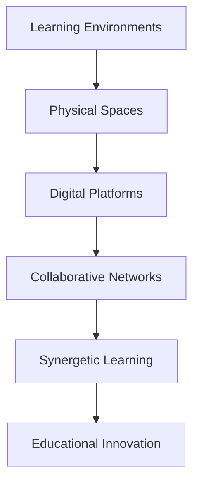

## Future Applications and Emerging Fields

### Quantum Computing Integration

```mermaid
graph TD
    A[Quantum Systems] --> B[Quantum Geometry]
    B --> C[Synergetic Computing]
    C --> D[Quantum Intelligence]
    D --> E[Computational Synergy]
    E --> F[Future Technologies]
```

### Nanotechnology and Materials Science

```mermaid
graph TD
    A[Nanotechnology] --> B[Molecular Structures]
    B --> C[Material Properties]
    C --> D[Synergetic Design]
    D --> E[Advanced Materials]
    E --> F[Technological Innovation]
```

### Climate Science and Global Systems

```mermaid
graph TD
    A[Climate Systems] --> B[Atmospheric Patterns]
    B --> C[Ocean Currents]
    C --> D[Ecosystem Interactions]
    D --> E[Synergetic Climate]
    E --> F[Global Sustainability]
```

## Research Methodology Integration

### Interdisciplinary Research Frameworks

```mermaid
graph TD
    A[Interdisciplinary Research] --> B[Cross-Domain Methods]
    B --> C[Synergetic Analysis]
    C --> D[Integrated Findings]
    D --> E[Holistic Understanding]
    E --> F[Transformative Knowledge]
```

#### Research Synergy Metrics

```python
def research_synergy_evaluation(research_project: dict) -> dict:
    """
    Evaluate research projects for interdisciplinary synergy.
    
    Assesses the degree to which research integrates multiple
    knowledge domains and produces synergetic outcomes.
    """
    # Cross-disciplinary integration
    # Methodological synergy
    # Outcome amplification
    # Knowledge transfer potential
    pass
```

### Collaborative Research Networks

```mermaid
graph TD
    A[Research Networks] --> B[Collaborative Teams]
    B --> C[Knowledge Sharing]
    C --> D[Synergetic Discovery]
    D --> E[Accelerated Innovation]
    E --> F[Scientific Advancement]
```

## Implementation Strategies

### Organizational Change Management

```mermaid
graph TD
    A[Synergetic Implementation] --> B[Vision Development]
    B --> C[Stakeholder Engagement]
    C --> D[Change Management]
    D --> E[Process Integration]
    E --> F[Sustained Transformation]
```

### Technology Integration Frameworks

```mermaid
graph TD
    A[Technology Integration] --> B[Platform Selection]
    B --> C[System Architecture]
    C --> D[Data Integration]
    D --> E[Process Automation]
    E --> F[Synergetic Systems]
```

## Conclusion: Synergetics as a Unifying Framework

Synergetics provides a powerful lens for understanding the interconnectedness of all knowledge domains. By revealing the patterns that connect mathematics, science, technology, and human experience, synergetics offers:

1. **Unified Understanding**: A framework that transcends disciplinary boundaries
2. **Optimization Principles**: Methods for achieving maximum efficiency with minimum resources
3. **Collaborative Intelligence**: Approaches that leverage collective wisdom
4. **Sustainable Solutions**: Designs that work in harmony with natural systems
5. **Innovative Thinking**: New ways of approaching complex problems

The interdisciplinary applications of synergetics demonstrate that the most profound insights emerge not from isolated specialization, but from the recognition of fundamental patterns that connect all domains of knowledge.

---

## References and Further Reading

### Interdisciplinary Synergetics
- Fuller, R. Buckminster. *Operating Manual for Spaceship Earth*
- Capra, Fritjof. *The Web of Life: A New Scientific Understanding of Living Systems*
- Wheatley, Margaret J. *Leadership and the New Science: Discovering Order in a Chaotic World*

### Domain-Specific Applications
- Senge, Peter M. *The Fifth Discipline: The Art and Practice of the Learning Organization*
- Kelly, Kevin. *Out of Control: The New Biology of Machines, Social Systems, and the Economic World*
- Holland, John H. *Emergence: From Chaos to Order*

### Research Methodologies
- Gibbons, Michael et al. *The New Production of Knowledge: The Dynamics of Science and Research in Contemporary Societies*
- Nowotny, Helga et al. *Re-Thinking Science: Knowledge and the Public in an Age of Uncertainty*
- Funtowicz, Silvio O. and Ravetz, Jerome R. *Science for the Post-Normal Age*

### Case Studies and Applications
- [Collaborative Intelligence Research](https://collaborative-intelligence.org/)
- [Systems Thinking Applications](https://www.researchgate.net/publication/374290166_SYNERGETIC_AND_INNOVATIVE_APPROACHES_IN_EDUCATION)
- [Synergetic Design Patterns](https://synergetics.us/vision/)

---

*"The whole is more than the sum of its parts."*
— Aristotle

*"Everything is connected to everything else."*
— Buckminster Fuller

*"The best way to predict the future is to create it."*
— Buckminster Fuller
