# Learning Theory and Synergetics: A Comprehensive Educational Framework

## Introduction to Synergetic Learning Theory

This comprehensive exploration examines how Buckminster Fuller's Synergetics revolutionizes our understanding of learning processes. Drawing from the web search insights about synergetics in education, we investigate how synergetic principles create more effective, engaging, and transformative learning experiences.

## Foundations of Synergetic Learning Theory

### The Geometry of Knowledge

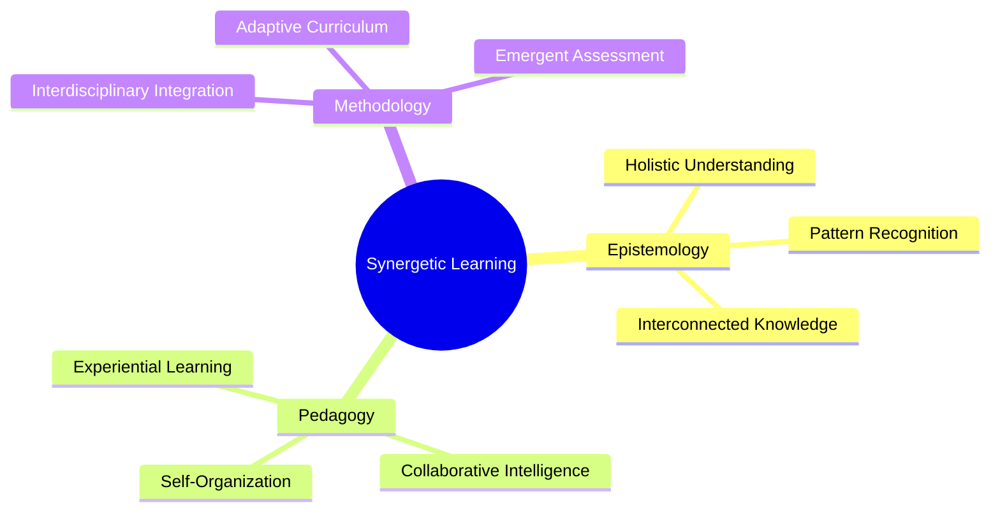

Synergetic learning theory challenges traditional educational paradigms by recognizing that knowledge emerges from interconnected patterns rather than isolated facts.

## Core Principles of Synergetic Education

### 1. Self-Organization and Emergent Learning

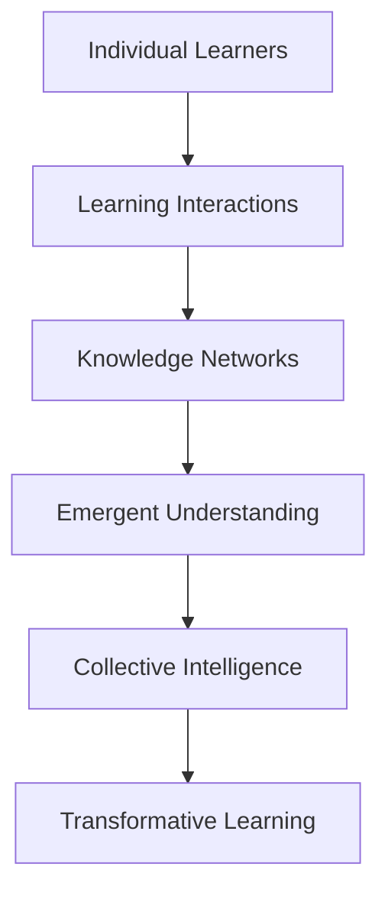

#### Phase Transitions in Learning

Synergetic learning recognizes that understanding emerges through critical transitions:

```python
def learning_phase_transition(learning_intensity: float, complexity_threshold: float) -> str:
    """
    Model learning phase transitions using synergetic principles.
    
    Args:
        learning_intensity: Current learning engagement level
        complexity_threshold: Point of conceptual breakthrough
    
    Returns:
        Learning phase description
    """
    if learning_intensity < complexity_threshold:
        return "Accumulative Learning"
    elif learning_intensity == complexity_threshold:
        return "Critical Transition"
    else:
        return "Emergent Understanding"
```

### 2. Collaborative Intelligence and Collective Learning

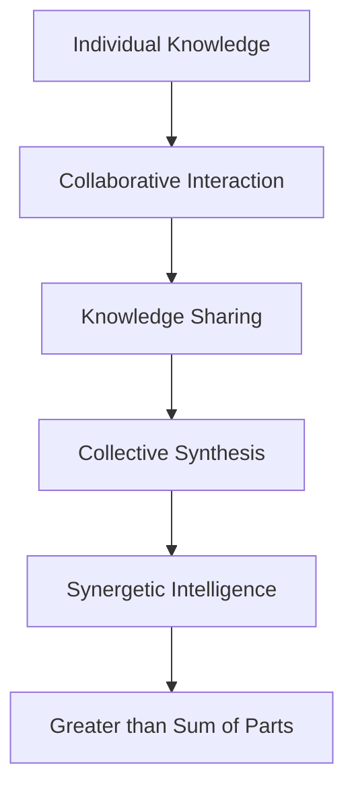

#### Collaborative Learning Metrics

```python
def collaborative_synergy_index(participants: list, interactions: list) -> float:
    """
    Calculate the synergetic effectiveness of collaborative learning.
    
    Args:
        participants: List of individual learners
        interactions: List of knowledge exchanges
    
    Returns:
        Synergy index (0-1, where 1 is perfect synergy)
    """
    individual_contributions = len(participants)
    collaborative_outputs = len(interactions)
    
    # Synergetic formula: output > sum of inputs
    synergy_ratio = collaborative_outputs / individual_contributions
    
    return min(synergy_ratio / 2.0, 1.0)  # Normalized to 0-1
```

## Synergetic Curriculum Design

### Interdisciplinary Knowledge Networks

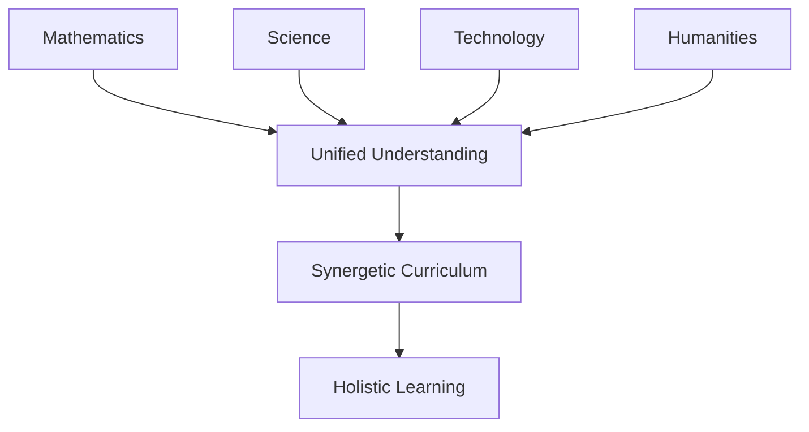

#### Curriculum Integration Framework

```python
def curriculum_synergy_matrix(subjects: list) -> dict:
    """
    Create a synergy matrix showing interdisciplinary connections.
    
    Args:
        subjects: List of academic subjects
    
    Returns:
        Dictionary of subject interconnections
    """
    synergy_matrix = {}
    
    # Define synergetic connections between subjects
    connections = {
        'mathematics': ['physics', 'computer_science', 'engineering'],
        'biology': ['chemistry', 'environmental_science', 'medicine'],
        'history': ['political_science', 'sociology', 'philosophy'],
        'art': ['mathematics', 'psychology', 'technology']
    }
    
    for subject in subjects:
        synergy_matrix[subject] = {
            'connections': connections.get(subject, []),
            'synergy_potential': len(connections.get(subject, [])) / len(subjects)
        }
    
    return synergy_matrix
```

## Adaptive Learning Environments

### Self-Organizing Learning Systems

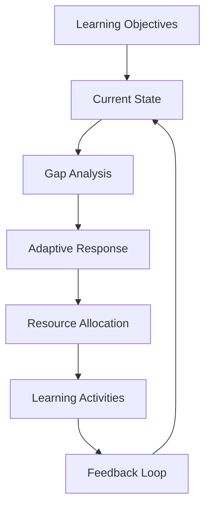

#### Adaptive Learning Algorithm

```python
def adaptive_learning_path(learner_profile: dict, learning_goals: list) -> dict:
    """
    Generate adaptive learning path using synergetic principles.
    
    Args:
        learner_profile: Dictionary of learner characteristics
        learning_goals: List of target competencies
    
    Returns:
        Personalized learning trajectory
    """
    # Analyze learner's current state
    current_competencies = learner_profile.get('competencies', [])
    
    # Calculate learning gaps
    gaps = [goal for goal in learning_goals if goal not in current_competencies]
    
    # Generate synergetic learning path
    learning_path = {
        'immediate_focus': gaps[:2],  # Start with most critical gaps
        'supporting_skills': current_competencies,
        'emergent_opportunities': [],  # Discovered during learning
        'collaborative_elements': True,
        'adaptive_adjustments': []
    }
    
    return learning_path
```

## Assessment and Evaluation in Synergetic Education

### Holistic Assessment Frameworks

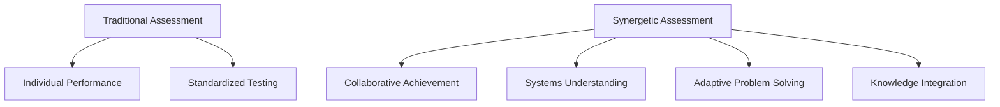

#### Synergetic Assessment Metrics

```python
def synergetic_assessment_score(individual_performance: float, 
                               collaborative_contribution: float,
                               systems_understanding: float) -> dict:
    """
    Calculate comprehensive synergetic assessment score.
    
    Args:
        individual_performance: Individual competency score (0-1)
        collaborative_contribution: Team contribution score (0-1)
        systems_understanding: Holistic understanding score (0-1)
    
    Returns:
        Comprehensive assessment results
    """
    # Synergetic weighting: collaborative and systems understanding
    # contribute more heavily than individual performance
    weights = {
        'individual': 0.3,
        'collaborative': 0.4,
        'systems': 0.3
    }
    
    total_score = (
        weights['individual'] * individual_performance +
        weights['collaborative'] * collaborative_contribution +
        weights['systems'] * systems_understanding
    )
    
    synergy_bonus = min(collaborative_contribution * systems_understanding * 0.2, 0.2)
    
    return {
        'total_score': total_score + synergy_bonus,
        'synergy_bonus': synergy_bonus,
        'component_scores': {
            'individual': individual_performance,
            'collaborative': collaborative_contribution,
            'systems': systems_understanding
        }
    }
```

## Technology Integration in Synergetic Learning

### Digital Learning Ecosystems

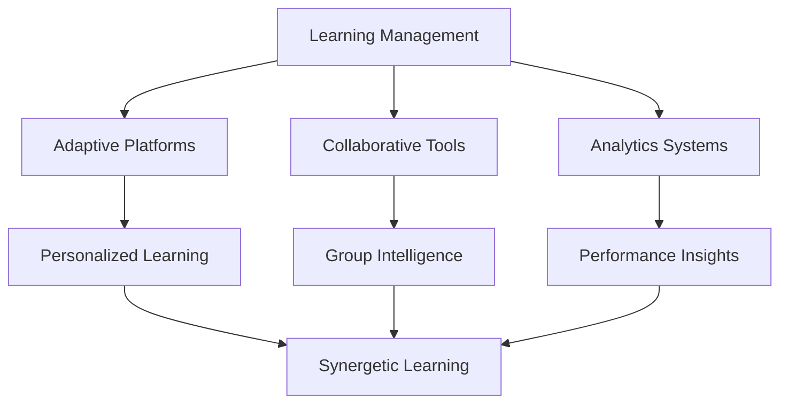

#### Intelligent Tutoring Systems

```python
def intelligent_tutoring_response(student_input: str, learning_context: dict) -> dict:
    """
    Generate intelligent tutoring response using synergetic principles.
    
    Args:
        student_input: Student's response or question
        learning_context: Current learning state and objectives
    
    Returns:
        Adaptive tutoring response
    """
    # Analyze student understanding
    understanding_level = analyze_understanding(student_input)
    
    # Identify knowledge gaps
    gaps = identify_knowledge_gaps(student_input, learning_context)
    
    # Generate synergetic response
    response = {
        'immediate_feedback': generate_feedback(student_input),
        'conceptual_connections': find_related_concepts(gaps),
        'collaborative_suggestions': suggest_peer_learning(gaps),
        'adaptive_resources': recommend_learning_materials(gaps),
        'next_steps': plan_learning_trajectory(gaps, learning_context)
    }
    
    return response
```

## Learning Analytics and Pattern Recognition

### Synergetic Learning Analytics

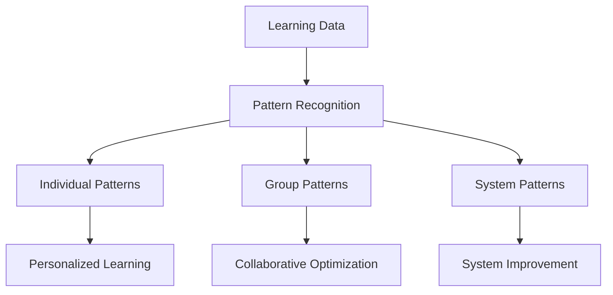

#### Learning Pattern Analysis

```python
def analyze_learning_patterns(learning_data: list) -> dict:
    """
    Analyze learning patterns using synergetic principles.
    
    Args:
        learning_data: List of learning interactions and outcomes
    
    Returns:
        Pattern analysis results
    """
    # Identify emergent patterns
    patterns = {
        'individual_trajectories': identify_individual_patterns(learning_data),
        'collaborative_dynamics': analyze_group_interactions(learning_data),
        'conceptual_breakthroughs': detect_phase_transitions(learning_data),
        'synergetic_opportunities': find_collaboration_potential(learning_data)
    }
    
    # Calculate synergy metrics
    synergy_metrics = {
        'collaboration_efficiency': calculate_collaboration_efficiency(patterns),
        'knowledge_emergence': measure_emergent_understanding(patterns),
        'adaptive_capacity': assess_learning_adaptability(patterns)
    }
    
    return {
        'patterns': patterns,
        'synergy_metrics': synergy_metrics,
        'recommendations': generate_synergetic_recommendations(patterns)
    }
```

## Teacher Professional Development

### Synergetic Teacher Training

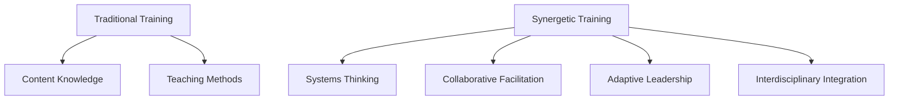

#### Teacher Development Framework

```python
def synergetic_teacher_development(teacher_profile: dict, professional_goals: list) -> dict:
    """
    Design synergetic professional development for teachers.
    
    Args:
        teacher_profile: Current teacher competencies and experience
        professional_goals: Target professional development outcomes
    
    Returns:
        Personalized development plan
    """
    development_plan = {
        'systems_thinking_workshops': identify_systems_training_needs(teacher_profile),
        'collaborative_practice_opportunities': design_collaboration_experiences(teacher_profile),
        'interdisciplinary_integration_training': plan_subject_integration_workshops(teacher_profile),
        'adaptive_teaching_strategies': develop_adaptive_methodologies(teacher_profile),
        'assessment_innovation': create_synergetic_assessment_training(teacher_profile),
        'technology_integration': design_digital_learning_integration(teacher_profile)
    }
    
    return development_plan
```

## Learning Environment Design

### Synergetic Learning Spaces

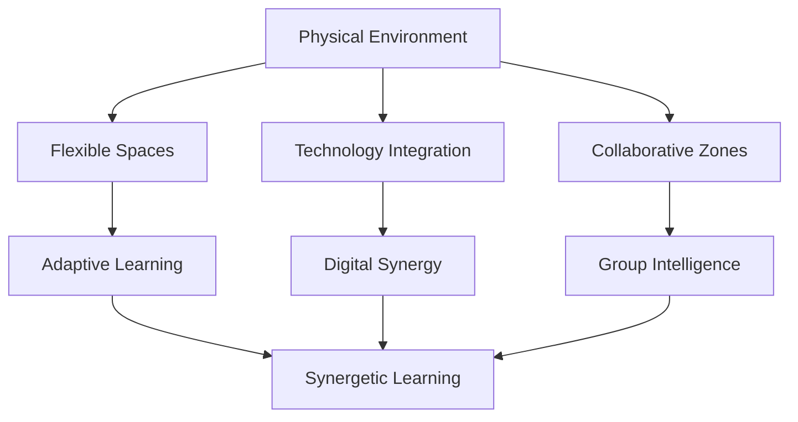

#### Learning Space Optimization

```python
def optimize_learning_space(space_configuration: dict, learning_activities: list) -> dict:
    """
    Optimize physical learning spaces for synergetic education.
    
    Args:
        space_configuration: Current space layout and capabilities
        learning_activities: Planned learning activities and methods
    
    Returns:
        Optimized space design recommendations
    """
    # Analyze space utilization patterns
    utilization_analysis = analyze_space_utilization(space_configuration, learning_activities)
    
    # Design collaborative zones
    collaborative_zones = design_collaborative_spaces(utilization_analysis)
    
    # Integrate technology infrastructure
    technology_integration = plan_technology_infrastructure(utilization_analysis)
    
    # Create adaptive learning environments
    adaptive_spaces = design_adaptive_environments(utilization_analysis)
    
    return {
        'space_optimization': {
            'utilization_analysis': utilization_analysis,
            'collaborative_zones': collaborative_zones,
            'technology_integration': technology_integration,
            'adaptive_spaces': adaptive_spaces
        },
        'implementation_plan': create_implementation_timeline(),
        'evaluation_metrics': define_success_metrics()
    }
```

## Research and Evidence-Based Practice

### Learning Outcomes Research

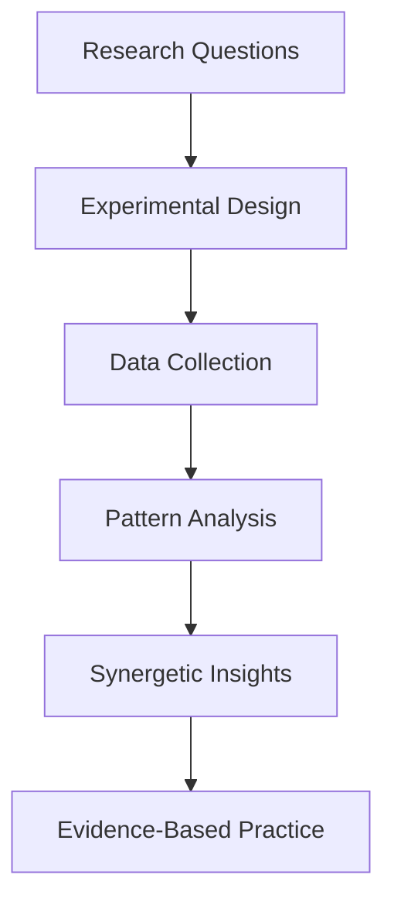

#### Research Methodology Framework

```python
def synergetic_research_design(research_question: str, methodological_approach: str) -> dict:
    """
    Design synergetic research methodology for learning studies.
    
    Args:
        research_question: Research question or hypothesis
        methodological_approach: Preferred research method
    
    Returns:
        Comprehensive research design
    """
    research_design = {
        'interdisciplinary_integration': identify_relevant_disciplines(research_question),
        'collaborative_methodology': design_collaborative_research_approach(methodological_approach),
        'systems_analysis': develop_systems_perspective(research_question),
        'emergent_findings': plan_for_unexpected_discoveries(),
        'adaptive_data_collection': create_flexible_data_strategies(),
        'synergetic_analysis': develop_integrated_analysis_methods()
    }
    
    return research_design
```

## Future Directions in Synergetic Learning

### Emerging Technologies and Synergetics

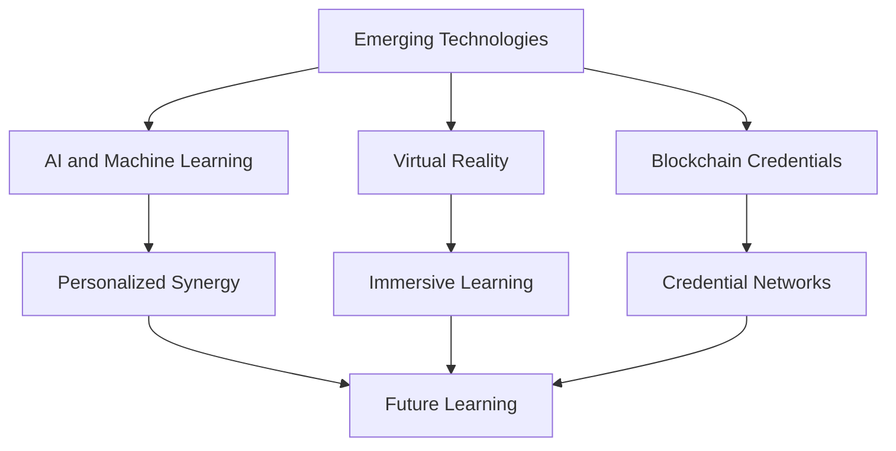

#### AI-Augmented Synergetic Learning

```python
def ai_synergetic_learning_system(learner_data: dict, ai_capabilities: list) -> dict:
    """
    Design AI-augmented synergetic learning system.
    
    Args:
        learner_data: Learner profile and learning history
        ai_capabilities: Available AI tools and services
    
    Returns:
        AI-enhanced learning system design
    """
    # Personalize learning experiences
    personalization = design_personalized_learning(learner_data, ai_capabilities)
    
    # Enhance collaborative intelligence
    collaboration = augment_collaborative_learning(learner_data, ai_capabilities)
    
    # Optimize learning environments
    optimization = optimize_learning_ecosystems(learner_data, ai_capabilities)
    
    return {
        'personalization_engine': personalization,
        'collaboration_amplifier': collaboration,
        'optimization_system': optimization,
        'ethical_considerations': define_ethical_frameworks(),
        'evaluation_metrics': establish_success_criteria()
    }
```

## Implementation Challenges and Solutions

### Scaling Synergetic Education

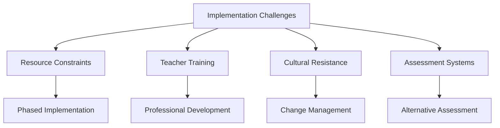

#### Implementation Strategy Framework

```python
def synergetic_implementation_strategy(organizational_context: dict) -> dict:
    """
    Develop implementation strategy for synergetic education.
    
    Args:
        organizational_context: Current educational system characteristics
    
    Returns:
        Comprehensive implementation plan
    """
    strategy = {
        'phased_approach': design_phased_implementation(organizational_context),
        'stakeholder_engagement': identify_key_stakeholders(organizational_context),
        'change_management': develop_change_strategy(organizational_context),
        'professional_development': create_training_programs(organizational_context),
        'resource_allocation': optimize_resource_utilization(organizational_context),
        'evaluation_framework': establish_evaluation_systems(organizational_context),
        'scaling_mechanisms': design_scaling_strategies(organizational_context)
    }
    
    return strategy
```

## Conclusion: Toward Synergetic Educational Transformation

Synergetic learning theory offers a comprehensive framework for transforming education in the 21st century. By embracing the principles of interconnectedness, self-organization, and collaborative intelligence, we can create learning environments that are:

- **More Effective**: Leveraging collective intelligence and adaptive methodologies
- **More Engaging**: Fostering deep understanding through experiential and collaborative learning
- **More Equitable**: Providing personalized learning pathways for diverse learners
- **More Sustainable**: Building resilient educational systems that evolve with changing needs
- **More Innovative**: Encouraging creative problem-solving through interdisciplinary approaches

The implementation of synergetic education requires courage, commitment, and creativity. It challenges us to move beyond traditional paradigms and embrace a more holistic, interconnected, and intelligent approach to learning.

---

## References and Further Reading

### Synergetic Learning Theory
- Fuller, R. Buckminster. *Synergetics: Explorations in the Geometry of Thinking*
- Capra, Fritjof. *The Web of Life: A New Scientific Understanding of Living Systems*
- Wheatley, Margaret J. *Leadership and the New Science: Discovering Order in a Chaotic World*

### Educational Innovation
- Senge, Peter M. *The Fifth Discipline: The Art and Practice of the Learning Organization*
- Pink, Daniel H. *Drive: The Surprising Truth About What Motivates Us*
- Robinson, Ken. *The Element: How Finding Your Passion Changes Everything*

### Technology in Education
- Siemens, George. *Knowing Knowledge*
- Downes, Stephen. *Places to Go: Connectivism & Connective Knowledge*
- Cormier, Dave. *The CCK08 MOOC: Connectivism course, 1/4 way*

### Research and Practice
- [Synergetics in Education Research](https://www.researchgate.net/publication/374290166_SYNERGETIC_AND_INNOVATIVE_APPROACHES_IN_EDUCATION)
- [Collaborative Intelligence in Learning](https://collaborative-intelligence.org/)
- [Systems Thinking in Education](https://www.synergetics.us/vision/)

---

*"The illiterate of the 21st century will not be those who cannot read and write, but those who cannot learn, unlearn, and relearn."*
— Alvin Toffler

*"Education is not the filling of a pail, but the lighting of a fire."*
— William Butler Yeats

*"The best way to predict the future is to invent it."*
— Buckminster Fuller
