# Mathematical Foundations of Synergetics: Exact Arithmetic and Geometric Patterns

## Introduction to Synergetic Mathematics

This comprehensive exploration delves into the mathematical foundations that underpin Buckminster Fuller's Synergetics, with particular emphasis on **symbolic operations on all-integer accounting based upon ratios (geometrically based upon high frequency shapes) of the Synergetics geometry and Quadray/4D coordinates**. We examine how mathematical precision enables the discovery of profound patterns in nature and human cognition.

### Core Concept: Symbolic Operations on Geometric Ratios

The fundamental approach of Synergetics is **symbolic operations on all-integer accounting** where:

1. **Symbolic Operations** maintain exact mathematical relationships
2. **All-Integer Accounting** expresses ratios as precise integer relationships
3. **Geometric Ratios** are derived from high-frequency polyhedral shapes
4. **Synergetics Geometry** provides the comprehensive geometric framework
5. **Quadray/4D Coordinates** enable spatial relationships in tetrahedral space


## The Principle of Exact Arithmetic

### Beyond Floating-Point Limitations

Traditional computational mathematics relies on floating-point representations that introduce inherent approximations. Synergetics demands exact arithmetic to preserve the integrity of geometric relationships and cosmic patterns.


#### The Challenge of Floating-Point Arithmetic

Consider the accumulation of errors in iterative calculations:

```python
# Traditional floating-point approach
def accumulate_fractions(n_terms=10):
    total = 0.0
    for i in range(1, n_terms + 1):
        total += 1.0 / i
    return total

# Exact rational approach
from fractions import Fraction
def accumulate_fractions_exact(n_terms=10):
    total = Fraction(0, 1)
    for i in range(1, n_terms + 1):
        total += Fraction(1, i)
    return total
```

The floating-point version accumulates errors, while the rational version maintains mathematical precision.

### Rational Number Theory in Synergetics

#### Fundamental Operations with Exact Precision


#### Implementation of Exact Arithmetic Classes

The `SymergeticsNumber` class implements exact rational arithmetic:

```python
class SymergeticsNumber:
    """
    Exact rational arithmetic for synergetic calculations.
    
    Maintains mathematical precision through fraction representation,
    enabling discovery of geometric and numerical patterns.
    """
    
    def __init__(self, numerator, denominator=1):
        self.value = Fraction(numerator, denominator)
    
    def __add__(self, other):
        """Exact addition preserving rational relationships."""
        if isinstance(other, SymergeticsNumber):
            return SymergeticsNumber(self.value + other.value)
        return SymergeticsNumber(self.value + Fraction(other))
    
    def __mul__(self, other):
        """Exact multiplication maintaining proportionality."""
        if isinstance(other, SymergeticsNumber):
            return SymergeticsNumber(self.value * other.value)
        return SymergeticsNumber(self.value * Fraction(other))
```

## Geometric Foundations: The Quadray Coordinate System

### Four-Dimensional Coordinate Geometry and High-Frequency Shapes

Synergetics introduces a revolutionary coordinate system that transcends traditional three-dimensional thinking. The Quadray system represents points in four-dimensional space using tetrahedral coordinates, enabling **symbolic operations on geometric ratios derived from high-frequency shapes**.

#### Connecting Symbolic Operations to Geometric Ratios

The Quadray system enables exact symbolic operations on geometric relationships:

```python
# Example: Exact volume ratios in Quadray coordinates
from symergetics import QuadrayCoordinate, integer_tetra_volume

# Tetrahedron vertices in Quadray coordinates
tetra_vertices = [
    QuadrayCoordinate(0, 0, 0, 0),  # Origin
    QuadrayCoordinate(2, 1, 1, 0),  # Face center
    QuadrayCoordinate(2, 1, 0, 1),  # Edge center
    QuadrayCoordinate(2, 0, 1, 1)   # Vertex
]

# Exact volume calculation (symbolic operation)
volume = integer_tetra_volume(*tetra_vertices)
print(f"Exact volume: {volume}")  # Returns exact integer ratio
```

This demonstrates how **symbolic operations on all-integer accounting** work with **geometric ratios from high-frequency shapes** in the **Quadray/4D coordinate system**.

#### High-Frequency Shapes and Their Ratios

The system derives exact ratios from polyhedral geometry:

- **Tetrahedron**: Volume = 1 (fundamental unit)
- **Octahedron**: Volume = 4 (ratio = 4:1)
- **Cube**: Volume = 3 (ratio = 3:1)
- **Cuboctahedron**: Volume = 20 (ratio = 20:1)

These ratios form the basis for **all-integer accounting** in synergetic geometry.


#### The Mathematics of Quadray Coordinates

Each Quadray coordinate `(a, b, c, d)` represents a point in tetrahedral space:

- **a, b, c, d**: Integer coordinates representing tetrahedral unit vectors
- **Normalization**: Coordinates are normalized to ensure lattice consistency
- **Volume Relationships**: Enable exact calculation of polyhedral volumes

#### IVM Lattice Structure

The Isotropic Vector Matrix (IVM) represents the optimal sphere packing in three dimensions:


### Volume Calculations: Exact Determinant Methods

#### Tetrahedron Volume Calculation

The volume of any tetrahedron can be calculated exactly using the determinant method:

```python
def integer_tetra_volume(p0: QuadrayCoordinate, p1: QuadrayCoordinate,
                        p2: QuadrayCoordinate, p3: QuadrayCoordinate) -> int:
    """
    Calculate tetrahedron volume using exact determinant method.
    
    Args:
        p0, p1, p2, p3: Quadray coordinates of tetrahedron vertices
        
    Returns:
        Exact integer volume in tetrahedral units
    """
    # Implementation uses 5x5 determinant for exact calculation
    # Returns integer representing volume in IVM units
    pass
```

#### Polyhedral Volume Relationships

Synergetics reveals exact volume relationships between Platonic solids:


## Pattern Recognition in Large Numbers

### Palindromic Structures

Palindromes represent mathematical symmetry and pattern recognition:


#### Palindrome Detection Algorithm

```python
def is_palindromic(number: Union[int, str, SymergeticsNumber]) -> bool:
    """
    Efficient palindrome detection for exact pattern recognition.
    
    Args:
        number: Input to check for palindromic properties
        
    Returns:
        True if number reads the same forwards and backwards
    """
    num_str = str(abs(number))
    return num_str == num_str[::-1]
```

### Scheherazade Number Analysis

The powers of 1001 reveal remarkable mathematical patterns:

```mermaid
graph TD
    A[1001 = 7×11×13] --> B[Scheherazade Base]
    B --> C[1001^1 = 1001]
    B --> D[1001^2 = 1002001]
    B --> E[1001^3 = 1003003001]
    B --> F[1001^4 = 1004006004001]
    C --> G[Palindromic]
    D --> G
    E --> G
    F --> H[PASCAL'S TRIANGLE]
```



#### Pascal's Triangle in Scheherazade Numbers

Higher powers of 1001 contain complete rows of Pascal's triangle:

```python
def scheherazade_pascal_coefficients(power: int) -> List[int]:
    """
    Extract Pascal's triangle coefficients from Scheherazade numbers.
    
    Args:
        power: Power of 1001 to analyze
        
    Returns:
        List of coefficients from Pascal's triangle
    """
    scheherazade_number = SymergeticsNumber(1001) ** power
    # Extract coefficients from the number structure
    # Returns coefficients for the corresponding Pascal's row
    pass
```

## Primorial Mathematics

### Product of Primes

Primorials represent the product of prime numbers up to a given limit:


#### Efficient Primorial Calculation

```python
def primorial(n: Union[int, SymergeticsNumber]) -> SymergeticsNumber:
    """
    Calculate n# using cached primes and exact arithmetic.
    
    Args:
        n: Upper limit for prime inclusion
        
    Returns:
        Exact primorial as SymergeticsNumber
    """
    if n < 2:
        return SymergeticsNumber(1)
    
    primes = _get_primes_up_to(n)
    result = SymergeticsNumber(1)
    
    for prime in primes:
        result = result * SymergeticsNumber(prime)
    
    return result
```

### Prime Number Theory Integration


## Advanced Mathematical Patterns

### Continued Fraction Analysis

Continued fractions provide optimal rational approximations:


#### Continued Fraction Expansion

```python
def continued_fraction_approximation(value: float, max_terms: int = 10) -> List[int]:
    """
    Generate continued fraction terms for optimal rational approximation.
    
    Args:
        value: Real number to approximate
        max_terms: Maximum number of terms to generate
        
    Returns:
        List of integer coefficients for continued fraction
    """
    terms = []
    current_value = value
    
    for _ in range(max_terms):
        integer_part = int(current_value)
        terms.append(integer_part)
        
        fractional_part = current_value - integer_part
        if fractional_part == 0:
            break
            
        current_value = 1 / fractional_part
    
    return terms
```

### Base Conversion and Number Systems


#### Efficient Base Conversion

```python
def convert_between_bases(number: int, from_base: int, to_base: int) -> str:
    """
    Convert number between arbitrary bases with exact precision.
    
    Args:
        number: Number to convert
        from_base: Source base
        to_base: Target base
        
    Returns:
        String representation in target base
    """
    # Implementation handles arbitrary base conversions
    # Maintains exact digit relationships
    pass
```

## Geometric Transformations and Symmetry

### Coordinate System Transformations


#### Transformation Implementation

```python
def translate(coord: QuadrayCoordinate, offset: QuadrayCoordinate) -> QuadrayCoordinate:
    """
    Pure function for coordinate translation.
    
    Args:
        coord: Original coordinate
        offset: Translation vector
        
    Returns:
        Translated coordinate
    """
    return coord.add(offset)

def scale(coord: QuadrayCoordinate, factor: Union[int, float]) -> QuadrayCoordinate:
    """
    Pure function for coordinate scaling.
    
    Args:
        coord: Original coordinate
        factor: Scaling factor
        
    Returns:
        Scaled coordinate
    """
    scaled_a = int(coord.a * factor)
    scaled_b = int(coord.b * factor)
    scaled_c = int(coord.c * factor)
    scaled_d = int(coord.d * factor)
    return QuadrayCoordinate(scaled_a, scaled_b, scaled_c, scaled_d)
```

## Information Theory and Complexity

### Entropy Analysis of Number Sequences


#### Entropy Calculation

```python
def calculate_entropy(sequence: str) -> float:
    """
    Calculate Shannon entropy of a number sequence.
    
    Args:
        sequence: String representation of number
        
    Returns:
        Entropy value in bits
    """
    from collections import Counter
    import math
    
    if not sequence:
        return 0.0
    
    # Count digit frequencies
    digit_counts = Counter(sequence)
    total_digits = len(sequence)
    
    # Calculate entropy
    entropy = 0.0
    for count in digit_counts.values():
        probability = count / total_digits
        entropy -= probability * math.log2(probability)
    
    return entropy
```

## Applications in Research and Education

### Pattern Discovery in Mathematical Constants


### Research Methodology Integration


## Future Directions in Synergetic Mathematics

### Advanced Computational Methods

#### GPU Acceleration for Large-Scale Calculations


#### Symbolic Computation Integration


### Emerging Research Areas

#### Quantum Geometry Applications


#### Fractal Dimension Analysis


## Conclusion: The Power of Exact Mathematical Thinking

The mathematical foundations of Synergetics demonstrate that precision matters. By maintaining exact relationships through rational arithmetic and geometric transformations, we unlock patterns and insights that would otherwise remain hidden behind the veil of floating-point approximations.

Key insights from this mathematical framework:

1. **Exact Arithmetic Preserves Relationships**: Rational numbers maintain the integrity of geometric and numerical patterns
2. **Geometric Patterns Reveal Structure**: The Quadray system provides a natural framework for understanding spatial complexity
3. **Pattern Recognition Enables Discovery**: Palindromes, primorials, and Scheherazade numbers reveal deep mathematical structures
4. **Transformations Maintain Precision**: Geometric operations preserve exact relationships
5. **Complexity Analysis Provides Insight**: Entropy and pattern analysis quantify mathematical complexity

This mathematical foundation not only supports the computational implementation but also provides a framework for deeper understanding of the universe's fundamental patterns. Through exact arithmetic and geometric insight, Synergetics bridges the gap between abstract mathematics and practical application.

---

## References and Further Reading

### Primary Synergetics Texts
- Fuller, R. Buckminster. *Synergetics: Explorations in the Geometry of Thinking*
- Fuller, R. Buckminster. *Synergetics 2: Further Explorations in the Geometry of Thinking*
- Edmondson, Amy C. *A Fuller Explanation: The Synergetic Geometry of R. Buckminster Fuller*

### Mathematical References
- Hardy, G.H. and Wright, E.M. *An Introduction to the Theory of Numbers*
- Khinchin, A.Y. *Continued Fractions*
- Conway, John H. and Sloane, N.J.A. *Sphere Packings, Lattices and Groups*

### Computational Mathematics
- Press, W.H. et al. *Numerical Recipes: The Art of Scientific Computing*
- Cohen, Henri. *A Course in Computational Algebraic Number Theory*
- Borwein, Jonathan M. *Pi and the AGM: A Study in Analytic Number Theory*

---

*"Mathematics is the language with which God has written the universe."*
— Galileo Galilei

*"The mathematician does not study pure mathematics because it is useful; he studies it because he delights in it and he delights in it because it is beautiful."*
— Henri Poincaré
