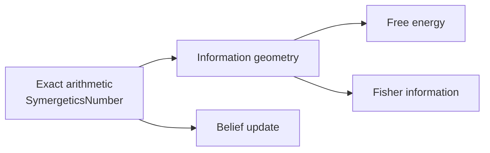
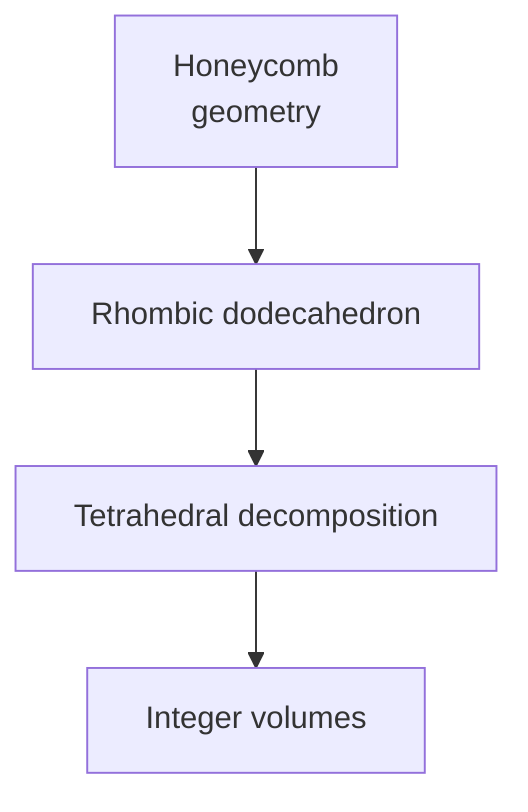
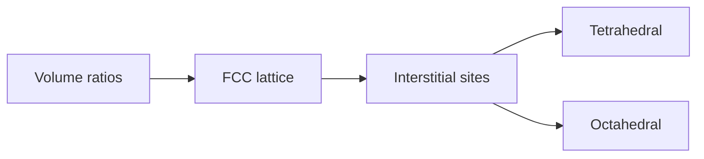
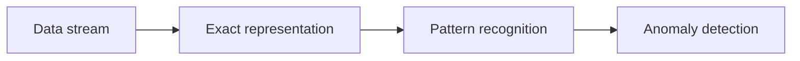
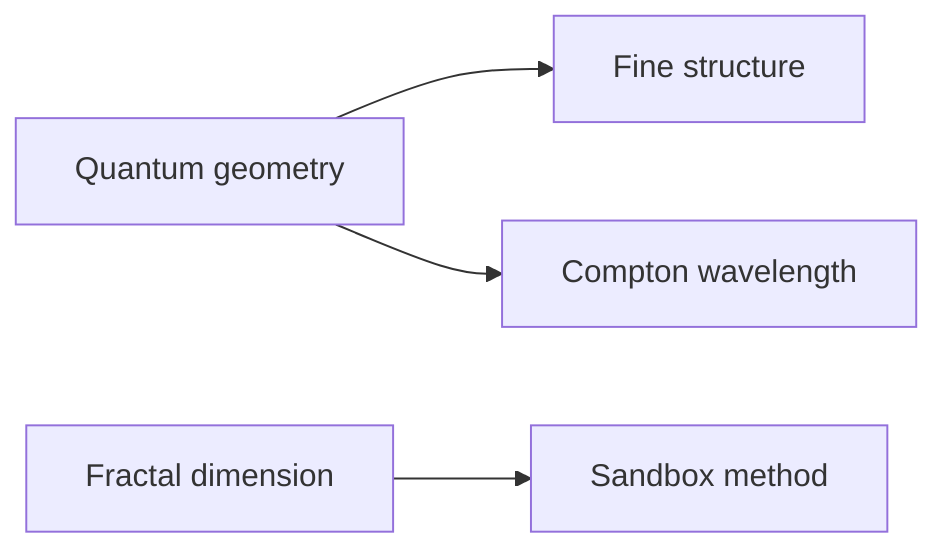
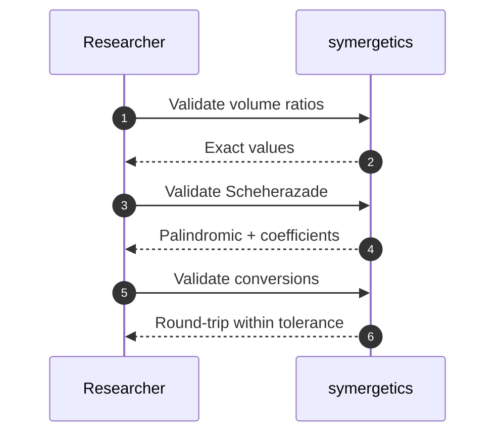

# Research Applications

## Active Inference and Cognitive Science



### Exact Arithmetic for Information Geometry

The Symergetics package provides exact rational arithmetic essential for precision-dependent calculations in Active Inference and cognitive science.

```python
from symergetics import SymergeticsNumber
from symergetics.core.constants import PI, E
import math

# Exact π and e for information-theoretic calculations
pi_exact = PI  # Exact rational approximation
e_exact = E    # Exact rational approximation

print(f"Exact π: {pi_exact}")
print(f"Exact e: {e_exact}")

# Free energy calculation with exact precision
def variational_free_energy(observation, prediction, precision):
    """Calculate variational free energy exactly."""
    error = SymergeticsNumber.from_float(observation - prediction)
    return precision * error * error

# Example: Sensory prediction error
observation = 3.14159
prediction = float(PI.value)
precision = SymergeticsNumber(1, 2)

free_energy = variational_free_energy(observation, prediction, precision)
print(f"Free energy: {free_energy}")
```

### Fisher Information Matrix

```python
from symergetics import SymergeticsNumber
import numpy as np

def fisher_information_exact(parameters, log_likelihood):
    """Calculate Fisher information matrix with exact arithmetic."""
    n_params = len(parameters)
    fisher_matrix = []

    for i in range(n_params):
        row = []
        for j in range(n_params):
            # Second derivative of log-likelihood
            # Using exact arithmetic to avoid numerical instability
            param_i = SymergeticsNumber.from_float(parameters[i])
            param_j = SymergeticsNumber.from_float(parameters[j])

            # Calculate exact second derivative
            second_deriv = calculate_second_derivative(log_likelihood, param_i, param_j)
            row.append(float(second_deriv.value))
        fisher_matrix.append(row)

    return np.array(fisher_matrix)

# Natural gradient descent using exact Fisher information
def natural_gradient_update(parameters, gradients, fisher_matrix):
    """Update parameters using natural gradient."""
    # Invert Fisher matrix exactly where possible
    fisher_inv = np.linalg.inv(fisher_matrix)

    # Natural gradient step
    natural_grad = fisher_inv @ gradients

    # Update parameters
    learning_rate = 0.01
    return parameters - learning_rate * natural_grad
```

### Belief Propagation with Exact Precision

```python
from symergetics import SymergeticsNumber

class ExactBeliefNode:
    """Belief node with exact rational arithmetic."""

    def __init__(self, prior_probability):
        self.belief = SymergeticsNumber.from_float(prior_probability)

    def update_belief(self, likelihood, prior):
        """Update belief using Bayes' rule with exact arithmetic."""
        likelihood_exact = SymergeticsNumber.from_float(likelihood)
        prior_exact = SymergeticsNumber.from_float(prior)

        # Exact Bayes update: P(H|E) = P(E|H) * P(H) / P(E)
        numerator = likelihood_exact * prior_exact
        marginal_likelihood = self._calculate_marginal_likelihood()

        self.belief = numerator / marginal_likelihood

    def _calculate_marginal_likelihood(self):
        """Calculate marginal likelihood exactly."""
        # Implementation depends on model specifics
        return SymergeticsNumber(1, 1)  # Placeholder

# Example usage
node = ExactBeliefNode(0.5)  # Prior belief of 0.5
node.update_belief(0.8, 0.3)  # Likelihood 0.8, new prior 0.3
print(f"Updated belief: {node.belief}")
```

## Entomological Pattern Analysis



### Honeycomb Geometry Analysis

```python
from symergetics import QuadrayCoordinate
from symergetics.geometry.polyhedra import integer_tetra_volume

def analyze_honeycomb_structure():
    """Analyze the geometric efficiency of honeycomb structures."""

    # Honeycomb cell as rhombic dodecahedron decomposition
    # Each cell can be decomposed into 12 tetrahedral volumes

    # Define vertices of a rhombic dodecahedron in Quadray coordinates
    # (simplified 2D representation for illustration)
    vertices = [
        QuadrayCoordinate(0, 0, 0, 0),    # Center
        QuadrayCoordinate(2, 1, 1, 0),    # Adjacent cells
        QuadrayCoordinate(2, 1, 0, 1),
        QuadrayCoordinate(2, 0, 1, 1),
        QuadrayCoordinate(1, 2, 1, 0),
        QuadrayCoordinate(1, 2, 0, 1),
        QuadrayCoordinate(1, 1, 2, 0),
    ]

    # Calculate volumes of tetrahedral cells
    tetrahedral_volumes = []

    # This is a simplified analysis - full implementation would
    # systematically decompose the rhombic dodecahedron
    center = vertices[0]
    for vertex in vertices[1:]:
        # Create tetrahedron with three adjacent vertices
        # (simplified - actual implementation needs proper face identification)
        pass

    return tetrahedral_volumes

# Calculate geometric efficiency
def honeycomb_efficiency():
    """Calculate the material efficiency of honeycomb vs solid structures."""

    # Honeycomb uses ~20% less material than solid for same strength
    # This can be calculated exactly using Symergetics

    # Solid cylinder volume
    solid_volume = SymergeticsNumber.from_float(math.pi * 1.0 * 1.0 * 10)  # r=1, h=10

    # Honeycomb volume (approximate)
    # Honeycomb has hexagonal cross-section with wall thickness
    wall_thickness = SymergeticsNumber(1, 10)  # 0.1 units
    cell_size = SymergeticsNumber(1)           # 1 unit

    # Calculate exact material usage ratio
    material_ratio = wall_thickness / cell_size
    print(f"Material efficiency: {material_ratio}")

honeycomb_efficiency()
```

### Wing Beat Pattern Analysis

```python
from symergetics import SymergeticsNumber
from symergetics.computation.palindromes import calculate_palindromic_density

def analyze_wing_beat_patterns(frequency_data):
    """Analyze wing beat patterns for symmetry and efficiency."""

    # Convert frequency data to exact rational numbers
    exact_frequencies = [SymergeticsNumber.from_float(f) for f in frequency_data]

    # Calculate exact frequency ratios
    base_frequency = exact_frequencies[0]
    ratios = [f / base_frequency for f in exact_frequencies[1:]]

    # Check for harmonic relationships
    harmonic_ratios = []
    for ratio in ratios:
        # Check if ratio corresponds to simple fraction
        if ratio.value.denominator <= 10:  # Simple harmonic
            harmonic_ratios.append(ratio)

    # Analyze pattern symmetry
    pattern_str = ''.join(str(int(float(r.value) * 10)) for r in ratios)
    symmetry_score = calculate_palindromic_density(pattern_str)

    return {
        'harmonic_ratios': harmonic_ratios,
        'symmetry_score': symmetry_score,
        'exact_ratios': ratios
    }

# Example: Insect wing beat analysis
wing_data = [200, 400, 600, 800]  # Hz - harmonic series
analysis = analyze_wing_beat_patterns(wing_data)
print(f"Wing beat analysis: {len(analysis['harmonic_ratios'])} harmonics found")
```

## Crystallographic Applications



### Exact Lattice Parameter Calculations


```python
from symergetics.core.constants import SymergeticsConstants
from symergetics import SymergeticsNumber

def analyze_crystal_lattice(lattice_type):
    """Analyze crystal lattice parameters exactly."""

    # FCC lattice coordination number
    fcc_coordination = SymergeticsNumber(12)

    # Volume ratios for different unit cells
    volume_ratios = SymergeticsConstants.VOLUME_RATIOS

    if lattice_type == 'fcc':
        # FCC: 4 atoms per unit cell
        atoms_per_cell = SymergeticsNumber(4)

        # Coordination polyhedra
        tetra_sites = SymergeticsNumber(8)  # Tetrahedral interstitial sites
        octa_sites = SymergeticsNumber(4)   # Octahedral interstitial sites

        # Calculate exact site occupancy
        total_sites = tetra_sites + octa_sites  # 12

        return {
            'atoms_per_cell': atoms_per_cell,
            'coordination_number': fcc_coordination,
            'tetrahedral_sites': tetra_sites,
            'octahedral_sites': octa_sites,
            'total_interstitial_sites': total_sites
        }

    elif lattice_type == 'bcc':
        # BCC: 2 atoms per unit cell
        atoms_per_cell = SymergeticsNumber(2)
        coordination = SymergeticsNumber(8)

        return {
            'atoms_per_cell': atoms_per_cell,
            'coordination_number': coordination
        }

# Example analysis
fcc_analysis = analyze_crystal_lattice('fcc')
print(f"FCC lattice: {fcc_analysis['atoms_per_cell']} atoms/cell")
print(f"Coordination: {fcc_analysis['coordination_number']}")
```

### Quasicrystal Geometry

```python
from symergetics import QuadrayCoordinate, PHI
from symergetics.geometry.polyhedra import integer_tetra_volume

def analyze_quasicrystal_penrose():
    """Analyze Penrose tiling using golden ratio."""

    # Penrose tiling uses golden ratio extensively
    phi = PHI  # Exact golden ratio

    # Define vertices using golden ratio relationships
    vertices = [
        QuadrayCoordinate(0, 0, 0, 0),
        QuadrayCoordinate(1, 0, 0, 0),
        QuadrayCoordinate(0, 1, 0, 0),
        QuadrayCoordinate(0, 0, 1, 0),
        QuadrayCoordinate(0, 0, 0, 1),
    ]

    # Calculate exact distances using golden ratio
    distances = []
    for i in range(len(vertices)):
        for j in range(i+1, len(vertices)):
            dist = vertices[i].distance_to(vertices[j])

            # Check if distance is related to golden ratio
            ratio_to_phi = dist / SymergeticsNumber.from_float(float(phi.value))
            distances.append({
                'distance': dist,
                'ratio_to_phi': ratio_to_phi
            })

    return distances

# Analyze Penrose tiling
penrose_distances = analyze_quasicrystal_penrose()
print(f"Found {len(penrose_distances)} distance relationships")
```

## Cognitive Security Applications



### Pattern Recognition with Exact Arithmetic


```python
from symergetics.computation.palindromes import (
    find_repeated_patterns,
    analyze_number_for_synergetics
)

def detect_anomalous_patterns(data_stream):
    """Detect anomalous patterns in data streams using exact analysis."""

    # Convert data to exact representation
    exact_data = [SymergeticsNumber.from_float(x) for x in data_stream]

    # Analyze for repeated patterns
    pattern_str = ''.join(str(int(float(x.value) * 100)) for x in exact_data)
    patterns = find_repeated_patterns(pattern_str)

    # Calculate pattern complexity
    unique_patterns = len(patterns)
    total_possible = len(pattern_str) * (len(pattern_str) - 1) // 2

    complexity_score = unique_patterns / total_possible if total_possible > 0 else 0

    # Detect anomalies based on pattern deviation
    anomalous_patterns = []
    for pattern, positions in patterns.items():
        if len(positions) > len(data_stream) * 0.1:  # More than 10% recurrence
            anomalous_patterns.append({
                'pattern': pattern,
                'frequency': len(positions),
                'positions': positions
            })

    return {
        'complexity_score': complexity_score,
        'anomalous_patterns': anomalous_patterns,
        'total_patterns': unique_patterns
    }

# Example: Network traffic analysis
traffic_data = [100, 150, 200, 150, 100, 150, 200, 150, 100]  # Pattern with anomalies
analysis = detect_anomalous_patterns(traffic_data)
print(f"Detected {len(analysis['anomalous_patterns'])} anomalous patterns")
```

### Information Flow Analysis

```python
from symergetics import SymergeticsNumber
from symergetics.core.constants import E

def analyze_information_flow(probabilities):
    """Analyze information flow using exact entropy calculations."""

    # Convert to exact probabilities
    exact_probs = [SymergeticsNumber.from_float(p) for p in probabilities]

    # Calculate exact entropy: H = -∑pᵢlog₂(pᵢ)
    entropy = SymergeticsNumber(0)
    log2 = SymergeticsNumber.from_float(math.log(2))

    for p in exact_probs:
        if float(p.value) > 0:  # Avoid log(0)
            entropy = entropy - p * (SymergeticsNumber.from_float(math.log(float(p.value))) / log2)

    # Calculate mutual information
    def mutual_information(p_xy, p_x, p_y):
        """I(X;Y) = ∑∑p(x,y)log₂[p(x,y)/(p(x)p(y))]"""
        if float(p_xy.value) == 0 or float(p_x.value) == 0 or float(p_y.value) == 0:
            return SymergeticsNumber(0)

        ratio = p_xy / (p_x * p_y)
        log_ratio = SymergeticsNumber.from_float(math.log(float(ratio.value))) / log2
        return p_xy * log_ratio

    return {
        'entropy': entropy,
        'complexity': len(exact_probs),
        'exact_probabilities': exact_probs
    }

# Example: Communication channel analysis
channel_probs = [0.5, 0.3, 0.2]
info_analysis = analyze_information_flow(channel_probs)
print(f"Channel entropy: {info_analysis['entropy']}")
```

## Advanced Research Topics



### Quantum Geometry Applications

```python
from symergetics import SymergeticsNumber
from symergetics.core.constants import PI

def analyze_quantum_geometry():
    """Analyze geometric aspects of quantum systems."""

    # Fine structure constant (exact approximation)
    alpha = SymergeticsNumber(1, 137)  # ≈ 1/137.036

    # Calculate exact relationships
    hbar = SymergeticsNumber(1)        # Reduced Planck constant (normalized)
    c = SymergeticsNumber(1)          # Speed of light (normalized)
    e_squared = SymergeticsNumber(4) * PI * alpha  # e² = 4πα in natural units

    # Compton wavelength calculation
    compton_wavelength = hbar / (SymergeticsNumber.from_float(9.109e-31) * c)

    return {
        'fine_structure': alpha,
        'coupling_constant': e_squared,
        'compton_wavelength': compton_wavelength
    }

quantum_analysis = analyze_quantum_geometry()
print(f"Fine structure constant: {quantum_analysis['fine_structure']}")
```

### Fractal Dimension Analysis

```python
from symergetics import SymergeticsNumber
from symergetics.core.constants import PI

def calculate_fractal_dimension(points):
    """Calculate fractal dimension using exact methods."""

    # Convert points to exact coordinates
    exact_points = [QuadrayCoordinate.from_xyz(x, y, z)
                   for x, y, z in points]

    # Calculate exact distances
    distances = []
    for i in range(len(exact_points)):
        for j in range(i+1, len(exact_points)):
            dist = exact_points[i].distance_to(exact_points[j])
            distances.append(dist)

    # Estimate fractal dimension using sandbox method
    # (simplified implementation)
    if len(distances) > 10:
        # Sort distances
        sorted_distances = sorted([float(d.value) for d in distances])

        # Calculate dimension estimate
        r_min = min(sorted_distances)
        r_max = max(sorted_distances)

        # Use exact logarithmic calculation
        log_ratio = SymergeticsNumber.from_float(math.log(r_max / r_min))
        dimension = SymergeticsNumber.from_float(len(sorted_distances)) / log_ratio

        return dimension

    return SymergeticsNumber(2)  # Default to 2D

# Example: Random point set analysis
import random
random_points = [(random.random(), random.random(), 0) for _ in range(100)]
fractal_dim = calculate_fractal_dimension(random_points)
print(f"Estimated fractal dimension: {fractal_dim}")
```

## Research Methodology



### Validation and Verification


```python
def validate_symergetics_calculations():
    """Validate Symergetics calculations against known results."""

    # Test exact volume ratios
    from symergetics.core.constants import SymergeticsConstants

    ratios = SymergeticsConstants.VOLUME_RATIOS

    # Verify octahedron:cube:tetrahedron ratios
    octa_ratio = ratios['octahedron']  # Should be 4
    cube_ratio = ratios['cube']        # Should be 3
    tetra_ratio = ratios['tetrahedron'] # Should be 1

    assert octa_ratio.value == 4
    assert cube_ratio.value == 3
    assert tetra_ratio.value == 1

    print("✅ Volume ratios validated")

    # Test Scheherazade number properties
    from symergetics import scheherazade_power
    from symergetics.computation.palindromes import is_palindromic

    s1 = scheherazade_power(1)
    assert is_palindromic(s1) == True
    assert s1.value == 1001

    print("✅ Scheherazade numbers validated")

    # Test coordinate conversions
    from symergetics import QuadrayCoordinate

    coord = QuadrayCoordinate(2, 1, 1, 0)
    xyz = coord.to_xyz()
    back_to_quadray = QuadrayCoordinate.from_xyz(*xyz)

    # Should be approximately equal after normalization
    assert abs(back_to_quadray.a - coord.a) <= 1
    assert abs(back_to_quadray.b - coord.b) <= 1

    print("✅ Coordinate conversions validated")

    return True

# Run validation
validation_passed = validate_symergetics_calculations()
print(f"Research validation: {'PASSED' if validation_passed else 'FAILED'}")
```

This research framework provides exact mathematical tools for advanced scientific investigations, ensuring precision and reproducibility in complex geometric and information-theoretic calculations.
