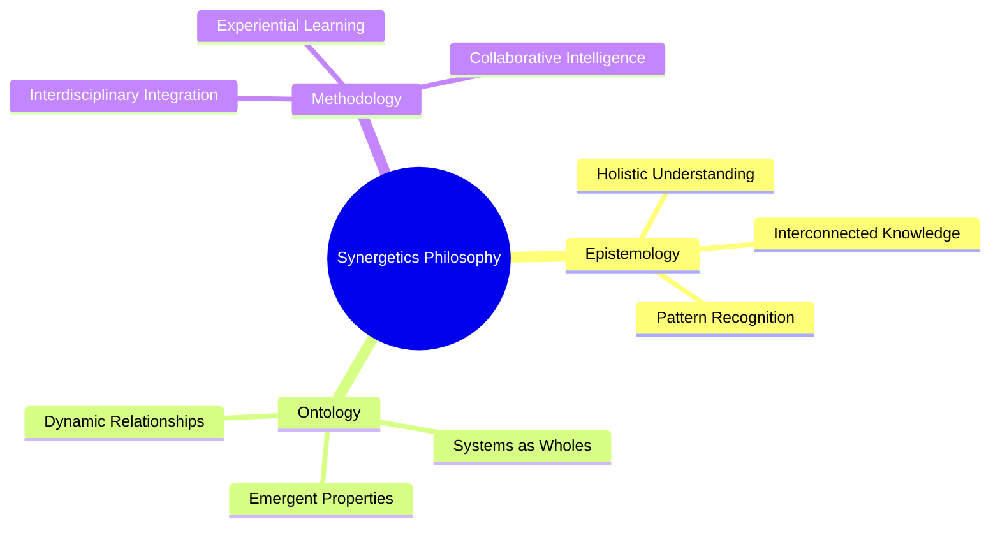
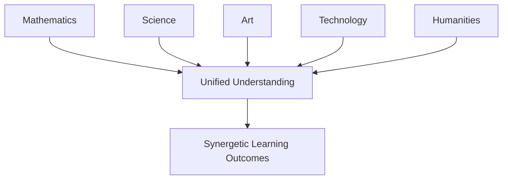
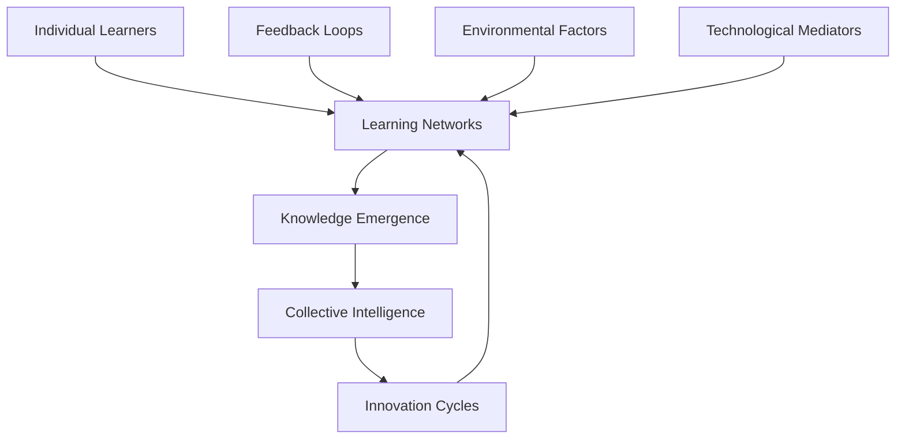
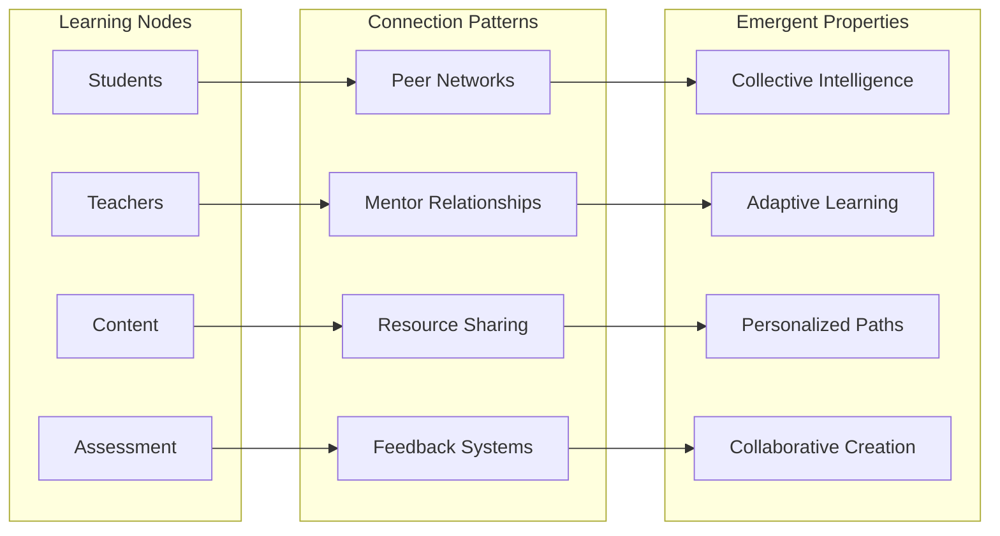
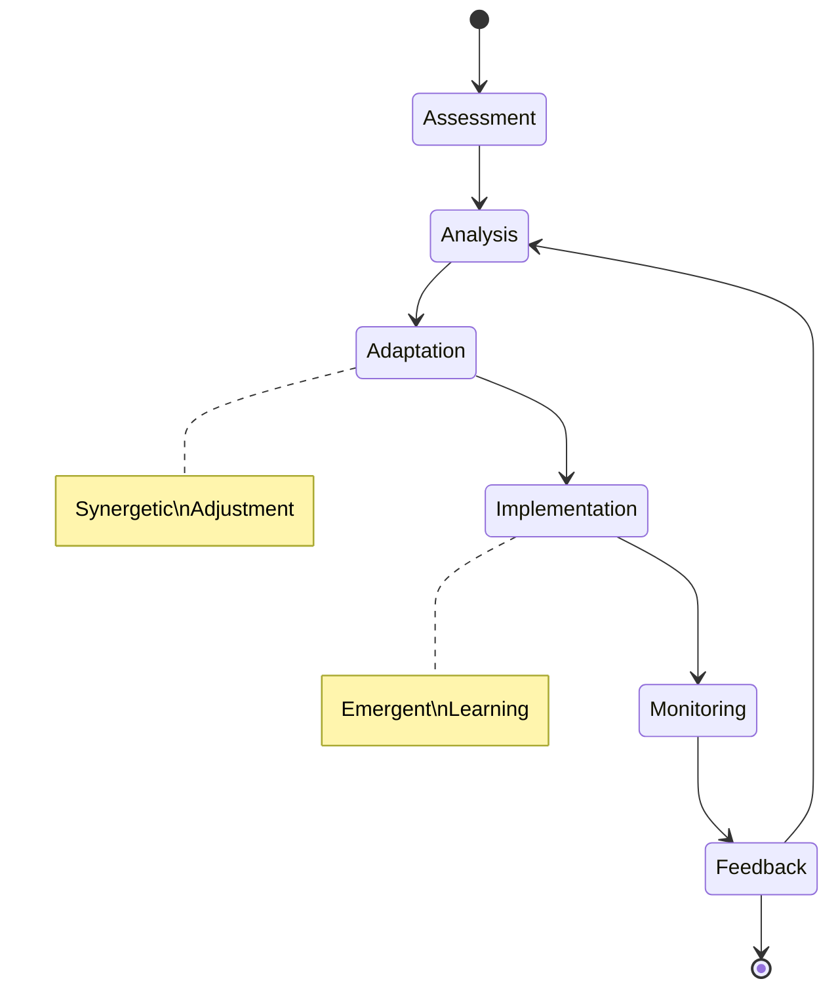
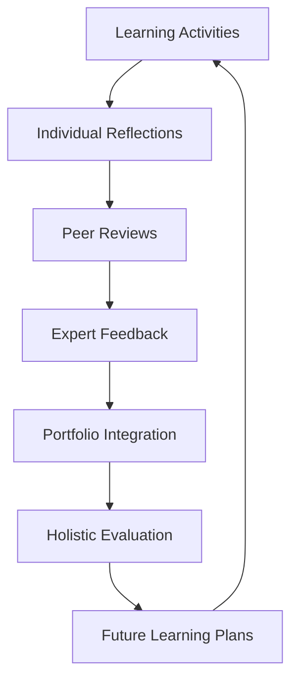
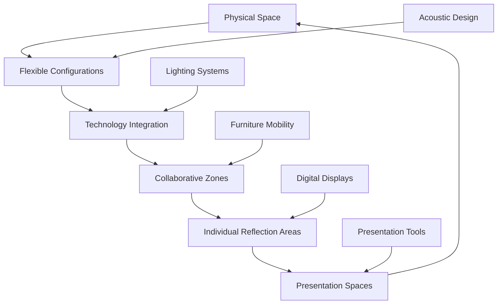
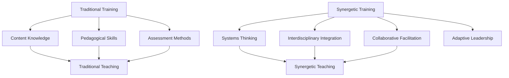
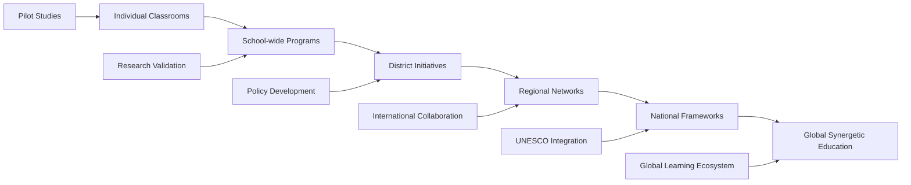
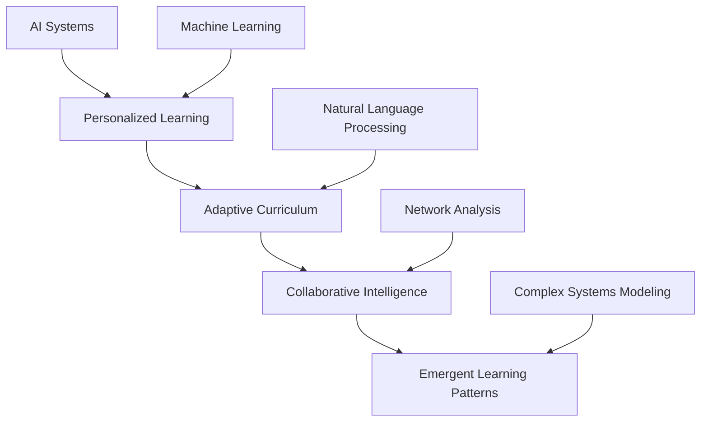

# Synergetics Philosophy and Education: A Comprehensive Framework

## Introduction to Synergetics in Educational Contexts

Synergetics, as envisioned by Buckminster Fuller, represents a fundamental shift in how we understand and approach complex systems, particularly within educational frameworks. This comprehensive exploration examines how synergetic principles transform learning environments, fostering holistic development and interdisciplinary understanding.

## Core Philosophical Foundations

### The Geometry of Thinking

Synergetics challenges traditional reductionist approaches to education by emphasizing the interconnectedness of all knowledge domains. Rather than viewing subjects as isolated silos, synergetics reveals the underlying patterns and relationships that connect mathematics, science, art, and human experience.

### The Principle of Synergy in Learning

> "The whole is greater than the sum of its parts" - Aristotle

In educational contexts, this principle manifests as collaborative intelligence, where the collective behavior of learners leads to outcomes that transcend individual capabilities. Synergetics education recognizes that learning emerges from the dynamic interaction of multiple subsystems:

- **Cognitive Systems**: Individual mental processes
- **Social Systems**: Group dynamics and peer learning
- **Environmental Systems**: Physical and virtual learning spaces
- **Technological Systems**: Tools and platforms that mediate learning

## Educational Applications of Synergetic Principles

### 1. Interdisciplinary Learning Environments

Synergetics education breaks down artificial disciplinary boundaries, creating learning ecosystems where:

#### Case Study: The Geodesic Dome as Learning Metaphor

Buckminster Fuller's geodesic dome serves as a powerful metaphor for synergetic education:

- **Structural Integrity**: Each component contributes to overall stability
- **Distributed Load**: No single element bears excessive burden
- **Efficient Resource Use**: Maximum strength with minimum materials
- **Scalable Design**: Adaptable to different sizes and contexts

In educational terms, this translates to:
- **Collaborative Learning**: Students support each other's learning
- **Resource Optimization**: Efficient use of educational resources
- **Adaptive Curriculum**: Flexible learning paths
- **Scalable Assessment**: Holistic evaluation methods

### 2. Self-Organization and Emergent Learning

Synergetics recognizes that learning systems naturally evolve toward higher levels of organization. This principle is particularly evident in:

#### Complex Adaptive Systems in Education

#### Nonlinear Learning Dynamics

Traditional education often assumes linear progress, but synergetics reveals that learning follows nonlinear patterns:

- **Phase Transitions**: Sudden breakthroughs in understanding
- **Critical Points**: Moments of maximum learning potential
- **Attractor States**: Stable patterns of knowledge organization
- **Bifurcations**: Choice points leading to different learning trajectories

### 3. The Role of Technology in Synergetic Education

Modern technology amplifies synergetic principles through:

#### Digital Learning Ecosystems

## Implementing Synergetics in Educational Systems

### Curriculum Design Principles

#### 1. Holistic Integration

Synergetic curriculum design focuses on:

- **Pattern Recognition**: Identifying underlying structures across disciplines
- **Systems Thinking**: Understanding relationships and interdependencies
- **Experiential Learning**: Direct engagement with complex systems
- **Collaborative Projects**: Interdisciplinary team-based learning

#### 2. Adaptive Learning Environments

### Assessment and Evaluation Frameworks

#### Beyond Traditional Testing

Synergetics education requires new evaluation methods that capture:

- **Systems Understanding**: Ability to see interconnected patterns
- **Collaborative Skills**: Effectiveness in group problem-solving
- **Adaptive Thinking**: Flexibility in approaching complex problems
- **Emergent Creativity**: Innovation through system interactions

#### Portfolio Assessment in Synergetic Contexts

## Philosophical Implications for Education

### Epistemological Shifts

Synergetics challenges traditional epistemological foundations by:

1. **Rejecting Reductionism**: Moving beyond analysis to synthesis
2. **Embracing Complexity**: Valuing multifaceted understanding
3. **Recognizing Emergence**: Understanding how new properties arise
4. **Promoting Holism**: Seeing the whole in its component parts

### Ontological Perspectives

From a synergetic viewpoint, reality itself is seen as:

- **Interconnected**: All phenomena are fundamentally linked
- **Dynamic**: Reality is in constant flux and evolution
- **Self-Organizing**: Systems naturally evolve toward higher complexity
- **Purposeful**: Evolution follows principles of efficiency and effectiveness

### Axiological Considerations

Synergetic education values:

- **Sustainability**: Long-term thinking and responsible action
- **Efficiency**: Optimal use of resources and energy
- **Harmony**: Balance between individual and collective needs
- **Innovation**: Creative solutions to complex problems

## Practical Implementation Strategies

### Classroom Design and Learning Spaces

#### Synergetic Learning Environments

#### Learning Activity Design

##### Project-Based Synergetic Learning

1. **Problem Identification**: Complex, real-world challenges
2. **Interdisciplinary Teams**: Diverse expertise and perspectives
3. **Iterative Development**: Cyclical improvement processes
4. **Stakeholder Engagement**: Real-world impact and feedback
5. **Reflection and Adaptation**: Continuous learning cycles

### Teacher Professional Development

#### Synergetic Teacher Training

## Challenges and Solutions

### Implementation Barriers

#### 1. Institutional Resistance

**Challenge**: Traditional educational systems resist fundamental change
**Solution**: Pilot programs demonstrating synergetic benefits

#### 2. Assessment Difficulties

**Challenge**: Measuring complex, emergent learning outcomes
**Solution**: Develop holistic assessment frameworks

#### 3. Resource Allocation

**Challenge**: Requiring more flexible learning environments
**Solution**: Phased implementation with existing resources

#### 4. Teacher Training

**Challenge**: Preparing educators for synergetic approaches
**Solution**: Comprehensive professional development programs

### Scaling Synergetic Education

## Future Directions

### Emerging Technologies and Synergetics

#### Artificial Intelligence Integration

#### Virtual and Augmented Reality

- **Immersive Learning Experiences**: Direct engagement with complex systems
- **Spatial Understanding**: Enhanced geometric and spatial reasoning
- **Collaborative Virtual Spaces**: Global learning communities
- **Simulation-Based Learning**: Safe exploration of complex phenomena

### Research Agenda

#### Key Research Questions

1. **How do synergetic learning environments affect long-term knowledge retention?**
2. **What are the most effective methods for teaching systems thinking?**
3. **How can we measure and assess emergent learning outcomes?**
4. **What role does technology play in facilitating synergetic education?**
5. **How do cultural contexts influence synergetic learning approaches?**

#### Research Methodologies

- **Longitudinal Studies**: Tracking learning outcomes over time
- **Network Analysis**: Mapping knowledge relationships
- **Complex Systems Modeling**: Simulating learning dynamics
- **Ethnographic Research**: Understanding cultural contexts
- **Action Research**: Practitioner-led investigations

## Conclusion: Toward a Synergetic Educational Paradigm

Synergetics offers a profound framework for rethinking education in the 21st century. By embracing the principles of interconnectedness, self-organization, and emergent intelligence, we can create learning environments that are:

- **More Effective**: Leveraging collective intelligence and collaborative learning
- **More Engaging**: Fostering deep understanding through experiential learning
- **More Adaptable**: Responding to the dynamic needs of learners and society
- **More Sustainable**: Promoting long-term thinking and responsible action

The implementation of synergetic education requires courage, creativity, and commitment. It challenges us to move beyond traditional paradigms and embrace a more holistic, interconnected, and intelligent approach to learning.

As Buckminster Fuller envisioned, synergetics provides the intellectual framework for addressing the complex challenges of our time. Through synergetic education, we can prepare learners not just to understand the world, but to actively participate in its transformation.

---

## References and Further Reading

### Key Synergetics Texts
- Fuller, R. Buckminster. *Synergetics: Explorations in the Geometry of Thinking*
- Fuller, R. Buckminster. *Synergetics 2: Further Explorations in the Geometry of Thinking*
- Edmondson, Amy C. *A Fuller Explanation: The Synergetic Geometry of R. Buckminster Fuller*

### Educational Applications
- Banathy, Bela H. *Systems Design of Education*
- Capra, Fritjof. *The Web of Life: A New Scientific Understanding of Living Systems*
- Senge, Peter M. *The Fifth Discipline: The Art and Practice of the Learning Organization*

### Contemporary Research
- [Synergetics in Education Research](https://www.researchgate.net/publication/374290166_SYNERGETIC_AND_INNOVATIVE_APPROACHES_IN_EDUCATION)
- [Collaborative Intelligence Frameworks](https://collaborative-intelligence.org/RBFuller.html)
- [Systems Thinking in Education](https://www.synergetics.us/)

---

*"Education is not the filling of a pail, but the lighting of a fire."*
— William Butler Yeats

*"The best way to predict the future is to create it."*
— Buckminster Fuller
