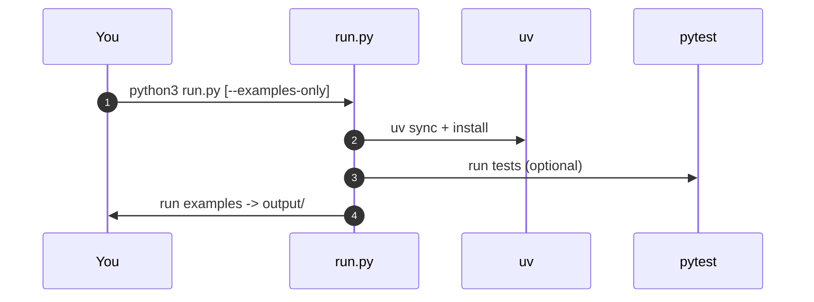

# Tutorials

## Getting Started

### Installation

```bash
# Clone the repository
git clone https://github.com/username/symergetics.git
cd symergetics

# Install in development mode
pip install -e .

# Run tests to verify installation
python -m pytest tests/
```

### Using uv (recommended for this repo)

```bash
uv sync
uv pip install -e .[scientific,test]
uv run python -m pytest -q
```

### First Steps

```python
# Import the package
from symergetics import *

# Create your first SymergeticsNumber
num = SymergeticsNumber(3, 4)
print(f"Created: {num}")  # "3/4 (0.75000000)"

# Basic arithmetic
result = num + SymergeticsNumber(1, 4)
print(f"3/4 + 1/4 = {result}")  # "1/1 (1.00000000)"
```

## Core Concepts

### 1. Exact Rational Arithmetic

**Problem**: Floating-point arithmetic introduces errors in geometric calculations.

```python
# Traditional floating-point (problematic)
a = 0.1
b = 0.2
print(a + b)  # 0.30000000000000004 (error!)

# Symergetics solution (exact)
a_exact = SymergeticsNumber(1, 10)
b_exact = SymergeticsNumber(1, 5)
result_exact = a_exact + b_exact
print(result_exact)  # 3/10 (0.30000000) - exact!
```

**Key Benefits:**

- Zero accumulation of rounding errors
- Exact geometric relationships
- Predictable numerical behavior

Number formatting defaults:

- Default representation is ungrouped; use `format_large_number()` and `ungroup_number()` to switch between grouped/ungrouped as needed.

### 2. Quadray Coordinate System

**Traditional XYZ**: Rectangular coordinates in 3D space.

**Quadray**: Tetrahedral coordinates in 4D with normalization.

```python
from symergetics import QuadrayCoordinate

# Create a normalized coordinate
coord = QuadrayCoordinate(2, 1, 1, 0)
print(f"Quadray: {coord}")  # Already normalized

# Convert to Cartesian
x, y, z = coord.to_xyz()
print(f"XYZ: ({x:.3f}, {y:.3f}, {z:.3f})")

# Distance calculations remain exact
origin = QuadrayCoordinate(0, 0, 0, 0)
distance = coord.distance_to(origin)
```

**Why Quadray?**

- Represents tetrahedral relationships exactly
- IVM (Isotropic Vector Matrix) lattice structure
- Natural for sphere packing problems

### 3. Volume Calculations

**Traditional**: Approximate volumes with floating-point errors.

**Symergetics**: Exact integer volumes in tetrahedral units.

```python
from symergetics import Tetrahedron, Octahedron, Cube

tetra = Tetrahedron()
octa = Octahedron()
cube = Cube()

print(f"Tetrahedron: {tetra.volume()} tetrahedra")    # 1
print(f"Octahedron: {octa.volume()} tetrahedra")      # 4
print(f"Cube: {cube.volume()} tetrahedra")            # 3

# Exact ratios
ratio = octa.volume() / tetra.volume()
print(f"Octahedron:Tetrahedron = {ratio}:1")  # Exactly 4:1
```

## Intermediate Tutorials

### Working with Scheherazade Numbers

Fuller discovered remarkable patterns in powers of 1001.

```python
from symergetics import scheherazade_power
from symergetics.computation.palindromes import is_palindromic

# The base Scheherazade number
s1 = scheherazade_power(1)
print(f"1001¹ = {s1}")
print(f"Is palindromic? {is_palindromic(s1)}")  # True

# The famous 1001^6 contains Pascal's triangle
s6 = scheherazade_power(6)
print(f"1001⁶ has {len(str(s6.value.numerator))} digits")

# Extract Pascal's coefficients
from symergetics.computation.primorials import scheherazade_pascal_coefficients
coeffs = scheherazade_pascal_coefficients(6)
print(f"Pascal's row 6: {coeffs}")  # [1, 6, 15, 20, 15, 6, 1]
```

### Primorial Mathematics

Primorials are products of prime numbers.

```python
from symergetics import primorial

# Calculate primorials
p5 = primorial(5)   # 2 × 3 × 5 = 30
p7 = primorial(7)   # 2 × 3 × 5 × 7 = 210
p13 = primorial(13) # 2 × 3 × 5 × 7 × 11 × 13 = 30,030

print(f"5# = {p5}")
print(f"7# = {p7}")
print(f"13# = {p13}")

# Fuller's 14-illion cosmic abundance number
from symergetics.core.constants import COSMIC_ABUNDANCE
print(f"Cosmic abundance: {COSMIC_ABUNDANCE}")
```

### Orchestration with run.py



### Mnemonic Encoding

Create memorable representations of large numbers.

```python
from symergetics.utils.mnemonics import mnemonic_encode, create_memory_aid

# Large cosmic number
atomic_diameters = 25000000000
mnemonic = mnemonic_encode(atomic_diameters)
print(f"25 billion: {mnemonic}")

# Comprehensive memory aids
aids = create_memory_aid(1001)
print("Scheherazade number memory aids:")
for style, aid in aids.items():
    print(f"  {style}: {aid}")
```

## Advanced Tutorials

### Custom Polyhedral Analysis

```python
from symergetics.core.coordinates import QuadrayCoordinate
from symergetics.geometry.polyhedra import integer_tetra_volume

# Define a custom tetrahedron
vertices = [
    QuadrayCoordinate(0, 0, 0, 0),
    QuadrayCoordinate(3, 1, 1, 0),
    QuadrayCoordinate(3, 1, 0, 1),
    QuadrayCoordinate(3, 0, 1, 1)
]

# Calculate exact volume
volume = integer_tetra_volume(*vertices)
print(f"Custom tetrahedron volume: {volume} IVM units")

# Analyze vertex relationships
for i, vertex in enumerate(vertices):
    distances = [vertex.distance_to(other) for other in vertices if other != vertex]
    print(f"Vertex {i} distances: {[f'{d:.6f}' for d in distances]}")
```

### Coordinate System Transformations

```python
from symergetics import QuadrayCoordinate
from symergetics.geometry.transformations import translate, scale, rotate_around_axis

# Start with a coordinate
coord = QuadrayCoordinate(2, 1, 1, 0)
print(f"Original: {coord}")

# Apply transformations
translated = translate(coord, QuadrayCoordinate(1, 0, 0, 0))
print(f"Translated: {translated}")

scaled = scale(coord, 2.0)
print(f"Scaled: {scaled}")

rotated = rotate_around_axis(coord, 'z', 45.0)  # 45 degrees around Z
print(f"Rotated: XYZ {rotated.to_xyz()}")
```

### Pattern Recognition in Large Numbers

```python
from symergetics.computation.palindromes import (
    find_palindromic_sequence,
    calculate_palindromic_density,
    analyze_number_for_synergetics
)

# Generate palindromic sequences
palindromes = find_palindromic_sequence(100, 5)
print(f"Palindromes starting from 100: {palindromes}")

# Analyze number patterns
analysis = analyze_number_for_synergetics(123454321)
print(f"Pattern analysis: {analysis['palindromic_density']:.2%} palindromic")

# SSRCD analysis
ssrcd = find_palindromic_sequence(6)
print(f"Scheherazade^6 patterns: {len(ssrcd['palindromic_patterns'])}")
```

### Performance Optimization

```python
import time
from symergetics import scheherazade_power

# Benchmark large calculations
powers = [5, 10, 15, 20]

for power in powers:
    start = time.time()
    result = scheherazade_power(power)
    elapsed = time.time() - start

    digit_count = len(str(result.value.numerator))
    print(f"1001^{power}: {digit_count} digits in {elapsed:.4f}s")
```

## Research Integration

### Active Inference Applications

```python
from symergetics import SymergeticsNumber
import math

# Exact precision for information-theoretic calculations
pi_exact = SymergeticsNumber.from_float(math.pi, max_denominator=1000000)
e_exact = SymergeticsNumber.from_float(math.e, max_denominator=1000000)

# Free energy calculations with exact precision
def free_energy(observation, prediction):
    """Calculate variational free energy exactly."""
    error = SymergeticsNumber.from_float(abs(observation - prediction))
    return error * error  # Exact quadratic

# Example calculation
obs = 3.14159
pred = float(pi_exact.value)
fe = free_energy(obs, pred)
print(f"Free energy: {fe}")
```

### Crystallographic Analysis

```python
from symergetics.core.constants import SymergeticsConstants

# Exact volume ratios for crystal systems
ratios = SymergeticsConstants.VOLUME_RATIOS

print("Crystal system volume ratios:")
for crystal, ratio in ratios.items():
    print(f"  {crystal}: {ratio} tetrahedra")

# Calculate exact coordination numbers
tetrahedral_sites = SymergeticsNumber(4)  # FCC has 4 tetrahedral sites per unit cell
octahedral_sites = SymergeticsNumber(4)   # FCC has 4 octahedral sites per unit cell

total_sites = tetrahedral_sites + octahedral_sites
print(f"FCC coordination: {total_sites}")  # Exactly 8
```

### Biological Pattern Analysis

```python
from symergetics import QuadrayCoordinate
from symergetics.geometry.polyhedra import integer_tetra_volume

# Analyze honeycomb geometry (inspired by Fuller)
def analyze_honeycomb_cell():
    """Analyze the geometry of a honeycomb cell."""
    # Honeycomb cell is 2/3 of a rhombic dodecahedron
    # Here we analyze the tetrahedral decomposition

    # Vertices of a tetrahedral cell in honeycomb
    vertices = [
        QuadrayCoordinate(0, 0, 0, 0),
        QuadrayCoordinate(2, 1, 0, 1),
        QuadrayCoordinate(2, 1, 1, 0),
        QuadrayCoordinate(2, 0, 1, 1)
    ]

    volume = integer_tetra_volume(*vertices)
    return volume

cell_volume = analyze_honeycomb_cell()
print(f"Honeycomb tetrahedral cell volume: {cell_volume} IVM units")
```

## Best Practices

### Error Handling

```python
from symergetics import SymergeticsNumber, QuadrayCoordinate

# Handle division by zero
try:
    result = SymergeticsNumber(1, 2) / SymergeticsNumber(0, 1)
except ZeroDivisionError:
    print("Division by zero detected")

# Handle invalid coordinates
try:
    invalid = QuadrayCoordinate("not", "a", "number", 0)
except (TypeError, ValueError) as e:
    print(f"Invalid coordinate: {e}")
```

### Memory Management

```python
from symergetics import scheherazade_power

# For very large numbers, be mindful of memory usage
large_power = scheherazade_power(50)
print(f"Very large number has {len(str(large_power.value.numerator))} digits")

# Use mnemonic encoding for memory-efficient representation
from symergetics.utils.mnemonics import mnemonic_encode
memory_aid = mnemonic_encode(large_power.value.numerator)
print(f"Memory aid: {memory_aid}")
```

### Testing Your Code

```python
from symergetics import SymergeticsNumber
import pytest

def test_exact_arithmetic():
    """Test that arithmetic is exact."""
    a = SymergeticsNumber(1, 3)
    b = SymergeticsNumber(1, 6)
    result = a + b

    # Should be exactly 1/2
    assert result.value == SymergeticsNumber(1, 2).value

def test_coordinate_conversion():
    """Test coordinate conversion round-trip."""
    original = (1.0, 0.5, -0.5)
    quadray = QuadrayCoordinate.from_xyz(*original)
    back = quadray.to_xyz()

    # Should be approximately equal
    assert back == pytest.approx(original, abs=1e-6)
```

## Troubleshooting

### Common Issues

#### 1. Import Errors

```python
# Solution: Ensure proper installation
pip install -e .
python -c "import symergetics; print('Import successful')"
```

#### 2. Memory Issues with Large Numbers

```python
# Solution: Use mnemonic encoding
from symergetics.utils.mnemonics import mnemonic_encode
large_num = scheherazade_power(100)
memory_repr = mnemonic_encode(large_num.value.numerator)
```

#### 3. Precision Loss

```python
# Solution: Use exact rational arithmetic
exact_result = SymergeticsNumber(1, 3) + SymergeticsNumber(1, 6)
# Instead of: 1/3 + 1/6 ≈ 0.333 + 0.167 = 0.5 (with floating-point error)
```

### Performance Tips

- Use `SymergeticsNumber` for precision-critical calculations
- Convert to float only when necessary for external libraries
- Cache frequently used coordinate conversions
- Use mnemonic encoding for large number storage

## Next Steps

1. **Explore Research Applications**: See the [research documentation](research/)
2. **Study the API**: Check the [API reference](api/)
3. **Run Examples**: Try the [examples](examples/)
4. **Contribute**: Help improve the package!

Remember: **"Mathematics is the language of energy expressed in comprehensible, rational terms."**
— Buckminster Fuller
