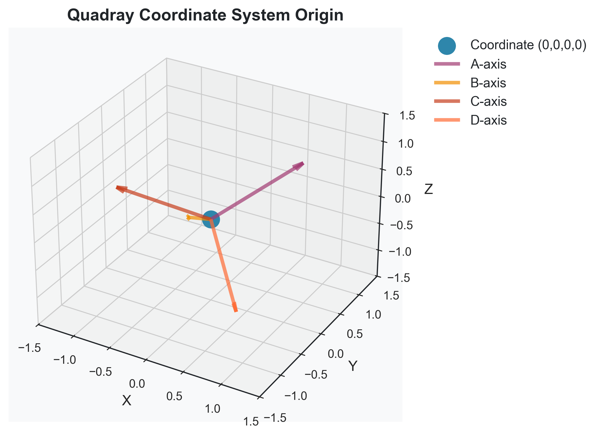

# Output Integration Guide

A technical guide for properly integrating visualizations from the `output/` directory into the Symergetics paper markdown sections.

## Table of Contents

1. [Overview](#overview)
2. [Output Directory Structure](#output-directory-structure)
3. [Image Discovery Process](#image-discovery-process)
4. [Reference Patterns](#reference-patterns)
5. [Figure Management System](#figure-management-system)
6. [Validation and Testing](#validation-and-testing)
7. [Troubleshooting](#troubleshooting)

## Overview

The Symergetics paper system automatically discovers and integrates visualizations from the `output/` directory. This guide explains the technical process and provides patterns for consistent integration.

## Output Directory Structure

### Standard Organization

```
output/
├── geometric/
│   ├── polyhedra/
│   │   ├── tetrahedron_3d_enhanced.png
│   │   ├── cube_3d_enhanced.png
│   │   └── octahedron_3d_enhanced.png
│   ├── coordinates/
│   │   ├── quadray_coordinate_0_0_0_0.png
│   │   └── quadray_coordinate_2_1_1_0.png
│   └── lattice/
│       └── ivm_lattice_size_3.png
├── mathematical/
│   ├── pattern_discovery/
│   │   └── pattern_discovery_geometric_pattern_discovery_analysis.png
│   ├── continued_fractions/
│   │   └── continued_fraction_convergence_3_14159_15.png
│   └── base_conversions/
│       └── base_conversion_30030_base_10_to_2.png
└── numbers/
    ├── palindromes/
    └── primorials/
```

### Naming Conventions

**File naming patterns:**
- `{category}_{subcategory}_{descriptive_name}.{ext}`
- `{function_name}_{parameters}.{ext}`
- `{analysis_type}_{data_description}.{ext}`

**Examples:**
- `quadray_coordinate_0_0_0_0.png` - Quadray coordinate visualization
- `tetrahedron_3d_enhanced.png` - Enhanced 3D tetrahedron
- `pattern_discovery_geometric_pattern_discovery_analysis.png` - Pattern analysis

## Image Discovery Process

### Automatic Discovery

The PDF renderer automatically searches for images in this order:

1. **Main output directory**: `../output/` (relative to paper/)
2. **Paper output directory**: `paper/output/`
3. **Mermaid images**: `paper/mermaid_images/`
4. **Documentation**: `../docs/`
5. **Project root**: `../`

### Search Patterns

The system searches for these file extensions:
- `*.png` - Raster images
- `*.svg` - Vector graphics
- `*.pdf` - PDF documents
- `*.jpg`, `*.jpeg` - JPEG images

### Path Resolution

```python
def _find_image_path(self, img_path: str) -> Optional[Path]:
    """Find image file in output directory and project directories"""
    img_filename = Path(img_path).name
    
    search_paths = [
        self.paper_dir.parent / 'output',      # Main output
        self.paper_dir / 'output',             # Paper output
        self.paper_dir / 'mermaid_images',     # Mermaid diagrams
        self.paper_dir.parent / 'docs',        # Documentation
        self.paper_dir.parent                  # Project root
    ]
    
    for search_path in search_paths:
        if search_path.exists():
            for pattern in ['**/*.png', '**/*.jpg', '**/*.jpeg', '**/*.svg', '**/*.pdf']:
                matches = list(search_path.glob(pattern))
                for match in matches:
                    if match.name == img_filename:
                        return match
    return None
```

## Reference Patterns

### Correct Reference Format

**Standard pattern:**
```markdown


**Figure X**: Detailed caption explaining the visualization's significance and technical details.
```

### Category-Specific Patterns

**Geometric visualizations:**
```markdown



```

**Mathematical visualizations:**
```markdown


```

**Number theory visualizations:**
```markdown


```

### Mermaid Diagram Integration

**Mermaid blocks in markdown:**
```markdown

```

**Automatic processing:**
- Mermaid blocks are automatically detected
- Converted to PNG using `mmdc` CLI tool
- Integrated as images in the PDF
- Fallback to text representation if conversion fails

## Figure Management System

### Automatic Numbering

The system maintains a document-level figure counter:

```python
class ScientificPaperRenderer:
    def __init__(self):
        self.document_figure_counter = 1
        self.processed_figures = set()  # Prevent duplicates
```

### Figure Registration

Figures are automatically registered with metadata:

```python
@dataclass
class FigureMetadata:
    number: int
    category: str
    subcategory: str
    filename: str
    title: str
    description: str
    technical_details: Dict[str, Any]
    generated_by: str
    timestamp: str
```

### Caption Generation

The system generates captions in three styles:

1. **Academic** (default): Full technical details
2. **Concise**: Brief title only
3. **Detailed**: Complete metadata

## Validation and Testing

### Pre-Integration Checks

**Validate image existence:**
```bash
# Check all referenced images exist
grep -r "!\[.*\](" paper/markdown/ | sed 's/.*](\(.*\)).*/\1/' | while read img; do
    if [ ! -f "../output/$img" ]; then
        echo "Missing image: $img"
    fi
done
```

**Check figure numbering:**
```bash
# Extract all figure numbers
grep -r "Figure [0-9]" paper/markdown/ | grep -o "Figure [0-9]*" | sort -n
```

**Validate path structure:**
```bash
# Check output directory structure
find ../output -name "*.png" -o -name "*.svg" -o -name "*.pdf" | sort
```

### Integration Testing

**Test image discovery:**
```python
def test_image_discovery():
    renderer = ScientificPaperRenderer("paper")
    
    # Test known images
    test_images = [
        "output/geometric/polyhedra/tetrahedron_3d_enhanced.png",
        "output/mathematical/pattern_discovery/pattern_analysis.png"
    ]
    
    for img in test_images:
        path = renderer._find_image_path(img)
        assert path is not None, f"Image not found: {img}"
        assert path.exists(), f"Image file missing: {path}"
```

**Test figure numbering:**
```python
def test_figure_numbering():
    renderer = ScientificPaperRenderer("paper")
    
    # Process a test section
    content = """
    
    **Figure 1**: Test caption.
    """
    
    flowables = renderer.process_markdown_content(content)
    
    # Verify figure counter incremented
    assert renderer.document_figure_counter == 2
```

## Troubleshooting

### Common Issues

**1. Image not found**
```
Warning: Image not found: output/geometric/polyhedra/tetrahedron.png
```

**Solutions:**
- Check file exists in `output/` directory
- Verify correct path structure
- Ensure file extension matches reference
- Check for typos in filename

**2. Duplicate figure processing**
```
Skipping duplicate figure: output/geometric/polyhedra/tetrahedron.png
```

**Solutions:**
- Check if same image referenced multiple times
- Verify figure counter is working correctly
- Review markdown for duplicate references

**3. Mermaid diagram conversion failed**
```
Warning: Mermaid CLI failed for diagram mermaid_1
```

**Solutions:**
- Install Mermaid CLI: `npm install -g @mermaid-js/mermaid-cli`
- Check Mermaid syntax in diagram
- Verify diagram is not too complex
- Check system has sufficient resources

### Debug Mode

Enable debug logging to troubleshoot issues:

```python
# In pdf_renderer.py
development:
  debug_mode: true
  log_level: "DEBUG"
  save_intermediate: true
```

### Manual Validation

**Check image paths:**
```bash
# List all images in output directory
find ../output -type f \( -name "*.png" -o -name "*.svg" -o -name "*.pdf" \) | sort

# Check markdown references
grep -r "output/" paper/markdown/ | grep -v "https://"
```

**Validate figure captions:**
```bash
# Extract all figure captions
grep -A1 "!\[.*\](" paper/markdown/ | grep "^\*\*Figure"
```

## Best Practices

### Image Organization

1. **Use consistent naming**: Follow the established patterns
2. **Organize by category**: Group related visualizations
3. **Include metadata**: Use descriptive filenames
4. **Optimize file sizes**: Compress images appropriately
5. **Use appropriate formats**: PNG for plots, SVG for diagrams

### Reference Writing

1. **Use descriptive titles**: Make image references informative
2. **Write detailed captions**: Explain significance and technical details
3. **Maintain consistency**: Follow established patterns
4. **Test references**: Verify all images exist before submission
5. **Update numbering**: Let the system handle figure numbering

### Integration Workflow

1. **Generate visualizations**: Run examples to create output files
2. **Organize output**: Ensure proper directory structure
3. **Write markdown**: Include proper image references and captions
4. **Test integration**: Run PDF renderer to verify integration
5. **Validate output**: Check final PDF for proper image inclusion

---

**Last Updated:** January 2025  
**Version:** 1.0.0  
**Maintainer:** Daniel Ari Friedman (daniel@activeinference.institute)
