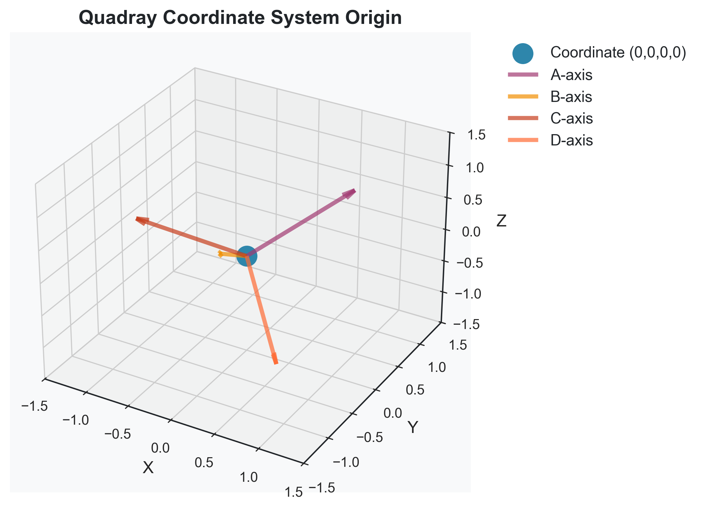

# Symergetics Paper Quick Start Guide

A quick reference for working with the Symergetics research paper system.

## Table of Contents

1. [Overview](#overview)
2. [Quick Commands](#quick-commands)
3. [Common Workflows](#common-workflows)
4. [Style Reference](#style-reference)
5. [Troubleshooting](#troubleshooting)

## Overview

The Symergetics paper system provides:
- **Modular markdown sections** in `paper/markdown/`
- **Automatic PDF generation** with scientific formatting
- **Integrated visualizations** from `output/` directory
- **Comprehensive validation** and style checking
- **Professional output** ready for publication

## Quick Commands

### Generate Complete Paper

```bash
# Full workflow: tests → examples → PDF generation
python run.py

# PDF generation only
python paper/generate_paper.py

# Manual PDF rendering
cd paper/render
python run_render.py --verbose
```

### Validate Paper

```bash
# Complete validation
python paper/validation/validate_paper.py

# Image-specific validation
python paper/validation/check_images.py

# Generate validation report
python paper/validation/validate_paper.py --output validation_report.md
```

### Check Output Integration

```bash
# List all available visualizations
find output -name "*.png" -o -name "*.svg" -o -name "*.pdf" | sort

# Check image references in markdown
grep -r "output/" paper/markdown/ | grep -v "https://"
```

## Common Workflows

### 1. Adding New Visualizations

**Step 1: Generate visualizations**
```bash
# Run examples to create output files
python run.py --examples-only

# Or run specific example
python examples/geometric_mnemonics_demo.py
```

**Step 2: Add to markdown**
```markdown


**Figure X**: Detailed caption explaining the visualization's significance and technical details.
```

**Step 3: Validate integration**
```bash
python paper/validation/check_images.py
```

### 2. Updating Paper Content

**Step 1: Edit markdown sections**
```bash
# Edit any section in paper/markdown/
nano paper/markdown/03_mathematical_foundations.md
```

**Step 2: Validate formatting**
```bash
python paper/validation/validate_paper.py
```

**Step 3: Generate updated PDF**
```bash
python paper/generate_paper.py
```

### 3. Fixing Style Issues

**Step 1: Run validation**
```bash
python paper/validation/validate_paper.py --verbose
```

**Step 2: Fix issues following suggestions**
- Check the generated report for specific issues
- Follow the style guide for proper formatting
- Use the integration guide for image references

**Step 3: Re-validate**
```bash
python paper/validation/validate_paper.py
```

## Style Reference

### Image References

**✅ Correct:**
```markdown


**Figure 7**: Quadray Coordinate System Origin - This visualization shows the origin point (0,0,0,0) in the four-dimensional Quadray coordinate system.
```

**❌ Incorrect:**
```markdown


```

### Links

**✅ Correct:**
```markdown
[🔗 core module](https://github.com/docxology/symergetics/tree/main/symergetics/core)
[🔗 Symergetics repository](https://github.com/docxology/symergetics)
```

**❌ Incorrect:**
```markdown
[click here](https://github.com/docxology/symergetics)
[this link](https://github.com/docxology/symergetics)
```

### Mathematical Notation

**✅ Correct:**
```markdown
The `IVM` coordinate system provides exact rational arithmetic.
The *isotropic vector matrix* framework enables precise calculations.
```

**❌ Incorrect:**
```markdown
The IVM coordinate system provides exact rational arithmetic.
The isotropic vector matrix framework enables precise calculations.
```

### Code Blocks

**✅ Correct:**
```python
def calculate_ivm_volume(vertices):
    """Calculate volume in IVM units using exact rational arithmetic."""
    # Implementation details
    return volume
```

**❌ Incorrect:**
```python
def calculate_ivm_volume(vertices):
# Missing docstring and proper indentation
return volume
```

## Troubleshooting

### Common Issues

**1. Image not found**
```
❌ Image file not found: output/geometric/polyhedra/tetrahedron.png
```
**Solution:** Check if file exists in `output/` directory, verify path structure

**2. Validation errors**
```
❌ Alt text should start with 'Figure X:': image
```
**Solution:** Follow proper image reference format in style guide

**3. PDF generation fails**
```
❌ PDF generation failed!
```
**Solution:** Check dependencies, run validation, verify markdown formatting

**4. Missing dependencies**
```
Error: reportlab not installed
```
**Solution:** Install requirements: `pip install -r paper/render/requirements.txt`

### Debug Commands

```bash
# Verbose validation
python paper/validation/validate_paper.py --verbose

# Check specific issues
python paper/validation/check_images.py --verbose

# Test PDF generation
cd paper/render
python run_render.py --verbose

# Check output directory
ls -la output/
find output -name "*.png" | head -10
```

### Getting Help

1. **Check validation reports** for specific error messages
2. **Review style guide** for formatting standards
3. **Check integration guide** for technical details
4. **Run validation** to identify issues
5. **Follow suggestions** in validation output

## File Structure Reference

```
paper/
├── markdown/           # Paper sections (00_title.md → 09_conclusion.md)
├── render/            # PDF generation system
├── validation/        # Validation tools
├── STYLE_GUIDE.md    # Comprehensive style guide
├── INTEGRATION_GUIDE.md # Technical integration guide
└── QUICK_START.md    # This file

output/                # Generated visualizations
├── geometric/         # Geometric visualizations
├── mathematical/      # Mathematical patterns
└── numbers/          # Number theory visualizations
```

## Quick Reference

| Task | Command |
|------|---------|
| Generate paper | `python run.py` |
| Validate paper | `python paper/validation/validate_paper.py` |
| Check images | `python paper/validation/check_images.py` |
| Generate PDF only | `python paper/generate_paper.py` |
| Manual PDF render | `cd paper/render && python run_render.py` |
| List visualizations | `find output -name "*.png" \| sort` |
| Check image refs | `grep -r "output/" paper/markdown/` |

---

**Need more help?** Check the comprehensive guides:
- [Style Guide](STYLE_GUIDE.md) - Detailed formatting standards
- [Integration Guide](INTEGRATION_GUIDE.md) - Technical implementation details
- [Validation README](validation/README.md) - Validation system documentation

**Last Updated:** January 2025  
**Version:** 1.0.0
