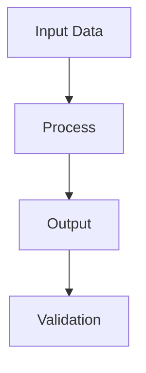
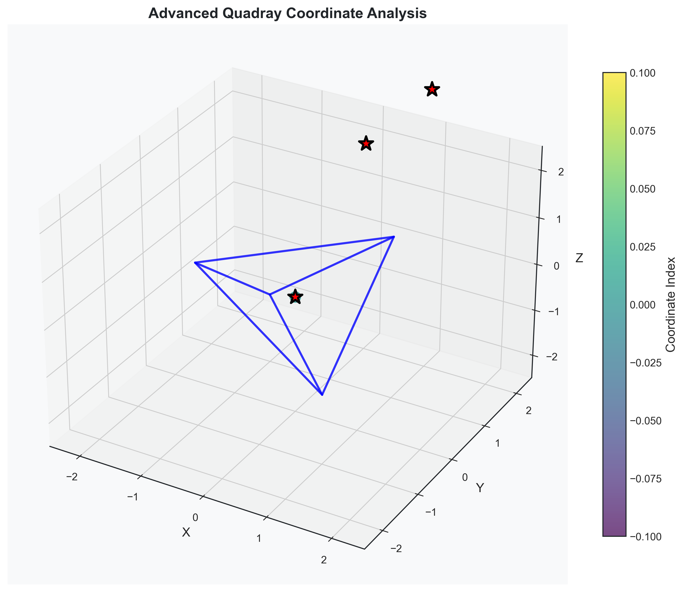

# Symergetics Paper Style Guide

A comprehensive guide for writing, formatting, and integrating content in the Symergetics research paper system.

## Table of Contents

1. [Overview](#overview)
2. [Markdown Formatting Standards](#markdown-formatting-standards)
3. [Image Integration Guidelines](#image-integration-guidelines)
4. [Figure Caption Standards](#figure-caption-standards)
5. [Link and Reference Standards](#link-and-reference-standards)
6. [Mathematical Notation](#mathematical-notation)
7. [Code Block Standards](#code-block-standards)
8. [Section Structure](#section-structure)
9. [Quality Assurance](#quality-assurance)
10. [Common Mistakes to Avoid](#common-mistakes-to-avoid)

## Overview

This style guide ensures consistent, professional formatting across all paper sections and proper integration of visualizations from the `output/` directory. Follow these guidelines to maintain the high standards expected for scientific publication.

## Markdown Formatting Standards

### Headers

Use proper header hierarchy with clear, descriptive titles:

```markdown
# Main Title (only in 00_title.md)
## Section Header (H2)
### Subsection Header (H3)
#### Sub-subsection Header (H4)
```

**Guidelines:**
- Use sentence case for headers (capitalize first word and proper nouns only)
- Keep headers concise but descriptive
- Avoid headers longer than 60 characters
- Use parallel structure in lists of headers

### Text Formatting

**Bold text** for emphasis:
```markdown
**Rational number arithmetic with automatic simplification**
```

*Italic text* for technical terms and foreign words:
```markdown
*Synergetics* framework
```

`Inline code` for technical terms, functions, and variables:
```markdown
The `quadray_coordinate_0_0_0_0.png` file contains...
```

### Lists

Use consistent list formatting:

**Bullet lists:**
```markdown
- **Rational number arithmetic**: Ensures exact mathematical precision
- **Quadray coordinate system**: Handles tetrahedral geometry
- **Volume calculations**: Computes IVM unit volumes
```

**Numbered lists:**
```markdown
1. Check requirements and dependencies
2. Generate visualizations in output/ directory
3. Process markdown sections with integrated images
4. Render final PDF with scientific formatting
```

## Image Integration Guidelines

### Correct Image Reference Format

**✅ CORRECT:**
```markdown


**Figure X**: Detailed description explaining the visualization's significance and technical details.
```

**❌ INCORRECT:**
```markdown


```

### Image Path Standards

**Required path structure:**
```
output/
├── geometric/
│   ├── polyhedra/
│   ├── coordinates/
│   └── lattice/
├── mathematical/
│   ├── pattern_discovery/
│   ├── continued_fractions/
│   └── base_conversions/
└── numbers/
    ├── palindromes/
    └── primorials/
```

**Path naming conventions:**
- Use lowercase with underscores: `quadray_coordinate_0_0_0_0.png`
- Include descriptive terms: `tetrahedron_3d_enhanced.png`
- Add resolution indicators when relevant: `high_res_`, `300dpi_`
- Use consistent file extensions: `.png`, `.svg`, `.pdf`

### Supported Image Formats

| Format | Use Case | Size Guidelines |
|--------|----------|-----------------|
| PNG | Raster images, plots, diagrams | 5×3.5 inches max |
| SVG | Vector graphics, mathematical diagrams | 4×3 inches max |
| PDF | Embedded vector content | 5×3.5 inches max |
| JPEG | Photographic content (rare) | 5×3.5 inches max |

## Figure Caption Standards

### Caption Structure

Every figure must have a two-part caption:

1. **Image reference with title:**
   ```markdown
   
   ```

2. **Detailed caption paragraph:**
   ```markdown
   **Figure X**: Detailed description that explains the visualization's significance, technical details, and relevance to the research. This should be 2-3 sentences providing context and interpretation.
   ```

### Caption Content Guidelines

**Required elements:**
- Figure number (auto-generated by system)
- Descriptive title in image reference
- Technical explanation of what the visualization shows
- Context about why this visualization is important
- Connection to the research findings

**Example of proper caption:**
```markdown


**Figure 7**: Quadray Coordinate System Origin - This visualization shows the origin point (0,0,0,0) in the four-dimensional Quadray coordinate system. The Quadray system extends traditional 3D Cartesian coordinates with an additional tetrahedral dimension, enabling precise representation of complex geometric relationships that cannot be adequately captured in standard coordinate systems.
```

### Caption Writing Tips

- Start with what the figure shows
- Explain the technical significance
- Connect to the broader research context
- Use present tense
- Keep descriptions concise but informative
- Avoid redundant information from the main text

## Link and Reference Standards

### Internal Links

**Repository links (use 🔗 emoji):**
```markdown
[🔗 core module](https://github.com/docxology/symergetics/tree/main/symergetics/core)
[🔗 examples directory](https://github.com/docxology/symergetics/tree/main/examples)
[🔗 repository docs](https://github.com/docxology/symergetics/tree/main/docs)
```

**Link text guidelines:**
- Use descriptive text, not "click here" or "this link"
- Include the 🔗 emoji for repository links
- Keep link text concise but informative
- Use consistent terminology across all links

### External References

**Academic citations:**
```markdown
Buckminster Fuller's Synergetics framework (Fuller, 1975)
```

**Web references:**
```markdown
[Active Inference Institute](https://activeinference.institute)
```

## Mathematical Notation

### Inline Mathematics

**Simple expressions:**
```markdown
The ratio 3/4 + 1/6 = 11/12 maintains exact precision.
```

**Variables and functions:**
```markdown
The `quadray_coordinate(a,b,c,d)` function returns...
```

**Mathematical terms:**
```markdown
The *isotropic vector matrix* (IVM) coordinate system...
```

### Code Blocks for Mathematics

**Mathematical algorithms:**
```python
def calculate_ivm_volume(vertices):
    """
    Calculate volume in IVM units using exact rational arithmetic.
    
    Args:
        vertices: List of coordinate tuples
        
    Returns:
        Rational number representing volume
    """
    # Implementation details...
    return volume
```

### Mathematical Constants

**Define constants clearly:**
```markdown
The fundamental geometric ratios in Synergetics are:
- **Tetrahedron**: 1 IVM unit volume
- **Octahedron**: 4 IVM units  
- **Cube**: 3 IVM units
- **Cuboctahedron**: 20 IVM units
```

## Code Block Standards

### Python Code Blocks

```python
def example_function():
    """Docstring explaining the function's purpose."""
    # Implementation with clear comments
    return result
```

**Guidelines:**
- Include docstrings for all functions
- Use clear, descriptive variable names
- Add comments for complex logic
- Keep code blocks under 15 lines in the paper
- Use proper Python syntax highlighting

### Mermaid Diagrams



**Guidelines:**
- Use descriptive node labels
- Keep diagrams simple and clear
- Use consistent arrow styles
- Include legend or explanation if needed

### Other Code Blocks

```yaml
# Configuration example
metadata:
  title: "Paper Title"
  author: "Author Name"
```

## Section Structure

### Standard Section Template

```markdown
## Section Title

Brief introduction paragraph explaining the section's purpose and scope.

### Subsection Title

Detailed content with proper formatting:

- **Key point 1**: Explanation with supporting details
- **Key point 2**: Additional information
- **Key point 3**: Further elaboration


**Figure X**: Caption explaining the visualization's significance and technical details.

Concluding paragraph that ties the section together and transitions to the next topic.
```

### Content Organization

**Each section should:**
1. Start with a clear introduction
2. Present information in logical order
3. Include relevant visualizations
4. Provide detailed figure captions
5. End with a conclusion or transition

## Quality Assurance

### Pre-Submission Checklist

- [ ] All images have proper references and captions
- [ ] Figure numbers are consistent
- [ ] Links are working and properly formatted
- [ ] Mathematical notation is clear and consistent
- [ ] Code blocks are properly formatted
- [ ] Headers follow the hierarchy guidelines
- [ ] Text formatting is consistent throughout
- [ ] All output/ references point to existing files

### Validation Commands

```bash
# Check for broken image references
grep -r "!\[.*\](" paper/markdown/ | grep -v "output/"

# Validate figure numbering
grep -r "Figure [0-9]" paper/markdown/ | sort

# Check link formatting
grep -r "\[.*\](" paper/markdown/ | grep -v "https://"
```

## Common Mistakes to Avoid

### Image Integration Mistakes

**❌ DON'T:**
```markdown


```

**✅ DO:**
```markdown


**Figure X**: Detailed caption explaining the visualization.
```

### Link Formatting Mistakes

**❌ DON'T:**
```markdown
[click here](https://github.com/docxology/symergetics)
[this link](https://github.com/docxology/symergetics)
```

**✅ DO:**
```markdown
[🔗 Symergetics repository](https://github.com/docxology/symergetics)
[🔗 core module](https://github.com/docxology/symergetics/tree/main/symergetics/core)
```

### Caption Mistakes

**❌ DON'T:**
```markdown

**Figure 1**: This shows a graph.
```

**✅ DO:**
```markdown


**Figure 1**: Advanced Quadray Coordinate Visualization - This figure demonstrates the coordinate (2,1,1,0) in the Quadray system, showing how the four-dimensional tetrahedral coordinates capture spatial relationships that reveal underlying geometric symmetries and structural patterns in three-dimensional space.
```

### Mathematical Notation Mistakes

**❌ DON'T:**
```markdown
The ratio 3/4 + 1/6 = 11/12 (this is wrong)
```

**✅ DO:**
```markdown
The ratio 3/4 + 1/6 = 11/12 maintains exact precision.
```

## Style Guide Updates

This style guide is maintained alongside the paper system. When making updates:

1. Update this document first
2. Update affected markdown sections
3. Test the changes with the PDF renderer
4. Update the validation scripts if needed

---

**Last Updated:** January 2025  
**Version:** 1.0.0  
**Maintainer:** Daniel Ari Friedman (daniel@activeinference.institute)
